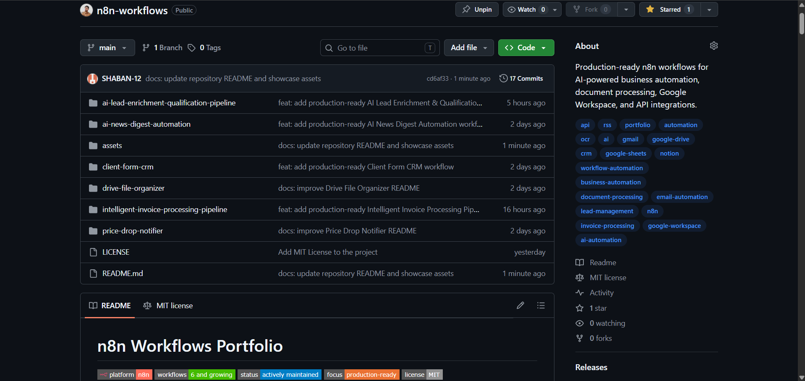
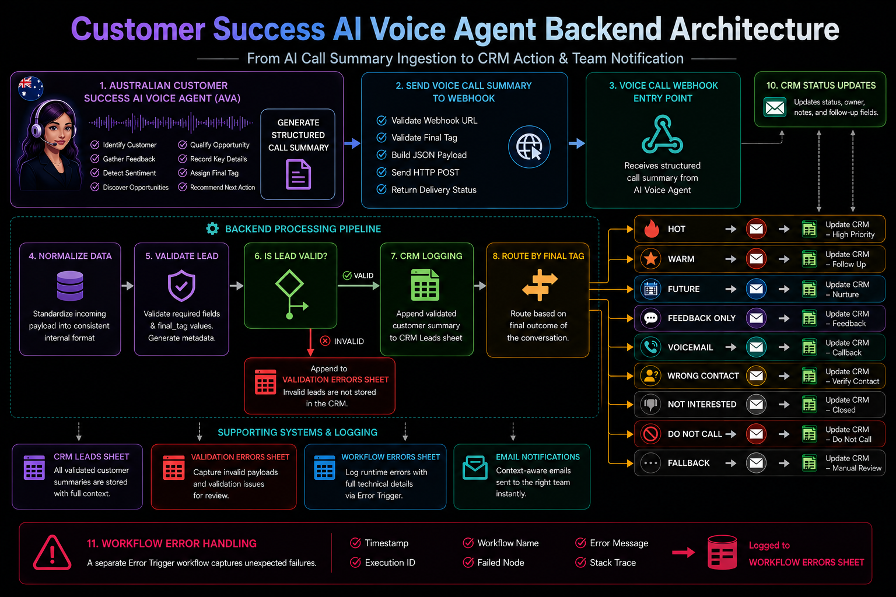
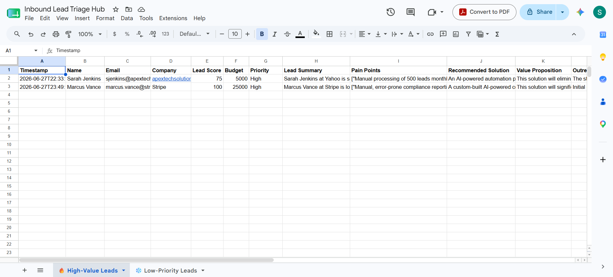
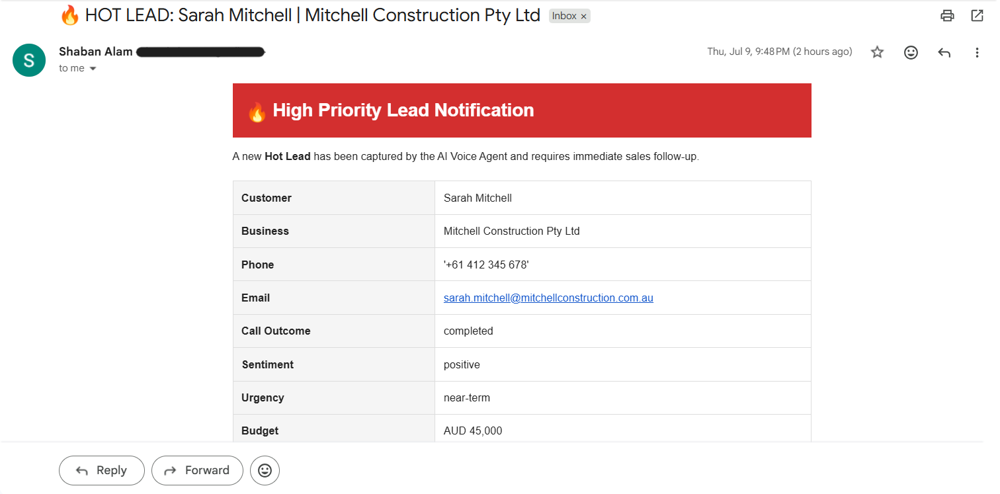

# n8n Workflows Portfolio


A curated collection of production-ready n8n workflows, each built to solve a real operational problem. This repository is not a showcase of what n8n can do — it is a record of automations that have been designed, tested, and structured to the standard of software that a business could actually deploy and rely on.

---

## About

Most workflow repositories are collections of demos. This one is different.

Every workflow in this repository starts from a real problem — a repetitive manual task that consumes time, introduces error, or creates invisible operational gaps. The automation is designed to eliminate that task entirely, not just reduce the friction around it.

The engineering philosophy that runs through every project here:

- **Production-ready** — workflows are tested against live data, handle edge cases, and include error paths. They are not prototypes.
- **Modular** — each node has a single responsibility. Pipelines are structured so that individual components can be swapped, extended, or reused without rebuilding the whole.
- **Documented** — every workflow ships with a README explaining the business problem, the architecture, the tech stack, and a step-by-step execution walkthrough. Someone new to the project should be able to understand it in minutes.
- **Business-focused** — the success criteria for each workflow is operational impact, not technical complexity. The simplest implementation that solves the problem reliably is the right one.
- **Evidenced** — flagship workflows go further, pairing the README with a dedicated business case study, an architecture diagram built for non-technical stakeholders, and sample input/output pulled directly from a live execution. The goal is for each of these to read like an engineered product with a track record, not just an exported automation.

That evidentiary standard now extends across three workflows — Client Form → CRM, AI Lead Enrichment & Qualification Pipeline, and the newest addition, Customer Success AI Voice Agent Backend, a production-grade backend that converts structured AI voice-agent call summaries into validated CRM records, outcome-based routing, and team notifications for a B2B SaaS customer success team.

---

## Repository Highlights

- **Event-driven automations** — workflows that react instantly to triggers rather than running on polling cycles
- **Scheduled automations** — time-based pipelines that run unattended on a configurable frequency
- **Business case study documentation** — flagship workflows pair their technical README with a dedicated case study PDF covering the business problem, ROI narrative, and a real-world deployment scenario
- **Stakeholder-facing architecture diagrams** — a simplified, non-technical version of each flagship pipeline's flow, built for the person evaluating the system rather than the engineer maintaining it
- **Real execution sample input/output** — documented artifacts pulled from a live run of the pipeline, not hypothetical placeholder data
- **AI voice-agent backend orchestration** — a structured JSON call-summary contract converts AI-assisted customer success conversations into deterministic backend actions, fully decoupled from the conversational layer that produces them
- **Structured webhook ingestion** — a fixed-shape JSON payload, not a raw transcript, is the contract between an AI conversation layer and this repository's newest backend, normalized and validated before it touches any downstream system
- **Nine-way outcome-based routing** — a Switch node fans validated records across nine mutually exclusive final-outcome paths, six of which trigger a targeted email alert and all nine of which update a CRM record with a status and owner
- **Two-lane error observability** — data-quality validation failures and unhandled engineering exceptions are captured in two separate, purpose-built logs, so a bad payload and a broken node are never mistaken for each other
- **AI-powered lead enrichment** — third-party firmographic data pulled from Apollo's organization database to verify email domain quality and estimate company size for every inbound lead
- **Deterministic lead scoring** — a four-category weighted rubric (domain quality, budget, company size, description richness) produces a consistent 0–100 score for every submission
- **Business-rule-gated AI invocation** — a Switch node routes only qualifying leads into AI-powered analysis, keeping inference cost and latency scoped to leads that have already cleared an objective bar
- **AI sales strategy generation** — a LangChain Agent produces a complete, ready-to-send outreach package per qualified lead: pain points, recommended solution, value proposition, personalized opening line, and subject line
- **Dual Google Sheets lead dashboards** — high-value and low-priority leads are written to separate tabs, keeping the sales-ready CRM view uncluttered by disqualified records
- **AI-powered document processing** — OCR extraction combined with LangChain Information Extractor for structured field parsing from invoice PDFs
- **Intelligent invoice validation** — four-condition compound gate that independently checks field presence, numeric validity, date parsing, and OCR content quality
- **Dual-path exception routing** — success and failure branches each write to a separate Google Sheets tab and dispatch distinct branded email notifications
- **Invoice audit logging** — raw OCR text preserved alongside failure metadata, enabling human reviewers to diagnose extraction issues without re-reading the original document
- **RSS feed ingestion** — continuous article monitoring from AI industry news sources on a four-hour polling cycle
- **AI-powered summarization** — LangChain AI Agent with OpenRouter LLM generating structured executive summaries and impact analysis per article
- **Dual-pipeline architecture** — independent ingestion and delivery schedules sharing a Notion knowledge base as the persistence layer
- **Knowledge base automation** — a queryable Notion database built continuously from RSS monitoring with no manual curation
- **Form-triggered pipelines** — intake workflows that fire the moment a prospect submits an inquiry form
- **CRM integration** — structured lead records written directly to Notion on every submission
- **Lead qualification logic** — JavaScript-based scoring rules that classify and route leads automatically
- **Google Workspace integrations** — Drive, Sheets, and Gmail connected as first-class workflow components
- **Web scraping pipelines** — HTTP requests, HTML extraction, and live data validation
- **Conditional routing** — Switch nodes and IF gates that branch execution based on data rather than fixed paths
- **JavaScript Code nodes** — custom logic for data transformation, scoring, HTML assembly, and metadata formatting
- **HTML email notifications** — branded, structured email templates for client-facing, internal, digest, and operational communications
- **Audit logging** — persistent, append-only records of every workflow execution in Google Sheets or Notion
- **Exportable JSON** — every workflow ships as an importable `.json` file, deployable in any n8n instance

---

## Featured Workflows

| Workflow | Problem Solved | Technologies | Docs |
|---|---|---|---|
| 🔔 [Price Drop Notifier](./price-drop-notifier/) | Monitors a product page daily and sends an email alert the moment the price drops to a configured target | n8n · HTTP Request · HTML Extraction · IF · Gmail | [README](./price-drop-notifier/README.md) |
| ⚙️ [Drive File Organizer](./drive-file-organizer/) | Detects new Google Drive uploads, classifies them by extension, moves them to the correct folder, logs every action to Sheets, and sends a confirmation email | n8n · Google Drive · Switch · JS Code · Google Sheets · Gmail | [README](./drive-file-organizer/README.md) |
| 📋 [Client Form → CRM](./client-form-crm/) | Captures client inquiries from Typeform, scores leads against business rules, logs every submission to Notion, and routes prospects into three distinct automated email paths | n8n · Typeform · Set · JS Code · Notion · Switch · Gmail | [README](./client-form-crm/README.md) · [Case Study](./client-form-crm/case-study/client-form-crm-case-study.pdf) |
| 📰 [AI News Digest Automation](./ai-news-digest-automation/) | Monitors the AI industry RSS feed every four hours, generates LLM-powered summaries via OpenRouter, stores every article in a Notion knowledge base, and emails a curated executive briefing at 8 AM daily | n8n · RSS Feed · HTTP Request · JS Code · AI Agent · OpenRouter · Notion · Gmail | [README](./ai-news-digest-automation/README.md) |
| 🧾 [Intelligent Invoice Processing Pipeline](./intelligent-invoice-processing-pipeline/) | Monitors Gmail for invoice attachments, OCR-processes each PDF, extracts structured fields via LangChain, archives to Drive, validates against four conditions, and routes to success logging or a compliance audit trail with distinct email notifications for each outcome | n8n · Gmail Trigger · OCR API · LangChain Extractor · OpenRouter · Google Drive · Google Sheets · Gmail | [README](./intelligent-invoice-processing-pipeline/README.md) |
| 🤖 [AI Lead Enrichment & Qualification Pipeline](./ai-lead-enrichment-qualification-pipeline/) | Automatically enriches inbound Typeform leads, evaluates lead quality using deterministic scoring rules, generates AI-powered sales intelligence for qualified prospects, routes leads based on score thresholds, logs them into dedicated Google Sheets dashboards, and dispatches branded HTML notifications | n8n · Typeform · HTTP Request · JavaScript · AI Agent · OpenRouter · Google Sheets · Gmail | [README](./ai-lead-enrichment-qualification-pipeline/README.md) · [Case Study](./ai-lead-enrichment-qualification-pipeline/case-study/ai-lead-enrichment-qualification-pipeline-case-study.pdf) |
| 🎙️ [Customer Success AI Voice Agent Backend](./customer-success-ai-voice-agent-backend/) | Receives structured AI voice-agent call summaries via webhook, validates them against explicit business rules, writes valid records to a Google Sheets CRM, routes each outcome across nine classification paths, dispatches targeted email notifications, and logs validation and runtime failures to separate audit trails | n8n · Webhook · Set · JS Code · IF · Switch · Google Sheets · Gmail · Error Trigger | [README](./customer-success-ai-voice-agent-backend/README.md) · [Case Study](./customer-success-ai-voice-agent-backend/case-study/customer-success-ai-voice-agent-backend-case-study.pdf) |

Three workflows — Client Form → CRM, AI Lead Enrichment & Qualification Pipeline, and the newest addition, Customer Success AI Voice Agent Backend — are documented as complete case studies: technical README, stakeholder-facing architecture diagram, sample input/output from a live execution, and a business case study PDF, all included in the workflow's own folder.

---

## Repository Structure

```
n8n-workflows/
│
├── assets/
│   ├── email-notification.png
│   ├── featured-workflow.png
│   ├── repo-overview.png
│   └── sheets-log.png
│
├── ai-lead-enrichment-qualification-pipeline/
│   ├── ai-lead-enrichment-qualification-pipeline.json  # Importable n8n workflow
│   ├── README.md
│   ├── case-study/
│   │   └── ai-lead-enrichment-qualification-pipeline-case-study.pdf   
│   └── images/
│       ├── workflow.png
│       ├── workflow-architecture.png
│       ├── sample-input.png
│       ├── sample-output.png
│       ├── sheets-log.png
│       └── gmail-alert.png
│
├── ai-news-digest-automation/
│   ├── ai-news-digest-automation.json            # Importable n8n workflow
│   ├── README.md
│   └── images/
│       ├── workflow.png
│       ├── notion-database.png
│       └── daily-news-email.png
│
├── client-form-crm/
│   ├── client-form-crm.json                      # Importable n8n workflow
│   ├── README.md
│   ├── case-study/
│   │   └── client-form-crm-case-study.pdf
│   └── images/
│       ├── workflow.png
│       ├── workflow-architecture.png
│       ├── lead-input.png
│       ├── lead-output.png
│       ├── notion-crm.png
│       ├── high-budget-email.png
│       └── branch-emails/
│           ├── low-budget-email.png
│           └── missing-info-email.png 
│
├── customer-success-ai-voice-agent-backend/
│   ├── customer-success-ai-voice-agent-backend.json  # Importable n8n workflow
│   ├── README.md
│   ├── case-study/
│   │   └── customer-success-ai-voice-agent-backend-case-study.pdf
│   └── images/
│       ├── workflow.png
│       ├── workflow-architecture.png
│       ├── voice-agent-identity.png
│       ├── call-summary-sample.png
│       ├── hot-lead-email.png
│       ├── crm-leads-sheet.png
│       ├── validation-errors-sheet.png
│       └── workflow-errors-sheet.png
│
├── drive-file-organizer/
│   ├── drive-file-organizer.json                 # Importable n8n workflow
│   ├── README.md
│   └── images/
│       ├── workflow.png
│       ├── email-alert.png
│       └── google-sheet.png
│
├── intelligent-invoice-processing-pipeline/
│   ├── intelligent-invoice-processing-pipeline.json  # Importable n8n workflow
│   ├── README.md
│   └── images/
│       ├── workflow.png
│       ├── processed-invoices.png
│       ├── invoice-audit-log.png
│       ├── success-email.png
│       └── manual-review-email.png
│
├── price-drop-notifier/
│   ├── price-drop-notifier.json                  # Importable n8n workflow
│   ├── README.md
│   └── images/
│       ├── workflow.png
│       └── email-alert.png
│
├── LICENSE
└── README.md
```

Each workflow folder is self-contained: the exported `.json` file, the documentation, and all reference screenshots live together. Import the JSON, connect credentials, and the workflow is ready to activate.

---

## Technologies Used

| Technology | Role Across Workflows |
|---|---|
| **n8n** | Orchestration engine — hosts, schedules, and executes all workflows |
| **Structured Output Parser** | Enforces a strict, multi-field JSON schema on AI Agent output, eliminating free-text parsing for downstream Sheets logging and email rendering |
| **Gmail Trigger** | Inbox monitoring — polls every minute and fires one execution per incoming email with attachments |
| **OCR API (api4ai)** | Converts PDF binary to machine-readable text via HTTP POST for downstream AI extraction |
| **LangChain Information Extractor** | Structured field extraction from unstructured document text with explicit "Not Found" fallback values |
| **RSS Feed Trigger** | Polls AI industry RSS sources on a four-hour interval and fires one execution per new article |
| **AI Agent (LangChain)** | Orchestrates structured LLM calls with constrained prompt formatting for consistent, professional output |
| **OpenRouter LLM** | Language model backend — powers article summarization, impact analysis, invoice field extraction, and AI-generated sales outreach strategies |
| **Merge Node** | Combines outputs from parallel processing branches into a single unified data object |
| **Typeform Trigger** | Form submission listener — fires the intake pipeline immediately on new client inquiries and inbound lead submissions |
| **Webhook Node** | Real-time ingestion endpoint — receives structured JSON payloads, such as AI voice-agent call summaries, the instant an external system posts to it |
| **Google Drive** | File detection via trigger, programmatic file moves between folders, and PDF archival |
| **Google Sheets** | Append-only audit log and structured dashboards — tracks processed invoices, failed documents, qualified and disqualified leads, and workflow execution records |
| **Notion** | Knowledge base and CRM destination — stores AI article summaries and client lead records with full structured data |
| **Gmail** | Outbound HTML email delivery for alerts, confirmations, client responses, digest briefings, and exception notifications |
| **HTTP Request** | Live data fetching from external URLs, APIs, OCR endpoints, and third-party enrichment services |
| **HTML Extraction** | CSS-selector-based parsing of web page content |
| **Switch Node** | Rules-based routing that branches execution by file type, lead status, lead score, or data value |
| **IF Node** | Binary conditional gates for data validation, invoice field verification, and threshold checks |
| **Set Node** | Field normalization — remaps raw form labels to consistent keys for downstream processing |
| **JavaScript Code Node** | Custom data transformation, lead scoring logic, timestamp filtering, HTML digest assembly, and metadata formatting |
| **HTML Email Templates** | Branded, structured email layouts — client-facing responses, internal priority alerts, daily digest briefings, and invoice and lead notifications |
| **Schedule Trigger** | Time-based workflow initiation without external cron management |
| **Error Trigger** | n8n's built-in exception handler — captures unhandled runtime failures independently of business-rule validation, routing them to a dedicated error log |

---

## Why These Projects?

Every business runs on repetitive processes. Someone checks a spreadsheet every morning. Someone moves files from one folder to another. Someone refreshes a product page hoping a price changed. Someone manually reads a form submission, copies the details into a CRM, decides whether the lead is worth pursuing, and types the same reply they've typed a hundred times before. Someone looks up a prospect's company by hand to gauge whether they're worth pursuing before ever writing a reply. Someone opens five different websites each morning trying to stay current with a fast-moving industry. Someone opens an email with a PDF attached, reads it, types the numbers into a spreadsheet, and files it away — only to do the same thing again tomorrow. Someone wraps up a good customer success call, means to log the details and flag the opportunity for sales, and either writes it up hours later once the urgency has faded or doesn't get to it at all.

These tasks are not difficult — they are just consistent, predictable, and time-consuming in a way that scales badly. The larger the operation, the more of them exist, and the more they crowd out work that actually requires human judgment.

Automation handles the predictable. This repository is a record of what that looks like in practice: real triggers, real data, real integrations, and outcomes that free up time rather than just demonstrating that automation is possible. For the workflows built out as full case studies, that record extends beyond the code itself — the business problem, the architecture, and a live execution trace are documented side by side, so the proof is available, not just asserted.

That same principle applies to conversations, not just tasks. A customer success call that surfaces a retention risk or an expansion opportunity is only worth what happens next — and what happens next shouldn't depend on whether the person who took the call remembered to write it up before a customer quietly churned. The newest workflow in this repository turns a structured call summary into a validated CRM record, an outcome-based routing decision, and a notification to whoever needs to act on it, so Customer-Led Growth, Time-to-Value, churn mitigation, and pipeline velocity become properties of the system rather than habits someone has to maintain. The same validation and error-logging discipline that runs through the rest of this repository is what makes that dependable enough to run without supervision.

The goal for each workflow is the same — that after it runs, a person's default assumption is that the task is handled, not that they need to go check.

---

## Upcoming Projects

The workflows currently in this repository are the foundation. The roadmap extends in two directions: deeper integrations with the tools businesses already use, and AI-augmented workflows that go beyond conditional routing.

| Project | Description | Status |
|---|---|---|
| 🔗 CRM Sync & Pipeline Automation | Pushes qualified leads from the Sheets dashboard directly into HubSpot or Salesforce, syncing score and AI-generated fields as native CRM properties | In progress |
| 📑 AI Contract Review Pipeline | Automated contract ingestion, clause extraction, risk flagging, and legal team notification | Planned |
| 📬 AI Email Classifier | Inbox monitoring with LLM-based label assignment and auto-routing to the right team | Planned |
| 🧑‍💼 Customer Onboarding Workflow | Post-signup pipeline: welcome email → task creation → CRM update → team notification | Planned |
| 📊 Multi-Channel Job Alert System | Job board scraping with deduplication, Sheets logging, and digest email delivery | Planned |
| 📱 Social Media Automation | Scheduled post publishing across platforms from a content calendar | Planned |

---

## Quick Start

Every workflow in this repository exports as a self-contained JSON file. To run one:

**1. Download the workflow JSON**

Navigate to any workflow folder and download the `.json` file.

**2. Import into n8n**

Open your n8n instance → **Workflows** → **Import from file** → select the downloaded JSON.

**3. Connect credentials**

The workflow will prompt for any required credentials (Google account, Gmail, Notion, Typeform, OpenRouter, OCR API, Apollo, etc.). Connect them through n8n's credential manager.

**4. Configure parameters**

Review the workflow's README for any variables that need updating — folder IDs, target prices, email addresses, form IDs, database IDs, RSS feed URLs, or Sheets spreadsheet IDs.

**5. Activate**

Toggle the workflow to **Active**. It begins running immediately on its configured trigger.

> Each workflow's README contains a full deployment walkthrough specific to that project.

---

## Screenshots

### Repository Overview

> 

The `Shaban27-dev/n8n-workflows` repository on GitHub, showing the seven current workflow folders and clean commit history.

---

### Workflow Example — Customer Success AI Voice Agent Backend

> 

The Customer Success AI Voice Agent Backend in the n8n editor, tagged `Production-grade` and `AI` in the workflow header. A Voice Call Webhook receives each structured call summary and carries it through normalization and validation to a single branch point: valid records continue into CRM logging and a nine-way Switch node keyed on the conversation's final outcome, while invalid records drop into a dedicated Validation Errors log. A fully separate Error Trigger lane sits apart from the main spine, catching unhandled execution failures independently of the business-rule validation path. This is the newest of three workflows in the repository backed by a full business case study — an architecture diagram, a structured call-summary sample, and a real-world deployment narrative for a B2B SaaS customer success team are all included alongside the code.

---

### Workflow-Architerture — Diagram

> 

This `architecture diagram` shows the full end-to-end backend for the `Customer Success AI Voice Agent Backend`. It starts with the Australian Customer Success AI Voice Agent generating a structured call summary, which is then transmitted through the webhook entry point into the n8n processing pipeline. The backend normalizes and validates the payload, routes valid records by final tag, and logs invalid data separately for auditability. It also includes a dedicated Error Trigger path so execution failures are captured independently of business-rule validation. Together, the diagram shows a production-grade ingestion and routing system built for reliable customer success automation.

---

### CRM-Leads — Google Sheets

> 

The `CRM Leads sheet` stores every validated customer conversation processed by the backend automation. Each record includes structured business information, call outcome, sentiment, opportunity details, routing status, products, quantity, and budget. This centralized log provides the sales and customer success teams with a reliable operational view of all qualified interactions. Because only validated records are written, the CRM remains clean, consistent, and ready for downstream reporting. The sheet serves as the system of record for the workflow's production data pipeline.

---

### Hot-Lead Notification — Email

> 

This email represents the high-priority notification branch triggered when the workflow classifies a customer interaction as a `Hot lead`. It delivers a clear, time-sensitive alert to the sales team so they can act immediately on a high-value opportunity. The email includes the customer name, business name, contact details, call outcome, sentiment, urgency, and budget. Its layout is intentionally structured so the team can scan the lead context quickly and move straight into follow-up. This is the primary revenue-acceleration path in the workflow.

---

## About Me

**Shaban Alam**
Python Automation Developer · n8n Workflow Specialist · AI Automation Builder

I build automation systems for businesses that want to stop doing things manually. My focus is on production-ready workflows — not demos, not prototypes, but systems that run reliably in the background and deliver measurable operational value.

- **GitHub:** [github.com/Shaban27-dev](https://github.com/Shaban27-dev)
- **Email:** shabandev27@gmail.com
- **Available for:** freelance automation projects, workflow consulting, document processing pipelines, Google Workspace integrations, CRM automation, AI sales intelligence, AI pipeline development

---

## Freelance Services

If you have a manual process that runs on a predictable pattern, it can probably be automated. Here is what I build:

| Service | Description |
|---|---|
| **n8n Workflow Development** | Custom workflow design, build, and deployment for any trigger-action automation |
| **AI Workflow Automation** | LLM-powered pipelines using Claude or OpenAI for classification, enrichment, and generation |
| **AI Lead Qualification & Enrichment** | Deterministic lead scoring, third-party firmographic enrichment, and AI-generated sales outreach strategy for inbound pipelines |
| **AI Voice-Agent Backend Development** | Structured webhook ingestion, deterministic validation, and outcome-based routing for the backend layer beneath an AI voice or chat agent |
| **Document Processing Automation** | OCR extraction, AI field parsing, validation pipelines, and structured logging for invoices, contracts, and business documents |
| **AI Content Pipelines** | RSS monitoring, LLM-powered summarization, knowledge base construction, and scheduled digest delivery |
| **CRM Automation** | Form-to-CRM pipelines with lead scoring, qualification routing, and automated client communication |
| **Customer Success & Revenue Operations Automation** | CRM logging, outcome-based notification routing, and status tracking built around real customer success and sales workflows |
| **Workflow Documentation & Case Studies** | Architecture diagrams, implementation guides, and business case studies that make a delivered automation easy for a client's team to understand, trust, and maintain |
| **Validation & Error-Logging Pipelines** | Explicit business-rule validation with complete failure aggregation, paired with independent, purpose-built error logs for production observability |
| **Google Workspace Automation** | Drive, Sheets, Gmail, and Calendar integrated into operational workflows |
| **API Integration** | Connecting internal tools and third-party APIs through webhook and HTTP request pipelines |
| **Python Automation** | Script-based automation for data processing, scraping, scheduling, and reporting |
| **Business Process Automation** | End-to-end replacement of repetitive manual workflows with event-driven systems |
| **Custom Internal Tools** | Lightweight automation tools built for specific operational needs |
| **Workflow Optimization** | Audit and refactor of existing n8n or Python workflows for reliability and performance |

> **Interested in working together?** Reach out at shabandev27@gmail.com with a brief description of the process you want to automate.

---

## Summary

This repository is an actively growing portfolio of automation systems built around one principle: every workflow should solve a problem a real business actually has, and solve it in a way that is reliable enough to run without supervision. It now spans seven production-ready workflows, from price monitoring and file organization through AI-powered lead enrichment and a full customer success backend.

The projects here draw on event-driven architecture, AI-powered lead enrichment and qualification, deterministic scoring with AI-generated sales intelligence, AI-powered document processing, OCR-based data extraction, RSS-driven content intelligence, AI-powered summarization, dual-pipeline scheduling, form-triggered intake pipelines, structured webhook ingestion with deterministic validation and outcome-based routing, CRM integration, Google Workspace automation, web scraping, and conditional workflow orchestration — applied to problems that repeat themselves every day in organizations of every size. Each one is documented, exportable, and ready to deploy.

The three most fully built-out workflows — Client Form → CRM, AI Lead Enrichment & Qualification Pipeline, and the newest addition, Customer Success AI Voice Agent Backend — go a step further, pairing the technical README with an architecture diagram written for non-technical stakeholders, sample input and output pulled from real executions, and a complete business case study covering the problem, the ROI narrative, and a concrete deployment scenario. The intent is for each of these to read like the record of an engineered product rather than an exported automation — a system built once, documented end-to-end, and proven to work.

This repository is actively maintained with new production-ready workflows added regularly. Star the repository to stay updated.
