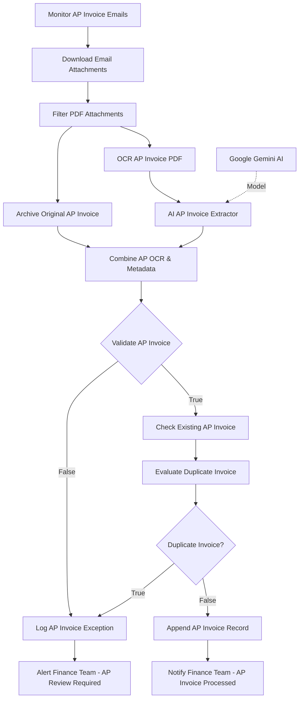
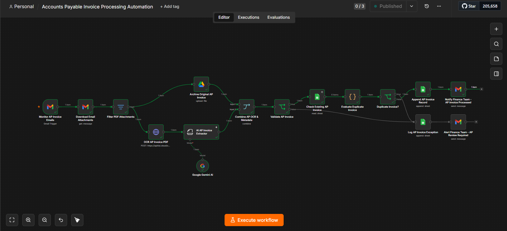
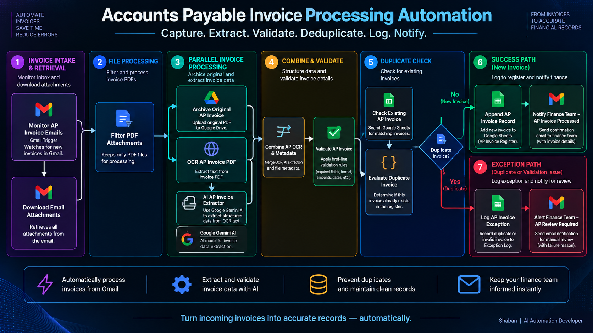
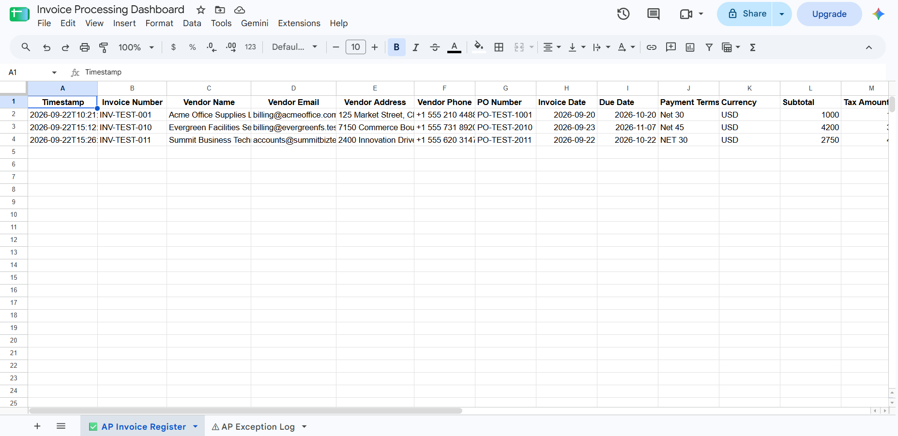
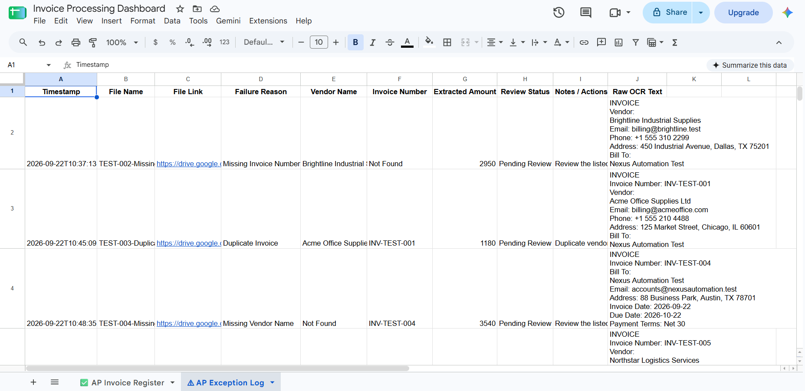
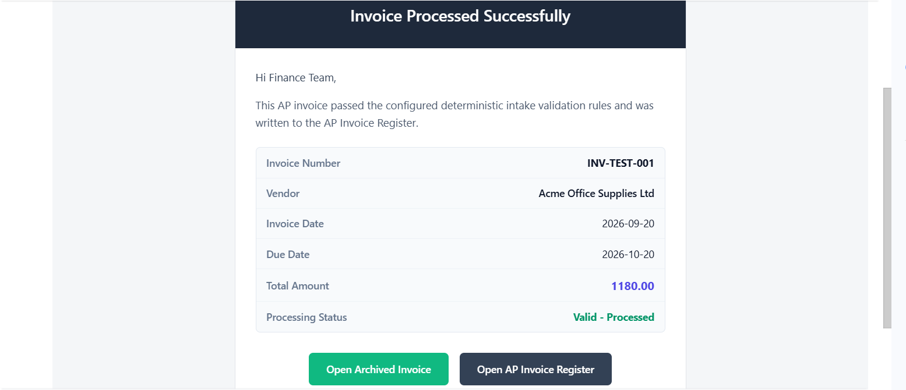
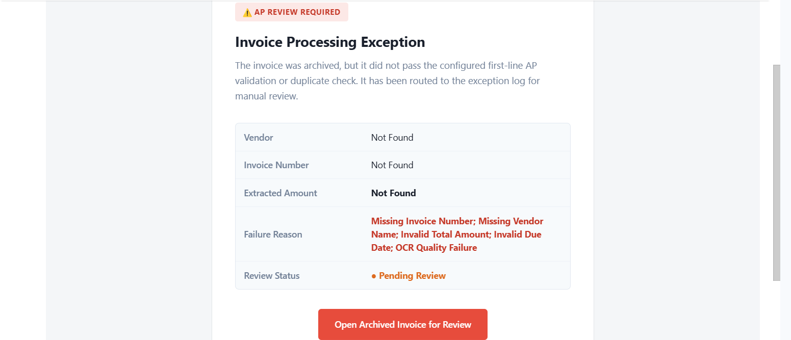

# 🧾 Accounts Payable Invoice Processing Automation


An n8n pipeline that monitors a Gmail inbox for AP invoice attachments, archives the original PDF, OCRs it, extracts a 13-field vendor-centric schema with a Gemini-backed LangChain Information Extractor, validates the result against five deterministic conditions, checks it against the existing register for duplicates, and routes it to one of two outcomes: an appended register row with a success notification, or a named exception with a manual-review alert.

> **Case study included.** A full business case study — problem framing, the three engineering decisions that define the pipeline's behavior, and demonstrated duplicate-detection evidence — is included at [`case-study/accounts-payable-invoice-processing-automation-case-study.pdf`](./case-study/accounts-payable-invoice-processing-automation-case-study.pdf).

---

## Problem

Manual invoice intake follows the same pattern in nearly every AP team: an email arrives, someone opens the PDF, retypes the numbers into a spreadsheet, files the original somewhere, and moves to the next one. At low volume it's tedious but survivable. At scale, it's a liability.

Every transcription step is a place for a digit to be misread or a due date mistyped — errors that surface later as payment problems, not at the point they're created. Originals sit in inboxes with no consistent archive, and review standards shift from person to person. When a document is incomplete, unreadable, or already paid once, the usual outcome isn't a flag — it's silence.

---

## Solution

This pipeline is a Gmail-triggered automation that begins working the moment an invoice email arrives, built on a firm separation of responsibility: deterministic logic makes every decision that can be defined by a rule — whether a required field is present, whether an amount is valid, whether this invoice already exists in the register — while AI is scoped to a single, narrow task: reading unstructured OCR text into structured data. It doesn't decide outcomes; it prepares the record the rules act on.

Every invoice follows the same path: it's received, archived, OCR'd, and extracted; then validated against five field-level conditions; then, only if valid, checked against the existing register for a duplicate. Validation failures are routed straight to the exception path, ahead of the duplicate check. A new, valid, non-duplicate invoice is appended to the register and confirmed by email; anything that fails validation or turns out to be a duplicate is logged to a separate exception sheet with a named reason and flagged for manual review.

This is not an ERP, a payment execution system, or an accounting-approval tool. It does not perform fraud detection and does not guarantee error-free processing. It's a first-line intake layer that gives a reviewer a complete starting point instead of a blank inbox.

---

## Architecture

The current export contains **16 nodes**. There is no shared terminal node — the two notification nodes each end independently.

**Monitor AP Invoice Emails** is a Gmail Trigger polling the inbox every minute. It is unfiltered by sender or subject; every new message triggers one execution.

**Download Email Attachments** is a Gmail node (`get` operation) that fetches the full message using the trigger's message ID, with `downloadAttachments: true`. The attachment binary is available as `attachment_0`; the pipeline processes this specific binary field, not a generalized multi-attachment loop.

**Filter PDF Attachments** is an n8n Filter node — new relative to earlier documentation of this workflow. It keeps only items where `attachment_0` exists, the filename ends in `.pdf`, and the MIME type is `application/pdf`, `application/x-pdf`, or blank. Anything else is dropped here.

From the filter's kept output, execution splits into two parallel branches:

**Archive Original AP Invoice** is a Google Drive node uploading the attachment binary to a configured folder, using `$binary.attachment_0.fileName` as the filename. Its output — including `webViewLink` — is used by both downstream branches and both notification emails.

**OCR AP Invoice PDF** is an HTTP Request node that `POST`s the attachment binary as `multipart/form-data` to `https://api4ai.cloud/ocr/v1/results`, with the API key passed as both a query parameter and a header. The response's extracted text is nested at `results[0].entities[0].objects[0].entities[0].text`.

**AI AP Invoice Extractor** is a LangChain Information Extractor node (not an AI Agent) that reads that OCR text and extracts 13 attributes: Invoice Number, Vendor Name, Vendor Email, Vendor Address, Vendor Phone, Invoice Date, Due Date, Subtotal, Tax Amount, Total Amount, Currency, PO Number, and Payment Terms. All 13 are marked `required` in the extraction schema, meaning the model must always return a value for each — falling back to the literal string `"Not Found"` when a field isn't supported by the OCR text — but only five of the thirteen are actually checked by the downstream validation gate; PO Number and Payment Terms are extracted when present but their absence alone never fails validation. The system prompt explicitly instructs the model not to invent, guess, or calculate missing financial figures, to distinguish the Vendor/Supplier from Bill To/Customer information, to preserve the invoice's stated currency, and not to perform accounting approval, tax-compliance assessment, fraud detection, or payment scheduling — extraction only. If the extractor itself errors, `onError: continueRegularOutput` lets the run continue rather than halt, relying on the validation gate to catch the resulting empty fields.

**Google Gemini AI** is the language-model node — `models/gemini-3.1-flash-lite`, capped at 1,500 output tokens — connected to the extractor as its `ai_languageModel` provider.

**Combine AP OCR & Metadata** is a Merge node (`combineByPosition`) taking the Drive archival metadata as input 1 and the AI extractor's output as input 2, producing one item carrying both.

**Validate AP Invoice** is an IF node applying five conditions with AND logic — all five must pass: (1) `Invoice Number` is present and not `"Not Found"`; (2) `Vendor Name` is present and not `"Not Found"`; (3) `Total Amount`, after stripping non-numeric characters, parses to a number greater than 0; (4) `Due Date` is present, not `"Not Found"`, and parses as a valid ISO date; (5) the raw OCR text — read directly from `OCR AP Invoice PDF`, not from the extractor — exceeds 100 characters, acting as a document-quality gate. Any single failed condition routes to the exception path, **before** duplicate detection runs at all.

**Check Existing AP Invoice** is a Google Sheets read node that pulls the current contents of the `✅ AP Invoice Register` tab — every row, unfiltered — as the comparison set for the next node.

**Evaluate Duplicate Invoice** is a JavaScript Code node performing deterministic duplicate detection: it builds a key from the normalized (trimmed, lowercased, whitespace-collapsed) Vendor Name and Invoice Number, and checks whether any row already returned by `Check Existing AP Invoice` matches both. It explicitly is not fraud detection — matching key, matching outcome, nothing more.

**Duplicate Invoice?** is an IF node reading the `duplicateDetected` boolean from the previous node. A duplicate routes to the exception path; a non-duplicate continues to the success path.

**Append AP Invoice Record** is a Google Sheets node appending 16 fields to `✅ AP Invoice Register`: Timestamp, Invoice Number, Vendor Name, Vendor Email, Vendor Address, Vendor Phone, PO Number, Invoice Date, Due Date, Payment Terms, Currency, Subtotal, Tax Amount, Total Amount, File Link, and Processing Status (`"Valid - Processed"`).

**Notify Finance Team - AP Invoice Processed** is a Gmail node — subject `AP Invoice [Invoice Number] Processed - Internal Finance Notification`, sourced from `Combine AP OCR & Metadata`. The body shows Invoice Number, Vendor, Invoice Date, Due Date, Total Amount, and Processing Status, with two CTA buttons — "Open Archived Invoice" (the Drive link) and "Open AP Invoice Register." It explicitly states the notification confirms intake, extraction, validation, archival, and record creation only — **not** payment execution or accounting approval.

**Log AP Invoice Exception** is a Google Sheets node appending 10 fields to `⚠ AP Exception Log`: Timestamp, File Name, File Link, Failure Reason, Vendor Name, Invoice Number, Extracted Amount, Review Status (`"Pending Review"`), Notes / Actions, and Raw OCR Text. `Failure Reason` is computed in-node: `"Duplicate Invoice"` when routed from the duplicate check, or a semicolon-joined list drawn from `Missing Invoice Number`, `Missing Vendor Name`, `Invalid Total Amount`, `Invalid Due Date`, and `OCR Quality Failure` when routed from validation, falling back to `"Processing Validation Failed"` if none of those specifically apply. `Notes / Actions` gives duplicate-specific or validation-specific guidance accordingly.

**Alert Finance Team - AP Review Required** is a Gmail node — subject `AP Review Required: Invoice Exception (Vendor Name - Invoice Number)`. Its Vendor, Invoice Number, Extracted Amount, and Failure Reason fields are read back from `Log AP Invoice Exception`'s own resolved output (i.e., exactly what was just written to the sheet), while its "Open Archived Invoice for Review" link is read from `Combine AP OCR & Metadata`. Like the success email, it explicitly states it is not payment or accounting approval.

---

## Workflow Diagram



There is no shared end node in the current export — `Notify Finance Team - AP Invoice Processed` and `Alert Finance Team - AP Review Required` each terminate independently.

---

## Tech Stack

| Technology | Role |
|---|---|
| **n8n** | Workflow orchestration engine |
| **Gmail Trigger** | Polls the inbox every minute (`Monitor AP Invoice Emails`) |
| **Gmail** | Downloads the attachment (`get`), and sends both outcome notifications |
| **Filter Node** | Keeps only valid PDF attachments (`Filter PDF Attachments`) |
| **Google Drive** | Archives the original PDF before any processing |
| **HTTP Request** | Calls the api4ai OCR endpoint |
| **LangChain Information Extractor** | Extracts a 13-field vendor-centric schema from OCR text |
| **Google Gemini Chat Model** | `gemini-3.1-flash-lite`, LLM backend for the extractor |
| **Merge Node** | Combines Drive metadata and AI extraction output |
| **IF Node (×2)** | Five-condition validation gate, and duplicate-result branching |
| **JavaScript Code Node** | Deterministic duplicate detection by normalized Vendor Name + Invoice Number |
| **Google Sheets (×3)** | Reads the register for duplicate checking; writes the register; writes the exception log |

---

## Features

| Feature | Description |
|---|---|
| Gmail inbox polling | Checks every minute via `Monitor AP Invoice Emails` — polling, not a webhook push |
| PDF attachment filtering | Only items matching a `.pdf` filename and an accepted/blank MIME type proceed |
| Parallel archival + OCR | The original PDF is archived to Drive at the same time it's sent for OCR |
| Gemini-powered extraction | 13-field vendor-centric schema extracted from raw OCR text |
| Explicit "Not Found" fallback | Every extracted field is guaranteed present, even when the source data isn't |
| Five-condition validation | Invoice Number, Vendor Name, Total Amount, Due Date, and OCR text length, all AND'd |
| OCR quality gate | The >100-character OCR-length check catches corrupt scans or blank pages |
| Deterministic duplicate detection | Normalized Vendor Name + Invoice Number checked against the live register |
| Validation before deduplication | A document must pass field-level checks before it's ever compared for duplicates |
| Separate success/exception sheets | `AP Invoice Register` for successes, `AP Exception Log` for everything else |
| Named, specific failure reasons | Missing/invalid fields and duplicates are each named explicitly, not a generic error |
| Raw OCR text preserved | Every exception row carries the full OCR output for reviewer diagnosis |
| Branded success and exception emails | Distinct HTML templates, both explicitly disclaiming payment/accounting approval |
| Deterministic rules, AI limited to extraction | Every accept/reject/duplicate decision is rule-based, not model-based |

---

## Screenshots

### Workflow



The full 16-node canvas: Gmail Trigger through the PDF filter, then a parallel split into Drive archival and OCR→AI extraction (with Google Gemini AI as the model connector), converging at the Merge node into validation, then the duplicate-check sequence, ending in one of two terminal Gmail nodes with no shared END. A captured execution trace shows `Check Existing AP Invoice` reading 6 existing register rows, `Evaluate Duplicate Invoice` and `Duplicate Invoice?` resolving to "not a duplicate," and the run completing through `Append AP Invoice Record` and `Notify Finance Team - AP Invoice Processed`.

### Workflow Architecture



A seven-stage, presentation-ready version of the same pipeline: Invoice Intake & Retrieval, File Processing, Parallel Invoice Processing, Combine & Validate, Duplicate Check, Success Path, and Exception Path — with the duplicate branch clearly marked "No (New Invoice)" vs. "Yes (Duplicate)."

### AP Invoice Register



The `✅ AP Invoice Register` tab of the Invoice Processing Dashboard spreadsheet, showing test records including `INV-TEST-001` (Acme Office Supplies Ltd), `INV-TEST-010` (Evergreen Facilities Services), and `INV-TEST-011` (Summit Business Tech) — each with the full vendor-centric field set: name, email, address, phone, PO number, dates, terms, currency, subtotal, and tax.

### AP Exception Log



The `⚠ AP Exception Log` tab, showing named-reason test rows including "Missing Invoice Number," "Duplicate Invoice" (for a resubmission of `INV-TEST-001`), and "Missing Vendor Name." The Raw OCR Text column preserves what the OCR engine actually read for each failed document.

### Success Notification Email



The confirmation sent for `INV-TEST-001`: Invoice Number, Vendor (Acme Office Supplies Ltd), Invoice Date, Due Date, Total Amount ($1,180.00), and Processing Status "Valid - Processed," with "Open Archived Invoice" and "Open AP Invoice Register" buttons.

### Manual Review Alert Email



The exception template — the same one used for both duplicate and validation-failure exceptions. The captured example here illustrates a validation-failure case with every field unresolved (Vendor, Invoice Number, and Extracted Amount all "Not Found," Failure Reason listing all five validation conditions), not the literal alert generated for the `INV-TEST-001` duplicate.

---

## How It Works

1. **A new email arrives.** `Monitor AP Invoice Emails` polls the inbox every minute.
2. **The attachment is downloaded.** `Download Email Attachments` fetches the message and its binary into `attachment_0`.
3. **Non-PDF attachments are dropped.** `Filter PDF Attachments` keeps only valid PDF files.
4. **The PDF is archived.** `Archive Original AP Invoice` uploads it to Google Drive.
5. **The same PDF is OCR'd**, in parallel with step 4, via `OCR AP Invoice PDF`.
6. **The OCR text is extracted into structured fields** by `AI AP Invoice Extractor`, backed by `Google Gemini AI`.
7. **Drive metadata and extraction output are merged** into one object by `Combine AP OCR & Metadata`.
8. **The merged object is validated** against five conditions by `Validate AP Invoice`.
9. **A validation failure routes immediately to the exception path**, skipping duplicate detection entirely.
10. **A valid invoice is checked against the register** by `Check Existing AP Invoice`.
11. **`Evaluate Duplicate Invoice` computes a normalized Vendor Name + Invoice Number match** against those existing rows.
12. **A detected duplicate also routes to the exception path.**
13. **A new, valid, non-duplicate invoice is appended** to `AP Invoice Register` by `Append AP Invoice Record`.
14. **A success notification is sent** by `Notify Finance Team - AP Invoice Processed`.
15. **Any exception is logged** to `AP Exception Log` with a named reason by `Log AP Invoice Exception`.
16. **A manual-review alert is sent** by `Alert Finance Team - AP Review Required`.

---

## Sample Input / Output

The case study's clearest evidence is what happens when the same invoice arrives twice — `INV-TEST-001`, Acme Office Supplies Ltd, $1,180.00, synthetic test data.

**First submission** — `Invoice → Validation → Duplicate Check → AP Invoice Register → Success Notification`. The invoice passed all five validation conditions, cleared the duplicate check against an (at that point) empty register, and was appended as a new row. The success email confirmed the same invoice number, vendor, and total.

**Second submission of the identical invoice** — `Same Invoice → Duplicate Check → AP Exception Log → Review Notification`. It cleared the same first-line validation, but the duplicate check matched it against the register entry created by the first submission and stopped it: no second register row was created. It was logged to `AP Exception Log` instead, with Failure Reason `"Duplicate Invoice"`, and a review notification replaced the confirmation.

No second `AP Invoice Register` entry exists for `INV-TEST-001` — the register, the exception log, and both emails independently agree on the same invoice number and amount.

**Secondary evidence, same exception log:** validation also catches incomplete documents on its own terms — one test invoice logged as `"Missing Invoice Number"` (Vendor: Brightline Industrial Supplies, Invoice Number: Not Found), another as `"Missing Vendor Name"` (Invoice Number: `INV-TEST-004`, Vendor Name: Not Found) — each naming the specific gap rather than a generic rejection.

---

## Known Behavior & Limitations

- **No shared terminal node.** `Notify Finance Team - AP Invoice Processed` and `Alert Finance Team - AP Review Required` each end independently; there is no No-Op or other shared endpoint in this export.
- **"Published" in the editor, inactive in the export.** The n8n editor shows this workflow as Published, but the exported JSON has `"active": false` — meaning it is not currently registered to run against new emails as exported.
- **Extraction failures don't halt the run.** `AI AP Invoice Extractor` is set to continue on error; a failed extraction produces an item with missing/empty fields that the five-condition validation gate is relied on to catch.
- **Duplicate checking reads the whole register, unfiltered.** `Check Existing AP Invoice` returns every row; the actual match logic — normalized Vendor Name + Invoice Number — runs entirely inside the following Code node.
- **Exception-email fields are sourced from the sheet write, not the raw extraction.** Vendor, Invoice Number, Extracted Amount, and Failure Reason in the review-alert email come from `Log AP Invoice Exception`'s own output — i.e., exactly what was just written — while the CTA link is read from `Combine AP OCR & Metadata`.
- **This is a demonstration build with synthetic test data** (Acme Office Supplies, Nexus Automation Test, and similar fictional vendors) — not a live accounting deployment. Gmail recipients, credentials, the Drive folder, the spreadsheet ID, and the api4ai API key are all placeholder values in this export.
- **Explicit scope boundaries**, per both notification emails and the case study: this pipeline does not execute or schedule payments, does not perform accounting approval, is not a fraud-detection system, and does not guarantee error-free processing.

---

## Future Improvements

- **Direct accounting/ERP integration** — replacing the spreadsheet register as the system of record
- **Purchase order matching** — confirming an invoice against an approved PO before logging
- **Vendor master validation** — flagging invoices from vendors outside an approved list
- **Line-item extraction** — capturing individual charges rather than totals alone
- **Multi-currency and multi-language OCR support** — for non-English or non-USD invoices

---

## Repository Structure

```
accounts-payable-invoice-processing-automation/
├── case-study/
│   └── accounts-payable-invoice-processing-automation-case-study.pdf
├── images/
│   ├── ap-exception-log.png
│   ├── ap-invoice-register.png
│   ├── manual-review-email.png
│   ├── success-email.png
│   ├── workflow-architecture.png
│   └── workflow.png
├── accounts-payable-invoice-processing-automation.json
└── README.md
```

**To deploy:** import the workflow JSON; connect Gmail (OAuth2), Google Drive, Google Sheets, and Google Gemini credentials; set the api4ai OCR API key; set the Drive archive folder; point all three Google Sheets nodes at your own Invoice Processing Dashboard spreadsheet; set the recipient address on both Gmail notification nodes; then activate. For the full business framing and demonstrated duplicate-detection evidence, see the case study PDF included above.

---

## Author

**Shaban Alam**
Python Automation Developer · n8n Workflow Specialist · AI Automation Builder

Building automation systems for businesses that want to eliminate repetitive manual work.

- **GitHub:** [github.com/Shaban27-dev](https://github.com/Shaban27-dev)
- **Email:** shabandev27@gmail.com
- **Available for:** freelance automation projects, document processing pipelines, OCR integrations, AI extraction systems, Google Workspace automation

> Open to projects involving n8n, Python automation, AI-powered document processing, invoice automation, and business process automation.

---

## Summary

Accounts Payable Invoice Processing Automation is a 16-node pipeline built on a firm separation of responsibility: Gmail-triggered intake, parallel Drive archival and api4ai OCR, Gemini-backed structured extraction across 13 vendor-centric fields, a five-condition deterministic validation gate, and rule-based duplicate detection against the live register — all before a single record is written. A validated, non-duplicate invoice reaches the `AP Invoice Register` with a success email; anything else reaches the `AP Exception Log` with a named reason and a review alert. AI is scoped to extraction only; every accept, reject, and duplicate decision is deterministic and inspectable. As exported, credentials, the recipient address, the spreadsheet ID, the Drive folder, and the OCR API key are placeholders, and the workflow itself is inactive — it's a demonstrated reference build, not a live accounting deployment, and explicitly not a payment-execution, accounting-approval, or fraud-detection system.

This project is part of an active automation portfolio. Additional workflows covering client intake, file management, price monitoring, and AI news digestion are available in the linked GitHub profile.
