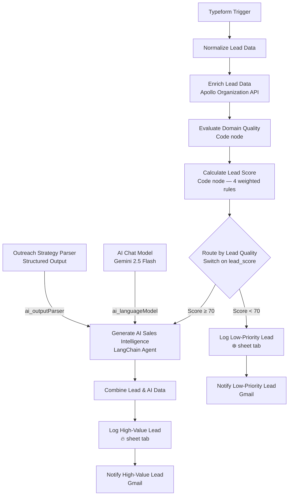
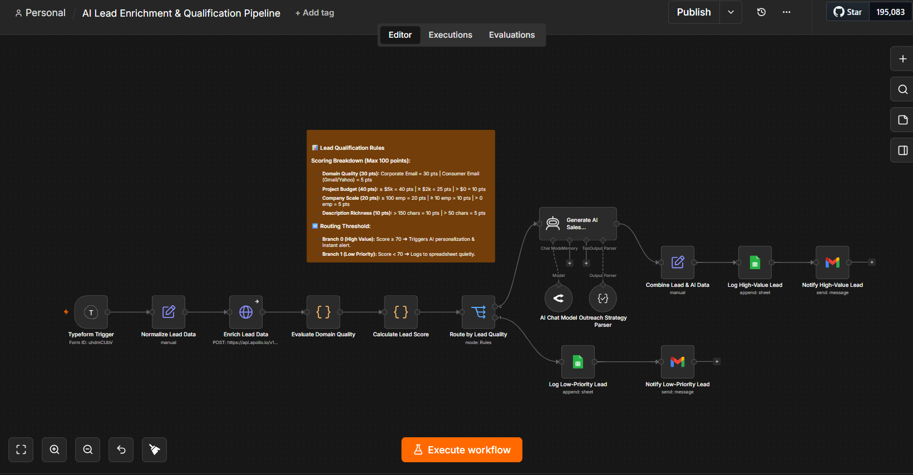
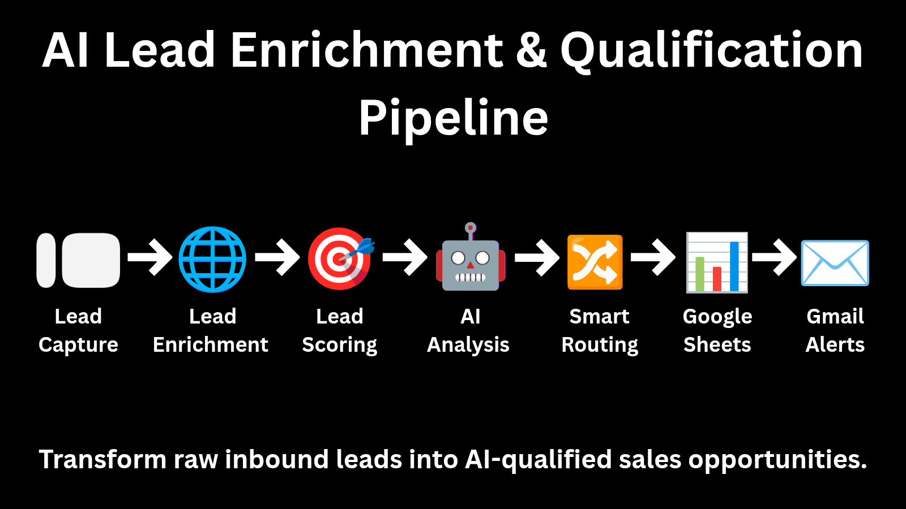
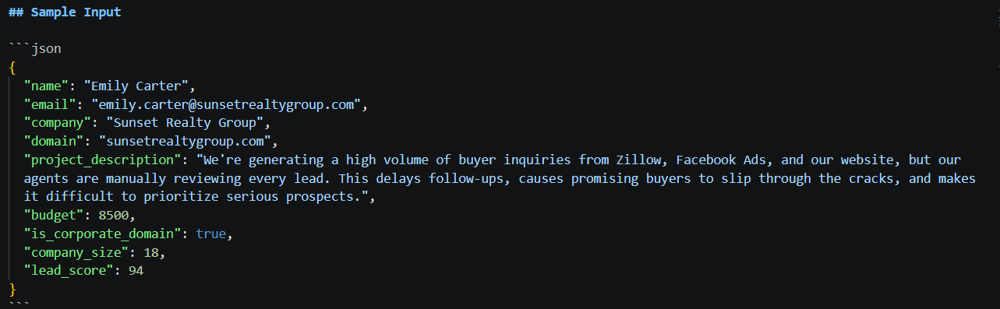
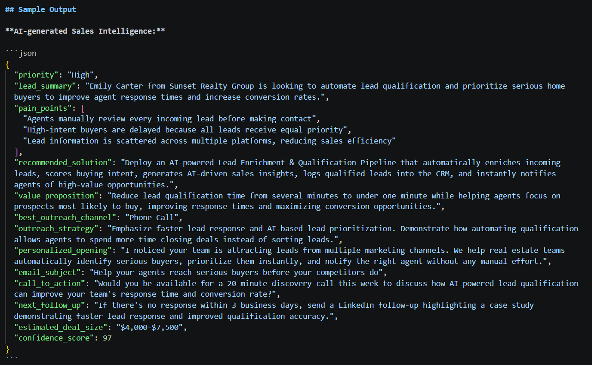
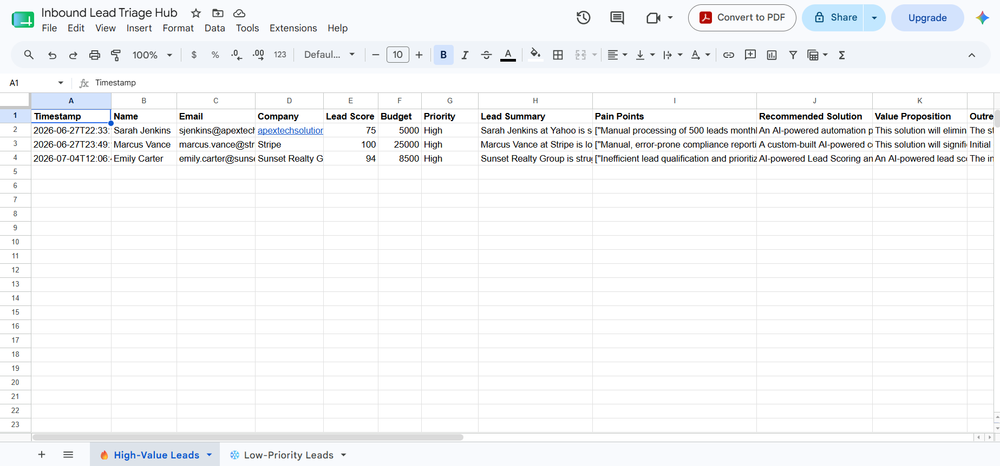
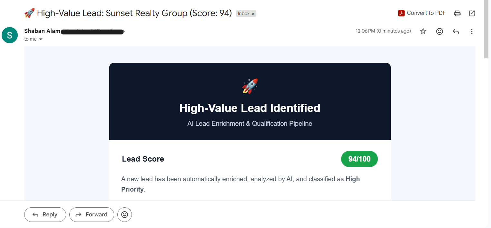

# 🎯 AI Lead Enrichment & Qualification Pipeline


A production-ready n8n pipeline that converts raw Typeform submissions into qualified, sales-ready intelligence with no human triage step in between. Every inbound lead is normalized, enriched against Apollo's company database, scored through a deterministic four-category rule set, and routed by that score: leads clearing the qualification threshold are handed to an LLM agent that generates a complete outreach strategy — pain points, recommended solution, value proposition, personalized opening line, subject line, and a confidence-scored deal estimate — while leads that don't qualify are logged with their disqualification reason and never reach the AI layer at all. Both outcomes are written to a dual-tab Google Sheets CRM and confirmed with a distinct branded email notification.

> **Case study included.** This README documents the general-purpose architecture. A full business case study — problem framing, ROI narrative, and a real-world deployment scenario for a real estate brokerage — is included at [`case-study/ai-lead-enrichment-qualification-pipeline.pdf`](./case-study/ai-lead-enrichment-qualification-pipeline.pdf).

---

## Problem

Real estate teams and brokerages generate leads continuously from a wide mix of channels — Zillow and other property portals, Facebook and Instagram ad campaigns, direct website inquiries, and open-house sign-ins. Volume is rarely the bottleneck. The bottleneck is that every one of those inquiries still has to be read, judged, and prioritized by a person before an agent ever picks up the phone, and that judgment step is where the whole system slows down.

- **Manual triage does not scale with inquiry volume.** A single active listing campaign running across a property portal, paid social, and a brokerage's own site can generate dozens of inbound inquiries in a day. An agent or intake coordinator reading each one, forming an impression, and deciding who gets a same-day callback is a process that degrades the moment volume exceeds what one person can comfortably review between showings and closings.
- **Prioritization without enrichment data is guesswork.** A one-line inquiry from a pre-approved, ready-to-transact buyer looks, on the page, identical to a casual browser six months out from actually buying — until someone manually cross-references the inquiry against whatever context is available. Most teams skip that lookup entirely and default to responding in the order inquiries arrived, which has no relationship to which lead is actually worth pursuing first.
- **Inconsistent qualification standards erode trust in the pipeline.** When "hot lead" means whatever the person who happened to read the inquiry decided it means, two functionally identical buyer or seller inquiries can receive completely different follow-up speed depending on who saw them first. Sales leadership loses the ability to trust their own pipeline data.
- **High-intent buyers and sellers are not identified or contacted quickly enough.** Response speed is one of the most reliable predictors of conversion in real estate, and it is exactly the metric manual triage puts at risk — a genuinely serious inquiry sitting in a shared inbox behind a dozen lower-intent ones has no way to signal that it should be called first.
- **Lead information arrives scattered and inconsistent across platforms.** A portal lead, a paid social lead-ad submission, and a website form each arrive in a different shape with different fields, making any kind of standardized scoring or prioritization difficult without first normalizing what actually came in.
- **CRM hygiene degrades when logging depends on someone remembering to do it.** Inquiries that don't immediately look promising often never make it into a spreadsheet or CRM at all — there is no record of them, no reason captured for why they were deprioritized, and no way to revisit them later if circumstances change.
- **Low-priority inquiries consume time that could go to higher-value prospects.** Every minute spent reading, evaluating, and manually filing an inquiry that was never going to convert this quarter is a minute not spent on the buyer or seller who is.

The result is a sales process where response time and consistency — the two variables that most directly affect whether an inbound inquiry converts — are also the two variables most exposed to manual bottlenecks. This pipeline replaces the judgment call with a repeatable, enrichment-backed, AI-assisted process that treats every inquiry the same way, at the same speed, regardless of who is on shift when it arrives.

---

## Solution

The AI Lead Enrichment & Qualification Pipeline intercepts every inbound submission at the moment it arrives and runs it through a fixed sequence before a human ever sees it. It was built and validated against exactly the scenario described above — a business fielding a steady stream of inbound inquiries from multiple channels — and the same architecture generalizes without modification to any inbound lead source: real estate buyer and seller inquiries, SaaS demo requests, agency consultations, or any other form-driven intake process.

A Typeform submission triggers the workflow immediately. The raw form responses — keyed by Typeform's full question text — are first normalized into a small set of clean, predictable field names. The normalized lead is then sent to Apollo's organization enrichment API using the submitted company domain, pulling back firmographic data including the company's primary domain and its departmental headcount breakdown. A code node interprets that enrichment response to determine two things: whether the lead's email domain is corporate or a consumer provider like Gmail or Yahoo, and an estimated total company size derived by summing Apollo's per-department headcount figures.

With enrichment complete, a scoring node applies a deterministic, four-category rubric — domain quality, stated budget, company size, and the richness of the submitted project description — to produce a single lead score between 0 and 100. That score is the sole input to a routing decision: leads at or above the qualifying threshold proceed to AI-powered analysis; leads below it are logged and excluded from further processing.

For qualifying leads, an AI Agent — backed by Gemini 2.5 Flash through OpenRouter — receives the full enriched lead profile and produces a structured sales intelligence package: a priority classification, a one-sentence lead summary, up to three likely pain points, a recommended automation or AI solution, a value proposition, a best-fit outreach channel, a complete outreach strategy, a personalized opening line, an email subject line, a call to action, a follow-up recommendation, an estimated deal size, and a confidence score. A Structured Output Parser enforces this exact schema, so the agent's output arrives as clean, addressable JSON rather than freeform text that would need further parsing. Nothing about this prompt is written specifically for real estate or any other vertical — it reasons entirely from whatever profile and description it's handed, which is what allows the identical workflow to score and personalize outreach sensibly for a mid-market SaaS company, an enterprise fintech, or a real estate brokerage without any per-industry configuration.

The enriched lead and its AI-generated strategy are merged into a single record, appended to the `🔥 High-Value Leads` tab of a shared Google Sheets CRM, and confirmed with a branded internal alert email containing the full sales brief and a one-click `mailto:` contact link. Leads that didn't qualify skip the AI step entirely — they are appended directly to the `❄️ Low-Priority Leads` tab with their score, enrichment data, and a standardized disqualification reason, and a separate, lower-key confirmation email notes that the lead was logged but no outreach was initiated.

The AI layer — the most expensive and slowest part of the pipeline — only ever runs for leads that have already cleared a deterministic bar. Every lead, regardless of outcome, leaves a complete record.

---

## Architecture

The workflow contains fourteen functional nodes organized as a single linear enrichment-and-scoring sequence that terminates in a two-way branch, with the high-value branch carrying its own AI sub-pipeline before reconverging into Sheets logging and email notification.

**Typeform Trigger** — The entry point. This node listens for new submissions to a specific Typeform form and fires one execution per response. The raw payload arrives keyed by the literal question text exactly as it appears in the form — fields like `"What is your full name?"` and `"What is your estimated development budget range?"` — which is why the very next node exists.

**Normalize Lead Data** — A Set node configured with `includeOtherFields: true` that remaps six raw Typeform question strings into clean, stable keys: `Name`, `Email`, `company`, `company website / domain`, `Project Description`, and `Budget` (explicitly typed as a number). This normalization step exists for the same reason it exists in every form-triggered workflow in this portfolio — it decouples every downstream node from the exact wording of the Typeform questions, so the form can be edited or rebuilt without breaking the pipeline, and every later node can reference a short, predictable key instead of a full sentence.

**Enrich Lead Data** — An HTTP Request node that performs a `POST` to Apollo's `https://api.apollo.io/v1/organizations/enrich` endpoint, sending the normalized `company website / domain` value as a JSON body parameter and authenticating via an `X-Api-Key` header. This call returns Apollo's organization-level firmographic data for the submitted domain, including the company's verified primary domain and a `departmental_head_count` breakdown — a per-department employee count used two nodes later to estimate company size. Critically, this node is configured with `onError: continueRegularOutput`, meaning that if Apollo cannot resolve the domain, rate-limits the request, or the company is unlisted in their database, the workflow does not halt. Execution continues with an empty or partial enrichment object, and every downstream node that reads from this response is written defensively enough to handle that absence gracefully.

**Evaluate Domain Quality** — A JavaScript Code node that interprets the Apollo response. It extracts `organization.primary_domain` and checks it against a hardcoded list of eight common consumer email providers — Gmail, Yahoo, Hotmail, Outlook, iCloud, Proton Mail, AOL, and Zoho — setting `is_corporate_domain` to `true` only if a domain was returned and it does not appear on that list. In parallel, it computes `company_size` by summing every value in Apollo's `departmental_head_count` object; if that object is empty or missing (as it will be whenever enrichment failed upstream), it falls back to Apollo's own `estimated_num_employees` figure, and ultimately to zero if neither is available. This node is what turns a raw, possibly-incomplete API response into two clean, always-present signals that the scoring node can rely on unconditionally.

**Calculate Lead Score** — The pipeline's scoring engine, and its most defensively written node. Because n8n's implicit item-pairing across multiple branch references can behave unpredictably once several nodes have touched the same execution, this Code node deliberately pulls its source data by explicitly referencing upstream nodes by name — `$('Normalize Lead Data').first().json` for the core lead fields, and `$('Typeform Trigger').first().json` specifically for the company name, checked against several possible casing variants (`"Company Name"`, `"Company name"`, `"company"`, `"company_name"`) to tolerate how the Typeform question might have been phrased. With clean inputs assembled, it applies four independent scoring rules: email domain quality contributes 30 points for a corporate domain or 5 for a consumer one; stated budget contributes 40 points at $5,000 or above, 25 points at $2,000 or above, or 10 points for any budget greater than zero; company size contributes 20 points at 100 or more employees, 10 points at 10 or more, or 5 points for any nonzero headcount; and project description richness contributes 10 points for descriptions over 150 characters or 5 points for descriptions over 50. The four contributions sum to a score clamped between 0 and 100. The node then reconstructs its output as a single clean object — `name`, `email`, `company`, `domain` (deliberately set to the literal string `"NA"` whenever the domain isn't corporate, since a non-corporate domain carries no enrichment value worth displaying), `project_description`, `budget`, `is_corporate_domain`, `company_size`, and `lead_score` — which becomes the canonical lead record every node from this point forward reads from.

**Route by Lead Quality** — A Switch node operating in Rules mode with two conditions evaluated against `lead_score`: the first checks whether the score is greater than or equal to 70, the second whether it falls below 70. The two outputs are mutually exclusive and together cover every possible score. The true branch (output 0) proceeds to AI-powered analysis; the false branch (output 1) bypasses the AI layer entirely and routes directly to low-priority logging. This threshold is also documented directly on the workflow canvas via a sticky note, keeping the qualification rule visible to anyone editing the pipeline without having to open the Switch node itself. This single node is what keeps the LLM call — the most expensive step in the pipeline — scoped only to leads that have already demonstrated a baseline level of fit.

**Generate AI Sales Intelligence** — A LangChain AI Agent node that receives the complete enriched lead object and a structured prompt instructing it to act as a senior B2B sales consultant and AI automation strategist. The prompt supplies every available signal — name, email, company, domain, company size, lead score, budget, and the full project description — and asks the model to determine a priority level, summarize the lead in one sentence, identify up to three likely business pain points, recommend a specific automation or AI solution that addresses them, articulate the business value of that solution, choose the best outreach channel from a defined set (Email, LinkedIn, Phone, or Email then LinkedIn), write a complete outreach strategy, draft a personalized opening sentence and email subject line, suggest a call to action, recommend a follow-up action, estimate an appropriate deal size given the lead's budget and company profile, and assign a numeric confidence score. The prompt explicitly instructs the model not to invent facts about the company and to base every recommendation on reasonable inference from the supplied data only — a constraint that holds regardless of what kind of business submitted the lead.

**AI Chat Model** — An OpenRouter language model node configured to call `google/gemini-2.5-flash` with a 5,000-token maximum output, connected to the Generate AI Sales Intelligence node as its `ai_languageModel` provider. This is the actual inference backend; the Agent node above it handles prompt construction and orchestration, while this node is solely responsible for executing the model call.

**Outreach Strategy Parser** — A LangChain Structured Output Parser connected to the Agent node as its `ai_outputParser`. It supplies a concrete JSON schema example containing all thirteen expected fields — `priority`, `lead_summary`, `pain_points` (an array), `recommended_solution`, `value_proposition`, `best_outreach_channel`, `outreach_strategy`, `personalized_opening`, `email_subject`, `call_to_action`, `next_follow_up`, `estimated_deal_size`, and `confidence_score`. This node is what converts the language model's natural-language reasoning into a strictly-shaped JSON object available at `$json.output`, which every downstream node addresses by exact field name rather than parsing free text.

**Combine Lead & AI Data** — A second Set node that consolidates data from three different upstream sources into one record ready for logging: `Name` and `Email` are pulled from `Normalize Lead Data`, `Company` and `Lead Score` from `Calculate Lead Score`, `Budget` from `Normalize Lead Data`, and the remaining eleven fields — Priority, Lead Summary, Pain Points, Recommended Solution, Value Proposition, Outreach Strategy, Personalized Opening, Email Subject, Call to Action, Next Follow-up, Estimated Deal Size, and Confidence Score — directly from the AI Agent's parsed `output` object. This node exists because the three upstream branches never naturally converge into a single item on their own; explicitly reassembling them here is what makes a clean, fully-populated row possible at the logging step.

**Log High-Value Lead** — A Google Sheets node that appends a new row to the `🔥 High-Value Leads` tab of the `Inbound Lead Triage Hub` spreadsheet, writing all eighteen fields produced by the Combine node: a timestamp plus every lead, enrichment, and AI-generated field. This sheet is the canonical sales-ready CRM view — every row represents a lead a salesperson can act on immediately, complete with the AI's full reasoning already attached.

**Notify High-Value Lead** — A Gmail node that dispatches a branded internal alert with the subject `🚀 High-Value Lead: [Company] (Score: [Lead Score])`. The email opens with a dark hero header and a rocket emoji under the heading "High-Value Lead Identified," followed by a green pill badge displaying the score out of 100. A structured details table presents name, company, email, a red priority badge, budget, estimated deal size, and AI confidence percentage. Color-coded sections follow: a blue-bordered Lead Summary, an amber-bordered Pain Points block, a green-bordered Recommended Solution, a Value Proposition paragraph, and an Outreach Strategy paragraph. A blue "Contact Lead" button links directly to a `mailto:` address pre-filled with the lead's email, putting the salesperson one click from first contact.

**Log Low-Priority Lead** — A Google Sheets node that appends to the separate `❄️ Low-Priority Leads` tab of the same spreadsheet, writing eleven fields: timestamp, name, email, company, domain (showing `"NA"` for non-corporate leads), budget, lead score, company size, the boolean corporate-email flag, a hardcoded `Reason` of `"Lead Score below qualification threshold"`, and a `Status` of `"New"`. This is a deliberately lighter record than the high-value sheet — there is no AI content to log, because none was ever generated.

**Notify Low-Priority Lead** — A Gmail node that sends a lower-key confirmation with the subject `📋 Low-Priority Lead Logged: [Company] (Score: [Lead Score])`. The email opens with a dark gray hero header, a clipboard emoji, and the heading "Low-Priority Lead Logged," followed by a gray pill badge showing the score. The body states plainly that the lead was evaluated and classified as Low Priority and that no outreach has been initiated, followed by a structured details table, a blue-bordered Qualification Result block explaining the disqualification reason, and a gray-bordered Recommendation block suggesting the lead be retained for future nurturing rather than discarded.

---

## Workflow Diagram



The AI Agent and its two supporting LangChain nodes only ever execute on the qualifying branch — the disqualified branch reaches Google Sheets and Gmail in two steps with no model inference involved at all.

---

## Tech Stack

| Technology | Role |
|---|---|
| **n8n** | Workflow orchestration engine — hosts the trigger, scoring logic, AI agent, and all downstream integrations |
| **Typeform Trigger** | Form submission listener — fires one execution per inbound lead with the full raw response payload |
| **Set Node (×2)** | Field normalization on intake and final data consolidation before logging |
| **HTTP Request (Apollo API)** | Calls Apollo's organization enrichment endpoint to retrieve firmographic data for the submitted company domain |
| **JavaScript Code Node (×2)** | Domain-quality evaluation and company-size derivation; deterministic four-category lead scoring with defensive node referencing |
| **Switch Node** | Score-threshold router that determines whether a lead proceeds to AI analysis or is logged as low priority |
| **LangChain AI Agent** | Orchestrates the structured prompt that produces the full sales intelligence package for qualifying leads |
| **OpenRouter LLM (Gemini 2.5 Flash)** | Language model backend powering the AI Agent's reasoning and content generation |
| **Structured Output Parser** | Enforces a strict thirteen-field JSON schema on the AI Agent's output, eliminating free-text parsing downstream |
| **Google Sheets** | Dual-tab CRM — `🔥 High-Value Leads` for AI-enriched, sales-ready records and `❄️ Low-Priority Leads` for disqualified leads |
| **Gmail (send ×2)** | Delivers a high-value alert with the full AI brief and a separate low-priority confirmation, each with a distinct branded template |
| **HTML Email Templates** | Dark hero headers, color-coded content blocks, and CTA buttons rendered per notification type |

---

## Features

- **Form-triggered intake** — the pipeline begins the instant a Typeform response is submitted, with no polling delay
- **Full field normalization on intake** — raw Typeform question text is remapped to stable keys before any other node touches the data
- **Third-party firmographic enrichment** — every lead's company domain is checked against Apollo's organization database for verified firmographic signals
- **Graceful enrichment failure handling** — the Apollo call is configured to continue on error, so an unresolvable domain or API outage never halts the pipeline
- **Consumer vs. corporate domain detection** — an explicit denylist of eight major consumer email providers distinguishes business inquiries from personal ones
- **Departmental headcount aggregation** — company size is derived by summing Apollo's per-department employee counts rather than relying on a single coarse figure
- **Estimated-employee fallback** — when departmental data is unavailable, the pipeline falls back to Apollo's overall employee estimate rather than defaulting to zero
- **Deterministic four-category scoring** — domain quality, budget, company size, and description richness are each scored independently and summed
- **Weighted scoring reflecting actual sales priorities** — budget carries the heaviest weight (40 points), followed by domain quality (30), company size (20), and description richness (10)
- **Score boundary enforcement** — the final lead score is explicitly clamped between 0 and 100 regardless of how the individual rule contributions sum
- **Defensive node-referencing pattern** — the scoring node explicitly pulls data by node name rather than relying on implicit item pairing, avoiding a known n8n data-linking edge case across multi-branch executions
- **Multi-variant field-key fallback matching** — company name and other identity fields are checked against several plausible Typeform question phrasings, tolerating form edits without breaking the pipeline
- **Non-corporate domain suppression** — leads without a verified corporate domain display `"NA"` rather than a misleading or unverified domain value
- **Score-based binary routing** — a single Switch node cleanly separates qualifying leads from disqualified ones at a documented 70-point threshold, with no overlap
- **AI inference scoped to qualified leads only** — the LLM is never invoked for a lead that hasn't already cleared the deterministic scoring bar, controlling both cost and latency
- **Industry-agnostic prompt design** — the AI Agent's prompt contains no vertical-specific assumptions, allowing the same pipeline to produce sensible, differentiated outreach strategies for a SaaS company, an enterprise fintech, or a real estate brokerage without reconfiguration
- **Structured prompt engineering** — the prompt explicitly constrains the model to base recommendations only on supplied data, reducing fabricated claims about the prospect's company
- **Thirteen-field AI-generated sales package** — priority, summary, pain points, recommended solution, value proposition, outreach channel, strategy, opening line, subject line, CTA, follow-up, deal size, and confidence score, generated in a single model call
- **Enforced JSON schema via Structured Output Parser** — the model's output is guaranteed to arrive in a fixed, addressable shape rather than requiring downstream regex or string parsing
- **AI confidence scoring** — every generated strategy includes a numeric self-assessed confidence score, giving the sales team a signal for how much to trust the recommendation
- **Up-to-three pain point identification** — the agent surfaces the most likely operational pain points without padding the list when fewer are evident
- **Outreach channel recommendation** — the agent selects the most appropriate first-contact channel from a defined set rather than defaulting to email for every lead
- **Ready-to-send opening line and subject line** — the AI output includes copy a salesperson can use directly, not just strategic guidance
- **Deal size estimation** — the agent projects an appropriate deal size by reasoning jointly over budget, company size, and project complexity
- **Three-source data consolidation before logging** — a dedicated Set node merges fields from the normalized lead, the scoring node, and the AI output into a single clean record
- **Dual-tab CRM structure** — high-value and low-priority leads are logged to separate tabs of the same spreadsheet, keeping the sales-ready view uncluttered by disqualified records
- **Full audit trail for every lead** — both qualifying and non-qualifying leads are logged with enough context to explain why they were classified the way they were
- **Standardized disqualification reasoning** — every low-priority record carries the same explicit reason string, keeping the CRM consistent rather than relying on free-text notes
- **Branded high-value alert email** — a color-coded HTML template surfaces the full AI sales brief at a glance, organized into summary, pain points, solution, value proposition, and outreach strategy sections
- **One-click lead contact** — the high-value email's CTA button opens a pre-addressed `mailto:` link, removing the step of locating the lead's email address
- **Branded low-priority confirmation email** — a distinct, lower-urgency template confirms the lead was processed and explains the disqualification without implying the lead was discarded
- **Nurture-path recommendation** — the low-priority email explicitly suggests retaining the lead for future reprocessing rather than treating disqualification as final
- **Modular node design** — the enrichment provider, scoring weights, AI model, and notification channels are each isolated to individual nodes and independently replaceable

---

## Screenshots

### Workflow

> **`images/workflow.png`**
>
> 

The complete fourteen-node pipeline in the n8n editor. The linear intake-and-scoring sequence — Typeform Trigger through Route by Lead Quality — runs left to right along the bottom row, with the connected Typeform form ID visible in the trigger's subtitle, confirming this is wired to a live form rather than a template placeholder. From the Switch node, the high-value path rises into the AI sub-pipeline: Generate AI Sales Intelligence sits above with its AI Chat Model and Outreach Strategy Parser connected below it as LangChain sub-resources, then continues right through Combine Lead & AI Data into Log High-Value Lead and Notify High-Value Lead. The low-priority path runs along the lower row directly into Log Low-Priority Lead and Notify Low-Priority Lead, bypassing the AI layer entirely. The sticky note on the canvas documents the exact scoring methodology and the 70-point routing threshold, and matches the Switch node's actual configured condition exactly — the in-canvas documentation and the executing logic agree.

---

### Workflow Architecture

> **`images/workflow-architecture.png`**
>
> 

A simplified, presentation-ready version of the same pipeline, built for the case study and intended for a non-technical audience — a brokerage owner or sales manager evaluating the system rather than an engineer maintaining it. Seven stages are rendered as icons with a connecting arrow: Lead Capture, Lead Enrichment, Lead Scoring, AI Analysis, Smart Routing, Google Sheets, and Gmail Alerts, closing with the line "Transform raw inbound leads into AI-qualified sales opportunities." Where the n8n screenshot above documents exactly what executes, this diagram documents exactly what a client needs to understand to trust the system — the same architecture communicated at two different levels of technical depth for two different audiences.

---

### Sample Input

> **`images/sample-input.png`**
>
> 

A code block showing the fully normalized and scored lead object as it exists immediately after the Calculate Lead Score node, for a submission from Emily Carter at Sunset Realty Group. Every field the Architecture section describes is present and correctly typed — `is_corporate_domain` as a native boolean, `company_size` and `lead_score` as native numbers rather than strings — confirming that the normalization and scoring layers hand off a clean, fully-shaped object rather than something a downstream node would need to coerce or re-parse.

---

### Sample Output

> **`images/sample-output.png`**
>
> 

The complete thirteen-field AI-generated sales intelligence object for the same submission, produced by Generate AI Sales Intelligence and shaped by the Outreach Strategy Parser. Every field described in the Architecture section is present — `priority`, `lead_summary`, `pain_points` as an array of three distinct items, `recommended_solution`, `value_proposition`, `best_outreach_channel`, `outreach_strategy`, `personalized_opening`, `email_subject`, `call_to_action`, `next_follow_up`, `estimated_deal_size`, and `confidence_score` — and every value is grounded in specifics the submission actually contained (Zillow, Facebook Ads, manual agent review), not generic filler that could apply to any lead regardless of industry.

---

### Google Sheets Log

> **`images/sheets-log.png`**
>
> 

The `🔥 High-Value Leads` tab of the `Inbound Lead Triage Hub` spreadsheet, now showing three qualified leads logged across separate executions: a lead scoring 75 from Apex Tech Solutions, a lead scoring 100 from Stripe, and the Sunset Realty Group lead scoring 94. The three rows span three genuinely different kinds of businesses — a small tech vendor, a large fintech enterprise, and a real estate brokerage — and each is fully populated across the same eighteen columns, with Lead Summary, Pain Points, Recommended Solution, and Value Proposition all visibly present and distinct per row. That variety is the clearest evidence that the scoring rubric and the AI prompt generalize across industries rather than having been tuned to any one of them. The adjacent `❄️ Low-Priority Leads` tab remains visible in the sheet navigation bar for disqualified submissions.

---

### Gmail Alert

> **`images/gmail-alert.png`**
>
> 

The internal high-value alert as delivered to Gmail for the Sunset Realty Group lead, with the subject "🚀 High-Value Lead: Sunset Realty Group (Score: 94)". The dark navy hero header carries the rocket emoji and the heading "High-Value Lead Identified," subtitled "AI Lead Enrichment & Qualification Pipeline," with a green rounded pill displaying "94/100" beside the Lead Score label. The visible body text confirms the lead was automatically enriched, analyzed by AI, and classified as High Priority — matching the branded template documented in Architecture, whose full Lead Summary, Pain Points, Recommended Solution, Value Proposition, and Contact Lead button continue further down the email.

---

## How It Works

1. **A prospect submits the inquiry form.** Typeform captures responses to six questions — name, business email, company name, company website or domain, project description, and estimated budget range. The Typeform Trigger fires immediately on submission and passes the full raw response, keyed by question text, into the workflow.

2. **Field names are normalized.** The Normalize Lead Data Set node remaps the verbose Typeform question strings to short, stable keys — `Name`, `Email`, `company`, `company website / domain`, `Project Description`, and `Budget` — while preserving any additional fields the form might collect via `includeOtherFields`.

3. **The company domain is sent to Apollo for enrichment.** The Enrich Lead Data HTTP Request node issues a `POST` to Apollo's organization enrichment endpoint with the normalized domain in the request body. If the call fails or the domain is unresolvable, the node is configured to continue rather than halt the pipeline.

4. **Domain quality and company size are derived.** The Evaluate Domain Quality Code node reads whatever Apollo returned — or didn't — and determines two facts: whether the domain belongs to a known consumer email provider, and an estimated company headcount, computed by summing departmental counts or falling back to Apollo's overall employee estimate.

5. **The lead score is calculated.** The Calculate Lead Score Code node pulls clean source data directly from the Normalize Lead Data and Typeform Trigger nodes by name, then applies four weighted rules — domain quality, budget, company size, and description length — summing them into a single score between 0 and 100. The node also decides, at this point, whether to display the lead's actual domain or suppress it to `"NA"` based on whether it was verified as corporate.

6. **The lead is routed by score.** The Route by Lead Quality Switch node evaluates the calculated score against the 70-point qualifying threshold. Leads at or above it proceed to AI analysis; leads below it skip directly to low-priority logging.

7. **Qualifying leads reach the AI Agent.** The Generate AI Sales Intelligence node receives the complete enriched lead profile and sends a structured prompt to the connected Gemini 2.5 Flash model via OpenRouter, instructing it to act as a senior B2B sales consultant.

8. **The model's output is constrained to a strict schema.** The Outreach Strategy Parser supplies a thirteen-field JSON schema that the Agent's response must conform to, guaranteeing a clean, predictable output object rather than free-form text that would require further parsing.

9. **The AI generates the full sales intelligence package.** Within the schema, the model determines priority, summarizes the lead, identifies up to three pain points, recommends a solution, articulates its value, selects an outreach channel, drafts a strategy, opening line, subject line, call to action, follow-up recommendation, estimated deal size, and a numeric confidence score — basing every claim strictly on the data it was given.

10. **Lead and AI data are consolidated.** The Combine Lead & AI Data Set node pulls identity fields from Normalize Lead Data, the score and company name from Calculate Lead Score, and all thirteen AI-generated fields from the Agent's parsed output, assembling one complete record.

11. **The high-value lead is logged.** The Log High-Value Lead Google Sheets node appends the consolidated record as a new row in the `🔥 High-Value Leads` tab of the Inbound Lead Triage Hub spreadsheet.

12. **A high-value alert is dispatched.** The Notify High-Value Lead Gmail node sends a branded internal email with the company name and score in the subject line, the full AI brief organized into color-coded sections, and a one-click `mailto:` contact button.

13. **Disqualified leads are logged independently.** For leads that didn't meet the threshold, the Log Low-Priority Lead node appends a leaner record directly from the scoring node's output — no AI step occurs on this path at all — including the standardized disqualification reason.

14. **A low-priority confirmation is dispatched.** The Notify Low-Priority Lead Gmail node sends a visually distinct, lower-urgency email confirming the lead was logged, stating plainly that no outreach was initiated, and recommending the lead be retained for future nurturing rather than discarded outright.

---

## Sample Input

A realistic Typeform submission as it arrives at the trigger:

```
What is your full name?                          Emily Carter
What is your business or primary email address?   emily.carter@sunsetrealtygroup.com
What is your company name?                        Sunset Realty Group
What is your company website / domain?            sunsetrealtygroup.com
Please describe your project or operational
  bottleneck.                                      We're generating a high volume of buyer
                                                    inquiries from Zillow, Facebook Ads, and
                                                    our website, but our agents are manually
                                                    reviewing every lead. This delays
                                                    follow-ups, causes promising buyers to
                                                    slip through the cracks, and makes it
                                                    difficult to prioritize serious prospects.
What is your estimated development budget range?   8500
```

After Normalize Lead Data, the payload becomes:

```json
{
  "Name": "Emily Carter",
  "Email": "emily.carter@sunsetrealtygroup.com",
  "company": "Sunset Realty Group",
  "company website / domain": "sunsetrealtygroup.com",
  "Project Description": "We're generating a high volume of buyer inquiries from Zillow, Facebook Ads, and our website...",
  "Budget": 8500
}
```

After Apollo enrichment, Evaluate Domain Quality, and Calculate Lead Score, the object leaving the scoring node — reproduced exactly in the Sample Input screenshot above — is:

```json
{
  "name": "Emily Carter",
  "email": "emily.carter@sunsetrealtygroup.com",
  "company": "Sunset Realty Group",
  "domain": "sunsetrealtygroup.com",
  "project_description": "We're generating a high volume of buyer inquiries from Zillow, Facebook Ads, and our website, but our agents are manually reviewing every lead. This delays follow-ups, causes promising buyers to slip through the cracks, and makes it difficult to prioritize serious prospects.",
  "budget": 8500,
  "is_corporate_domain": true,
  "company_size": 18,
  "lead_score": 94
}
```

Applying the four scoring rules to this submission: a corporate domain contributes 30 points, a budget of $8,500 clears the $5,000-or-above tier for 40 points, a company size of 18 falls into the 10-to-99 employee tier for 10 points, and a project description well over 150 characters contributes the full 10 points for richness. The scored object recorded above shows a final `lead_score` of 94, comfortably clearing the 70-point qualifying threshold and routing the lead into the AI branch.

---

## Sample Output

**AI-generated sales intelligence (Generate AI Sales Intelligence output):**

```json
{
  "priority": "High",
  "lead_summary": "Emily Carter from Sunset Realty Group is looking to automate lead qualification and prioritize serious home buyers to improve agent response times and increase conversion rates.",
  "pain_points": [
    "Agents manually review every incoming lead before making contact",
    "High-intent buyers are delayed because all leads receive equal priority",
    "Lead information is scattered across multiple platforms, reducing sales efficiency"
  ],
  "recommended_solution": "Deploy an AI-powered Lead Enrichment & Qualification Pipeline that automatically enriches incoming leads, scores buying intent, generates AI-driven sales insights, logs qualified leads into the CRM, and instantly notifies agents of high-value opportunities.",
  "value_proposition": "Reduce lead qualification time from several minutes to under one minute while helping agents focus on prospects most likely to buy, improving response times and maximizing conversion opportunities.",
  "best_outreach_channel": "Phone Call",
  "outreach_strategy": "Emphasize faster lead response and AI-based lead prioritization. Demonstrate how automating qualification allows agents to spend more time closing deals instead of sorting leads.",
  "personalized_opening": "I noticed your team is attracting leads from multiple marketing channels. We help real estate teams automatically identify serious buyers, prioritize them instantly, and notify the right agent without any manual effort.",
  "email_subject": "Help your agents reach serious buyers before your competitors do",
  "call_to_action": "Would you be available for a 20-minute discovery call this week to discuss how AI-powered lead qualification can improve your team's response time and conversion rate?",
  "next_follow_up": "If there's no response within 3 business days, send a LinkedIn follow-up highlighting a case study demonstrating faster lead response and improved qualification accuracy.",
  "estimated_deal_size": "$4,000-$7,500",
  "confidence_score": 97
}
```

**Google Sheets — `🔥 High-Value Leads` row:**

```
Timestamp              Name           Email                              Company              Lead Score  Budget  Priority
2026-07-04T12:06:...    Emily Carter   emily.carter@sunsetrealtygroup...  Sunset Realty Group  94          8500    High
```

**High-value alert email:**

```
Subject: 🚀 High-Value Lead: Sunset Realty Group (Score: 94)

┌──────────────────────────────────────────────────────────────┐
│  🚀 High-Value Lead Identified                                │
│  AI Lead Enrichment & Qualification Pipeline                  │
├──────────────────────────────────────────────────────────────┤
│  Lead Score                                       [94/100]    │
│                                                                │
│  A new lead has been automatically enriched, analyzed by      │
│  AI, and classified as High Priority.                         │
│                                                                │
│  📝 Lead Summary  |  ⚠ Pain Points  |  💡 Solution  |  🎯 Value │
│                                                                │
│  [ Contact Lead → ] (mailto:emily.carter@sunsetrealtygroup.com)│
└──────────────────────────────────────────────────────────────┘
```

For comparison, a submission that fails to clear the threshold never reaches the AI layer at all. A lead scoring 20 — a non-corporate domain, a budget under $500, and no verifiable company size — produces only:

**Google Sheets — `❄️ Low-Priority Leads` row:**

```
Timestamp              Name          Email                  Company              Domain  Budget  Lead Score  Company Size  Corporate Email  Reason                                     Status
2026-06-28T15:13:...   Kevin Smith   kevinsmith9942@...     Just Me / Freelancer  NA      250     20          0             FALSE            Lead Score below qualification threshold  New
```

**Low-priority confirmation email:**

```
Subject: 📋 Low-Priority Lead Logged: Just Me / Freelancer (Score: 20)

This lead has been automatically evaluated by the AI Lead Enrichment &
Qualification Pipeline and classified as Low Priority. No outreach has
been initiated.

Qualification Result: Lead Score below qualification threshold
Recommendation: Store this lead for future nurturing campaigns.
```

---

## Future Improvements

The current pipeline runs a single intake source through a binary qualification gate. The architecture supports substantial extension without restructuring the core flow:

- **CRM integration** — replace or supplement the Google Sheets logging with a direct write to HubSpot, Salesforce, or a vertical-specific CRM such as Follow Up Boss or kvCORE for real estate teams, syncing lead score and AI-generated fields as native properties rather than spreadsheet rows
- **Lead deduplication** — before logging, check existing High-Value and Low-Priority records for a matching email or domain, updating an existing record instead of creating a duplicate entry
- **Slack alerts for high-value leads** — add a parallel notification branch that posts a condensed version of the AI brief to a sales channel in real time, alongside the email
- **Telegram alerts for field agents** — for teams where agents are mobile rather than at a desk, mirror the high-value alert to a Telegram bot for faster on-the-go response
- **Additional enrichment providers** — layer in Clearbit, ZoomInfo, or LinkedIn Sales Navigator data alongside Apollo for a more complete firmographic and technographic picture
- **Individual-level enrichment** — extend enrichment beyond the company to the actual contact, pulling job title, seniority, or — in a real estate context — pre-approval and timeline signals to sharpen the AI's outreach personalization
- **Intent signal monitoring** — incorporate website visit tracking or content engagement signals as an additional scoring input, surfacing leads who have shown buying intent beyond the form submission itself
- **Meeting scheduling integration** — embed a Calendly or Cal.com booking link directly in the high-value alert and outreach copy, removing a manual step between AI recommendation and booked call
- **Configurable scoring weights** — externalize the four scoring categories and their point values into a configuration object or database table, allowing weight tuning without editing workflow code
- **Medium-priority tier** — extend the current binary routing into a three-way split, giving mid-scoring leads a distinct, lighter-touch treatment instead of folding them entirely into the low-priority path
- **Lead revalidation workflow** — build a secondary trigger that allows a previously low-priority lead to be reprocessed through enrichment and scoring if new information becomes available
- **Multi-agent AI pipeline** — split the single Agent call into a research-focused agent and a writing-focused agent, allowing the research step to incorporate broader context before the outreach copy is drafted
- **Analytics dashboard** — connect both Sheets tabs to Looker Studio to track qualification rate, average lead score, and conversion outcomes by score band over time
- **Vector search over historical leads** — store embeddings of past lead summaries to surface similar previously-won or previously-lost deals when a new lead arrives, informing the AI's recommendation
- **A/B testing for outreach copy** — generate two candidate opening lines or subject lines per lead and track which variant produces better response rates over time
- **Webhook-based CRM push** — replace the Sheets append with a webhook call to push qualified leads into an external system in real time rather than relying on a spreadsheet as the system of record
- **Automated email verification** — validate the submitted email address before logging, catching obviously invalid or disposable addresses before they reach either sheet
- **Duplicate-domain consolidation** — when multiple leads arrive from the same company domain, surface them as a single grouped opportunity rather than as unrelated rows
- **Time-zone-aware outreach scheduling** — delay the high-value alert, or a follow-up send, to align with the recipient's business hours based on inferred location

---

## Repository Structure

```
n8n-workflows/
└── ai-lead-enrichment-qualification-pipeline/
    ├── case-study/
    │   └── ai-lead-enrichment-qualification-pipeline.pdf   # Business case study: problem, ROI, and deployment narrative
    ├── images/
    │   ├── workflow.png                 # n8n editor screenshot
    │   ├── workflow-architecture.png    # Simplified pipeline diagram for non-technical stakeholders
    │   ├── sample-input.png             # Normalized + scored lead object
    │   ├── sample-output.png            # AI-generated sales intelligence object
    │   ├── sheets-log.png               # High-Value Leads Google Sheets tab
    │   └── gmail-alert.png              # High-value lead notification email
    ├── ai-lead-enrichment-qualification-pipeline.json      # Exported n8n workflow (importable directly)
    └── README.md
```

To deploy: import the workflow JSON into your n8n instance, connect Typeform, Apollo (API key), OpenRouter, Google Sheets, and Gmail credentials, update the Typeform form ID and Google Sheets spreadsheet ID to your own values, and activate. The workflow begins processing submissions immediately. For the full business case behind this build — including the ROI narrative for a real estate brokerage deployment — see the case study PDF included above.

---

## Author

**Shaban Alam**
Python Automation Developer · n8n Workflow Specialist · AI Automation Builder

Building production-ready automation systems for businesses that want to eliminate repetitive manual work.

- **GitHub:** [github.com/Shaban27-dev](https://github.com/Shaban27-dev)
- **Email:** shabandev27@gmail.com
- **Available for:** freelance automation projects, lead qualification pipelines, AI sales intelligence systems, CRM automation, Google Workspace integrations

> Open to projects involving n8n, Python automation, AI-powered lead scoring, sales enablement automation, enrichment pipelines, and business process automation — including vertical-specific deployments such as real estate lead qualification.

---

## Summary

AI Lead Enrichment & Qualification Pipeline is a production-grade sales intelligence system built on n8n. It demonstrates form-triggered intake, third-party firmographic enrichment with graceful failure handling, deterministic multi-category scoring with explicit boundary enforcement, cost-aware conditional AI invocation, LangChain Agent orchestration with a Structured Output Parser enforcing a strict response schema, multi-source data consolidation, dual-destination CRM logging, and two distinct branded HTML notification templates — all coordinated as a single pipeline with no manual triage step at any point between form submission and a sales-ready record.

The architecture reflects a deliberate design principle: deterministic logic decides who gets expensive AI treatment, not the other way around. Every lead is enriched and scored the same way regardless of outcome, which means the qualification bar is consistent across every submission rather than dependent on who happens to review it. The AI layer is reserved for the leads that have already proven, through objective signals, that they're worth a sales rep's time — and when it runs, it produces not just a score but a complete, ready-to-send outreach package grounded explicitly in the data it was given.

The system's generality is not theoretical — the same fourteen-node pipeline, with the same scoring weights and the same prompt, has processed and correctly prioritized leads from a small technology vendor, a large financial technology enterprise, and a real estate brokerage, producing coherent, differentiated outreach strategies for each without any per-industry configuration. That range is what makes the accompanying case study meaningful: a system built once, validated against a genuine real estate use case, and applicable well beyond it.

Each layer — the enrichment provider, the scoring weights, the language model, the CRM destination, the notification channel — is isolated to one or two nodes and replaceable without touching the rest of the pipeline. This project is part of an active automation portfolio. Additional workflows covering document processing, client intake, file management, price monitoring, and AI news intelligence are available in the linked GitHub repository.
