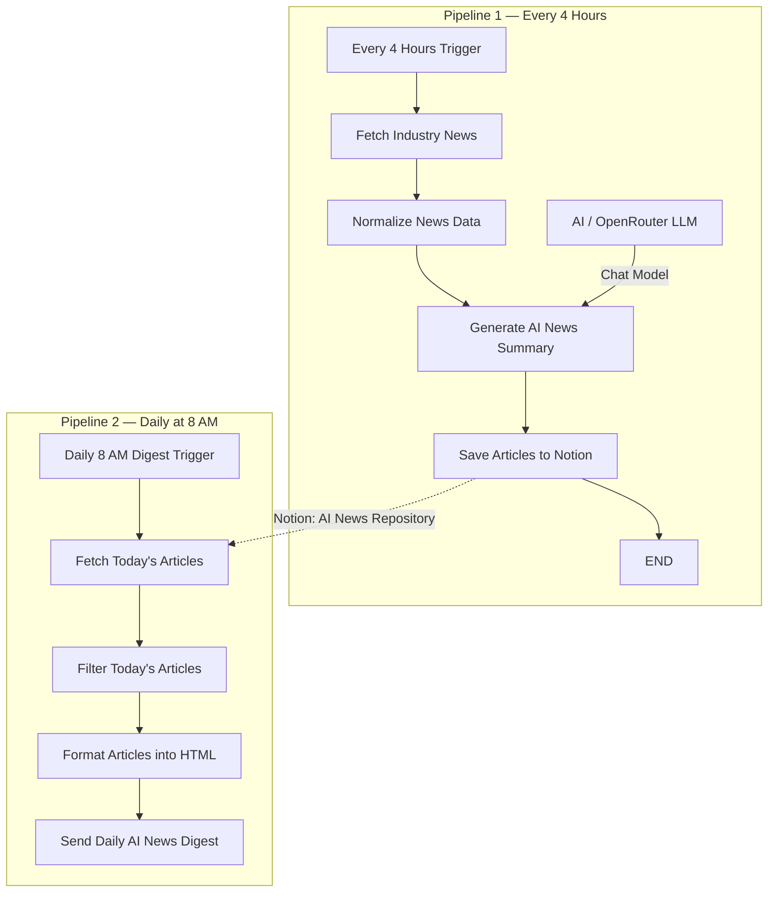
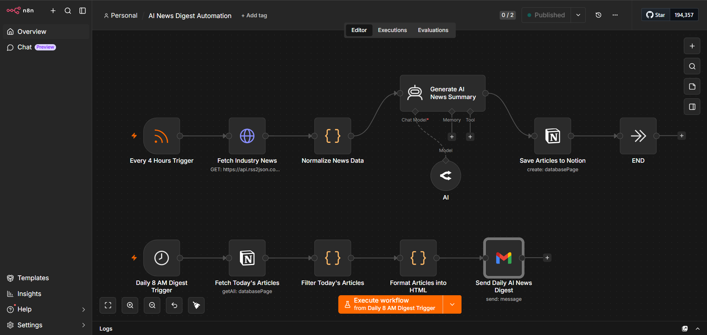
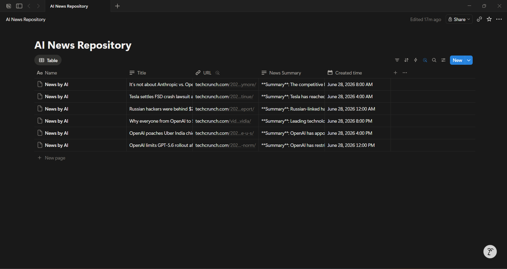
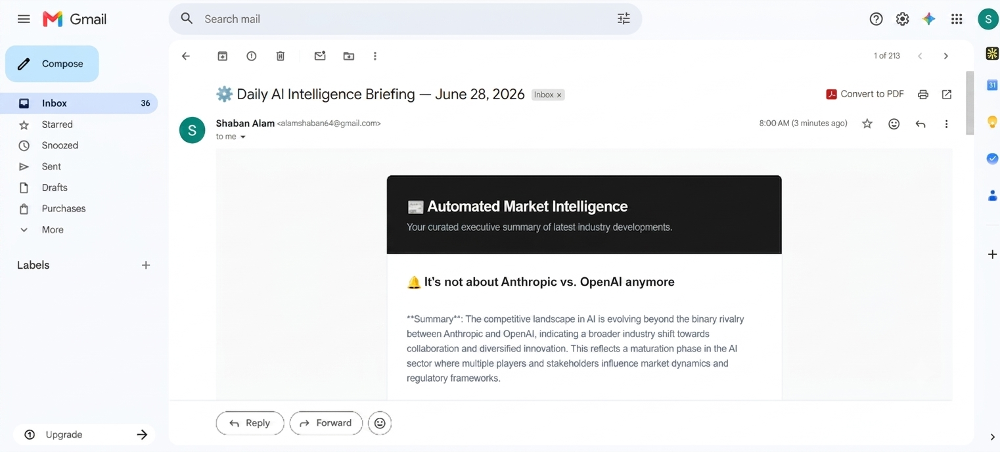

# 📰 AI News Digest Automation


A dual-pipeline n8n automation that monitors AI industry news around the clock, generates structured LLM summaries for every article, persists a searchable knowledge base in Notion, and delivers a curated executive briefing to your inbox every morning at 8:00 AM — with zero manual effort between the RSS feed and the email.

> **Development note:** During testing and validation, this workflow used the TechCrunch AI RSS feed, which publishes high-frequency content well-suited to end-to-end pipeline testing. The production configuration uses OpenAI's official RSS feed (`https://openai.com/news/rss.xml`) as the primary news source. This README describes the workflow as a general AI industry intelligence pipeline, not as a TechCrunch-specific tracker.

---

## Problem

Staying current with AI industry developments is increasingly expensive in terms of time and attention. The field moves fast — model releases, regulatory shifts, acquisitions, and research breakthroughs happen on a daily cadence — and the signal is spread across a dozen different sources with no central summary.

The manual alternative compounds the problem:

- **Multi-source monitoring is unsustainable.** Checking news sites, RSS readers, and newsletters throughout the day fragments attention without guaranteeing complete coverage.
- **Raw articles require active reading time.** A useful understanding of a news story requires context, not just the headline — and reading every article in full is not a realistic daily commitment.
- **No persistent record accumulates.** Individually read articles disappear from working memory. There is no searchable archive of what was covered, when, or what its significance was assessed to be.
- **Context arrives too late.** Without a scheduled digest, important developments from overnight are discovered reactively rather than as a structured morning briefing.
- **Manual curation doesn't scale.** For developers, founders, or agencies whose business depends on understanding the AI landscape, keeping up is genuinely a full-time input — and it should be automated.

---

## Solution

AI News Digest Automation runs two independent pipelines that together form a complete intelligence cycle.

The first pipeline runs every four hours. It monitors an AI industry RSS feed, fetches each new article, strips the raw content of HTML noise, and passes the clean title and source to an AI Agent node powered by OpenRouter. The agent generates a structured two-sentence executive summary and three bullet points identifying the article's likely industry impact. That output is saved as a new record in a Notion database called `AI News Repository`, alongside the article title, source URL, and a timestamped creation date.

The second pipeline runs once daily at 8:00 AM. It queries the Notion database for all articles logged in the preceding 24 hours, filters them by creation timestamp, formats each record into a styled HTML block containing the title, AI-generated summary, and a source link, and sends the compiled digest as a branded HTML email. The email's dark header identifies it as "Automated Market Intelligence," and the subject line includes the current date for easy inbox scanning.

By the time a reader opens their morning email, the Notion database already holds six to twelve structured article summaries accumulated during the night. The digest is the human-readable output of a knowledge base that has been building continuously in the background.

---

## Architecture

The workflow contains eleven nodes organized across two independent trigger pipelines. They share the Notion database as an intermediate persistence layer.

---

### Pipeline 1 — Article Ingestion (runs every 4 hours)

**Every 4 Hours Trigger** — An RSS Feed Trigger node that polls the configured AI news RSS source every four hours. Each new item in the feed initiates one workflow execution, passing the article's title, publication link, and raw metadata as the initial payload. This is the entry point for all article ingestion.

**Fetch Industry News** — An HTTP Request node that calls the `rss2json.com` conversion API, passing the Google News AI RSS feed URL as a query parameter. The API returns a structured JSON response containing parsed article items with their full content fields, converting the raw XML feed into a form n8n can process directly.

**Normalize News Data** — A JavaScript Code node that processes the raw HTTP response. It targets the `data` field of the API response, strips all `<script>` and `<style>` blocks along with their contents, removes all remaining HTML tags, and collapses whitespace into single-spaced clean text. The output is stored as `clean_article_text` on the item — a sanitized, readable representation of the article content suitable for LLM input.

**Generate AI News Summary** — An n8n AI Agent node (LangChain) that calls the connected OpenRouter language model with a structured prompt. The prompt instructs the agent to act as an executive research assistant and produce two outputs: a maximum two-sentence professional summary of the article's significance, and exactly three bullet points identifying potential industry impact, market changes, or regulatory implications. The agent is explicitly constrained to a corporate tone with no conversational filler. The title and source URL are drawn from the original RSS trigger item.

**AI (OpenRouter)** — The LLM provider node attached to the AI Agent. This is an OpenRouter connection that supplies the language model backend. It is configured with a 2,000-token maximum output, which is sufficient for the constrained summary format the prompt defines.

**Save Articles to Notion** — A Notion node that creates a new database page in the `AI News Repository` database for each processed article. Four properties are written: `Title` (rich text, the article headline), `URL` (url field, the source link), `News Summary` (rich text, the AI agent's output stored as the `output` field), and `Created time` (date, timestamped in the Asia/Kolkata timezone). Every execution of Pipeline 1 produces exactly one new Notion record.

**END** — A No-Op node that terminates Pipeline 1 cleanly after the Notion write completes.

---

### Pipeline 2 — Daily Digest Delivery (runs at 8:00 AM)

**Daily 8 AM Digest Trigger** — A Schedule Trigger node configured to fire once daily at 8:00 AM. It initiates Pipeline 2 independently of Pipeline 1, with no data dependency between them — Pipeline 2 reads exclusively from Notion.

**Fetch Today's Articles** — A Notion node that queries the `AI News Repository` database for up to 15 records, sorted by `created_time` in descending order. This retrieves the most recently added articles across the database without any pre-filtering, passing the full result set to the next node for time-based filtering.

**Filter Today's Articles** — A JavaScript Code node that applies a 24-hour recency filter. It constructs a `yesterday` timestamp by subtracting one day from the current time, then retains only those Notion records whose `property_created_time.start` falls within the window. This ensures the digest contains only articles that arrived since the previous morning's send, preventing duplicate coverage across consecutive digests.

**Format Articles into HTML** — A JavaScript Code node that iterates over the filtered article records and builds a composite HTML string. For each record, it extracts `property_title`, `property_news_summary`, and `property_url`, and wraps them in a styled HTML block containing a bold article title with a bell emoji prefix, the AI summary in body text, and a "Read Original Article →" link. A dashed border separates consecutive entries. If no articles pass the filter — for example, on a day with no new feed items — a fallback paragraph is rendered instead. The final HTML payload is returned as a single `html` field for the email node.

**Send Daily AI News Digest** — A Gmail node that injects the formatted HTML payload into a branded email template and dispatches it. The email opens with a dark header containing the title "📰 Automated Market Intelligence" and the subtitle "Your curated executive summary of latest industry developments." The article HTML is embedded in the content body, and the footer identifies the data source as the Notion Intelligence Hub. The subject line reads `⚙️ Daily AI Intelligence Briefing — [current date]`, formatted dynamically using n8n's `$now.toFormat()` function.

---

## Workflow Diagram

Two independent pipelines share a Notion database as the persistence layer between ingestion and delivery:



Pipeline 1 writes continuously throughout the day. Pipeline 2 reads from Notion once each morning and delivers the accumulated digest.

---

## Tech Stack

| Technology | Role |
|---|---|
| **n8n** | Workflow orchestration engine — hosts both pipelines, manages triggers, and connects all services |
| **RSS Feed Trigger** | Polls the AI news RSS source every four hours and fires one execution per new article |
| **HTTP Request** | Calls the rss2json API to convert the RSS feed into structured JSON with full article content |
| **JavaScript Code Node (×3)** | HTML normalization, 24-hour timestamp filtering, and HTML newsletter assembly |
| **AI Agent (LangChain)** | Orchestrates the LLM call with a structured prompt, enforcing output format and professional tone |
| **OpenRouter LLM** | Language model backend — generates article summaries and industry impact analysis |
| **Notion** | Persistent knowledge base — stores every processed article with its AI summary, URL, and timestamp |
| **Schedule Trigger** | Fires the digest pipeline at 8:00 AM daily without external cron management |
| **Gmail** | Delivers the formatted HTML digest email with the full article collection |
| **HTML Email Template** | Custom dark-header layout rendering article titles, summaries, and source links in a structured briefing format |

---

## Features

- **Dual-pipeline architecture** — ingestion and delivery run on independent schedules; the Notion database decouples them cleanly
- **Event-driven article ingestion** — a new RSS item triggers one complete execution of Pipeline 1 with no polling overhead beyond the RSS check interval
- **HTML stripping and content normalization** — raw article content is sanitized of all markup before reaching the LLM, ensuring the model receives clean input
- **Structured LLM summarization** — the AI Agent applies a constrained prompt that enforces a professional tone, a two-sentence summary cap, and exactly three impact bullet points per article
- **OpenRouter LLM backend** — model-agnostic summarization layer; swapping the underlying model requires changing the AI node's configuration, not the workflow structure
- **Persistent Notion knowledge base** — every article is stored with its full AI analysis, creating a queryable archive of AI industry coverage over time
- **24-hour temporal filtering** — the digest pipeline filters by creation timestamp to include only articles from the current cycle, preventing duplicate content across daily sends
- **Empty-state handling** — the HTML formatter includes a fallback message if no articles pass the filter, preventing empty or broken email renders
- **Dynamic date formatting** — the email subject line renders the current date at send time, making each digest immediately identifiable in an inbox
- **Branded HTML email layout** — dark header, body content area, and footer assembled into a consistent executive briefing format
- **Timezone-aware logging** — all Notion timestamps are recorded in Asia/Kolkata time, keeping the knowledge base and filter logic consistent across time zones
- **Fully unattended operation** — both pipelines run without any manual trigger, configuration, or review between RSS source and delivered email

---

## Screenshots

### Workflow

> **`images/workflow.png`**
>
> 

Both pipelines as they appear in the n8n editor. Pipeline 1 occupies the top lane — the RSS Trigger connects through the HTTP Request, Normalize, AI Agent, and Notion write nodes to END. Pipeline 2 runs across the bottom lane — the Schedule Trigger connects through the Notion fetch, JavaScript filter, HTML formatter, and Gmail send nodes. The OpenRouter AI node is visible below the AI Agent, connected as the chat model provider.

---

### Notion AI News Repository

> **`images/notion-database.png`**
>
> 

The `AI News Repository` database in Notion, populated during a full test run. Six articles are visible — all labeled "News by AI" in the Name column — with truncated titles, TechCrunch source URLs from the development testing phase, AI-generated summary text beginning with `**Summary**:`, and creation timestamps spanning June 28, 2026 at four-hour intervals from 12:00 AM through 8:00 PM. This is the intermediate store that Pipeline 2 reads from each morning.

---

### Daily AI Intelligence Briefing Email

> **`images/daily-news-email.png`**
>
> 

The digest email as it arrives in Gmail, with the subject "⚙️ Daily AI Intelligence Briefing — June 28, 2026" delivered at exactly 8:00 AM. The dark header reads "📰 Automated Market Intelligence" with the subtitle "Your curated executive summary of latest industry developments." The first article — "🔔 It's not about Anthropic vs. OpenAI anymore" — is displayed with its full AI-generated summary describing the shift in the competitive AI landscape beyond the binary Anthropic-OpenAI rivalry.

---

## How It Works

### Pipeline 1 — Article Ingestion

1. **A new article appears in the RSS feed.** The Every 4 Hours Trigger polls the configured AI news source at four-hour intervals. When a new item is detected, n8n fires one execution and passes the article's title, link, and metadata as the initial payload.

2. **The article content is fetched.** The Fetch Industry News HTTP Request node calls the rss2json conversion API, passing the Google News AI RSS URL as a query parameter. The API returns parsed article data in JSON format, including the full article content field for the matched item.

3. **HTML is stripped from the content.** The Normalize News Data Code node processes the raw response. It removes all `<script>` and `<style>` blocks first, then strips every remaining HTML tag, and finally collapses irregular whitespace into clean single-spaced text. The result is stored as `clean_article_text` — readable prose the LLM can process without markup interference.

4. **The AI Agent generates a structured summary.** The Generate AI News Summary Agent node sends a structured prompt to the OpenRouter LLM. The prompt supplies the article title and URL from the RSS trigger, instructs the model to adopt an executive research assistant persona, and constrains the output to a two-sentence professional summary followed by three industry impact bullet points. The model's response is captured as the `output` field.

5. **The article is saved to Notion.** The Save Articles to Notion node creates a new database page in `AI News Repository`. Four properties are written: the article title, the source URL, the AI-generated summary, and the current timestamp in Asia/Kolkata time. Execution terminates at the END node. The database now has one new structured record.

### Pipeline 2 — Daily Digest Delivery

6. **The digest pipeline fires at 8:00 AM.** The Daily 8 AM Digest Trigger initiates Pipeline 2 independently of Pipeline 1. No article data is passed — the trigger simply wakes the pipeline.

7. **Recent articles are retrieved from Notion.** The Fetch Today's Articles Notion node queries `AI News Repository` for up to 15 records sorted by creation time in descending order. This retrieves the full dataset without date filtering — the filtering happens in the next step.

8. **Articles are filtered to the last 24 hours.** The Filter Today's Articles Code node constructs a `yesterday` timestamp (current time minus 24 hours) and retains only records whose `property_created_time.start` falls within that window. Articles from previous days are excluded, ensuring the digest covers only the current cycle's content.

9. **Articles are formatted into an HTML newsletter body.** The Format Articles into HTML Code node loops through each filtered record and builds a styled HTML block for each article. Each block contains the article title prefixed with a bell emoji, the AI summary in body text, and a "Read Original Article →" link. Blocks are separated by dashed horizontal rules. If no articles pass the filter, a fallback message is rendered instead.

10. **The digest is sent.** The Send Daily AI News Digest Gmail node injects the HTML payload into a branded email template with a dark header, content area, and footer, and dispatches it to the configured recipient. The subject line includes the current date formatted as `MMMM dd, yyyy`. The email arrives at exactly 8:00 AM each day.

---

## Sample Input

A new item from the RSS feed as it arrives at the Every 4 Hours Trigger:

```
Title:     It's not about Anthropic vs. OpenAI anymore
Link:      https://techcrunch.com/2026/06/28/anthropic-openai-industry-anymore/
Published: Sun, 28 Jun 2026 08:00:00 +0530
Source:    TechCrunch (development testing) / OpenAI RSS (production)
```

After the Normalize News Data node, the content field becomes:

```
clean_article_text: "The competitive landscape in artificial intelligence is 
shifting away from a simple two-player rivalry toward a broader ecosystem of 
specialized models, open-source contributors, and enterprise-specific deployments. 
Analysts and industry observers are noting a significant diversification in how 
organizations are selecting and deploying AI infrastructure..."
```

Prompt sent to the OpenRouter AI Agent:

```
You are an expert executive research assistant. Summarize the following news 
story based on its headline title and reference data.

Constraints:
1. Tone must be professional, objective, and corporate-grade.
2. Provide a 2-sentence maximum high-level summary.
3. Extract exactly 3 professional bullet points predicting industry impact.

Title: It's not about Anthropic vs. OpenAI anymore
Reference Meta: https://techcrunch.com/2026/06/28/anthropic-openai-industry-anymore/
```

---

## Sample Output

**AI-generated summary stored in Notion:**

```
Name:         News by AI
Title:        It's not about Anthropic vs. OpenAI anymore
URL:          https://techcrunch.com/2026/06/28/anthropic-openai-industry-anymore/
News Summary: **Summary**: The competitive landscape in AI is evolving beyond
              the binary rivalry between Anthropic and OpenAI, indicating a
              broader industry shift towards collaboration and diversified
              innovation. This reflects a maturation phase in the AI sector
              where multiple players and stakeholders influence market dynamics
              and regulatory frameworks.

              **Key Takeaways**:
              - Enterprise AI procurement will increasingly favor multi-vendor
                strategies over single-provider lock-in.
              - Regulatory bodies will face greater complexity as the AI field
                fragments across a wider set of significant actors.
              - Open-source and specialized model providers stand to gain
                market share as the field moves beyond the dominant duopoly.

Created time: June 28, 2026 8:00 AM IST
```

**Email digest as received:**

```
Subject: ⚙️ Daily AI Intelligence Briefing — June 28, 2026

┌─────────────────────────────────────────────────────────────────┐
│  📰 Automated Market Intelligence                               │
│  Your curated executive summary of latest industry developments │
├─────────────────────────────────────────────────────────────────┤
│                                                                 │
│  🔔 It's not about Anthropic vs. OpenAI anymore                 │
│                                                                 │
│  **Summary**: The competitive landscape in AI is evolving       │
│  beyond the binary rivalry between Anthropic and OpenAI,        │
│  indicating a broader industry shift towards collaboration and   │
│  diversified innovation...                                      │
│                                                                 │
│  Read Original Article →                                        │
│- - - - - - - - - - - - - - - - - - - - - - - - - - - - - - - -│
│  🔔 OpenAI limits GPT-5.6 rollout after safety review           │
│                                                                 │
│  **Summary**: OpenAI has restricted access to its latest model  │
│  following an internal safety assessment...                     │
│                                                                 │
│  Read Original Article →                                        │
│                                                                 │
├─────────────────────────────────────────────────────────────────┤
│  This automated briefing was generated and compiled by your     │
│  operational AI engine.                                         │
│  Data Source: Notion Intelligence Hub • Synchronized Daily      │
└─────────────────────────────────────────────────────────────────┘
```

---

## Future Improvements

The current workflow handles one RSS source, one delivery channel, and one LLM backend. The dual-pipeline architecture is designed to absorb significant expansion:

- **Duplicate article detection** — before saving to Notion, check existing records for matching URLs or highly similar titles to prevent the same story from appearing in multiple digests
- **Multiple RSS source ingestion** — run parallel ingestion branches for additional feeds (Wired AI, MIT Technology Review, The Verge, ArXiv) that all write to the same Notion database
- **Category and topic tagging** — extend the AI prompt to assign category labels (model releases, regulation, research, funding) and write them as a Notion multi-select property for filtered views
- **AI importance scoring** — instruct the LLM to assign a relevance score from 1 to 10 based on likely industry impact, and use that score to order articles within the digest
- **Semantic article clustering** — use embeddings to group related stories across different sources before digest assembly, presenting the day's themes rather than individual articles
- **Keyword and topic filtering** — add a pre-LLM filter that excludes articles whose normalized text doesn't match a configurable keyword list, reducing noise in high-volume feeds
- **Sentiment analysis** — include a sentiment field in the Notion record (positive, neutral, cautionary) to allow filtering or visual coding in the digest
- **Slack and Microsoft Teams delivery** — add a parallel notification branch that posts the top three articles to a designated channel at a cadence separate from the morning email
- **Telegram digest delivery** — send a condensed version of the briefing to a Telegram bot for mobile-first consumption
- **Weekly executive report** — add a third pipeline that fires on Sunday mornings, queries the full week's Notion records, and generates a weekly synthesis email with trend analysis
- **Vector search over article history** — store embeddings alongside each Notion record to enable semantic search across the accumulated knowledge base
- **Custom digest frequency** — make the digest schedule configurable per subscriber, allowing some recipients to receive a briefing every four hours alongside those receiving the daily summary

---

## Repository Structure

```
n8n-workflows/
└── ai-news-digest-automation/
    ├── ai-news-digest-automation.json   # Exported n8n workflow (importable directly)
    ├── README.md
    └── images/
        ├── workflow.png                 # n8n editor screenshot showing both pipelines
        ├── notion-database.png          # AI News Repository database screenshot
        └── daily-news-email.png         # Gmail digest email screenshot
```

To deploy: import `ai-news-digest-automation.json` into your n8n instance, connect OpenRouter, Notion, and Gmail credentials, update the Notion database ID and RSS feed URL to your own values, and activate both pipelines. Pipeline 1 begins monitoring the RSS feed immediately; Pipeline 2 delivers its first digest at the next scheduled 8:00 AM.

---

## Author

**Shaban Alam**
Python Automation Developer · n8n Workflow Specialist · AI Automation Builder

Building production-ready automation systems for businesses that want to eliminate repetitive manual work.

- **GitHub:** [github.com/Shaban27-dev](https://github.com/Shaban27-dev)
- **Email:** shabandev27@gmail.com
- **Available for:** freelance automation projects, AI pipeline development, LLM integration, Notion automation, newsletter systems

> Open to projects involving n8n, Python automation, AI-augmented workflows, LLM integration, content intelligence pipelines, and business process automation.

---

## Summary

AI News Digest Automation is a production-grade, dual-pipeline intelligence system built on n8n. It demonstrates RSS-based event-driven ingestion, multi-step content normalization, LangChain AI Agent orchestration with an OpenRouter LLM backend, Notion as a structured intermediate persistence layer, timestamp-based data filtering, dynamic HTML email assembly, and scheduled digest delivery — across two independent pipelines that share a single database without coupling their execution.

The architecture deliberately separates concerns between the two pipelines: ingestion does not care when the digest fires, and the digest does not care how many sources feed the database. Each layer — the RSS trigger, the LLM summarizer, the Notion store, the HTML formatter, the email sender — is independently replaceable. Switching from OpenRouter to a different model provider, from Notion to Airtable, or from Gmail to SendGrid requires targeted node changes without structural refactoring.

This project is part of an active automation portfolio. Additional workflows covering client intake, file management, price monitoring, and lead qualification pipelines are available in the linked GitHub repository.
