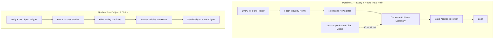
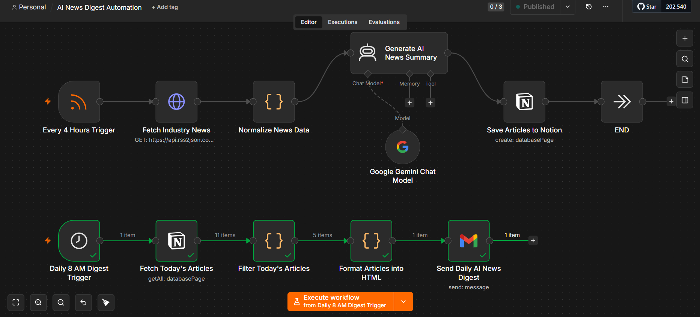
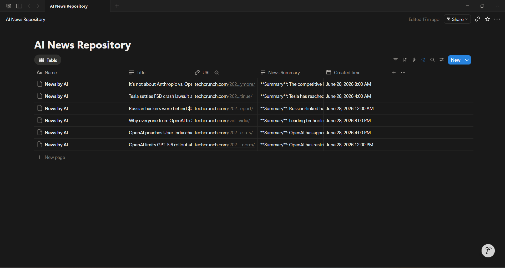
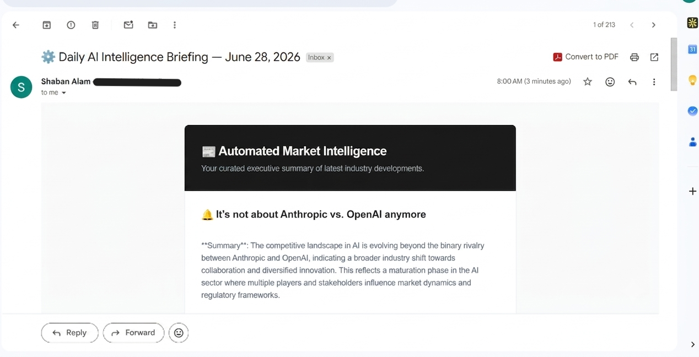

# 📰 AI News Digest Automation


-brightgreen?style=flat-square)


An n8n automation built from two independent pipelines that share a Notion database. Pipeline 1 polls an RSS feed every 4 hours, generates a short AI summary for the triggering article via an OpenRouter-backed AI Agent, and saves it to Notion. Pipeline 2 runs once daily at 8:00 AM, pulls recent Notion records, filters them to a rolling 24-hour window, and emails a formatted digest.

> **Development note:** During testing and validation, this workflow used the TechCrunch AI RSS feed, which publishes high-frequency content well-suited to end-to-end pipeline testing. The production configuration uses OpenAI's official RSS feed (`https://openai.com/news/rss.xml`) as the primary news source. This README describes the workflow as a general AI industry intelligence pipeline, not as a TechCrunch-specific tracker.

---

## Problem

Staying current with AI industry developments costs real time and attention. Checking news sites and RSS readers throughout the day fragments attention without guaranteeing coverage, raw articles take active reading time to extract value from, and without a scheduled digest there's no persistent, searchable record of what was covered or why it mattered.

---

## Solution

The workflow separates ingestion from delivery into two pipelines that never call each other directly — they're linked only through a shared Notion database.

Pipeline 1 polls an RSS feed every 4 hours. When it fires, the triggering item's title and link are sent to an AI Agent, which produces a short structured summary. That summary — along with the title, link, and a timestamp — is saved as a new page in a Notion database called "AI News Repository." Separately, in the same run, an HTTP Request node also fetches a Google News AI search feed via the rss2json API and cleans its HTML into plain text; as configured in this export, that cleaned text is not currently referenced by the AI Agent's prompt (see Known Behavior & Limitations below for the full detail).

Pipeline 2 fires independently once a day at 8:00 AM. It pulls up to 15 of the most recent Notion records, filters them down to whatever was created in the preceding 24 hours, formats the survivors into an HTML newsletter body, and sends it as a branded email via Gmail.

---

## Architecture

The workflow contains 12 nodes across two independent pipelines.

### Pipeline 1 — Article Ingestion (every 4 hours)

**Every 4 Hours Trigger** is an RSS Feed Read Trigger polling `https://openai.com/news/rss.xml` on an `everyX` schedule with a value of `4` (hours). This is a polling trigger — the workflow checks the feed periodically, not a push/webhook subscription — and it fires one execution per new feed item, carrying that item's title and link forward.

**Fetch Industry News** is an HTTP Request node that calls `https://api.rss2json.com/v1/api.json`, passing a Google News AI search feed as the `rss_url` query parameter (`https://news.google.com/rss/search?q=artificial+intelligence&hl=en-IN&gl=IN&ceid=IN:en`). This is a second, separate news source from the one that fired the trigger — the two are not the same feed.

**Normalize News Data** is a JavaScript Code node that takes the `data` field from the HTTP Request's response, strips `<script>`/`<style>` blocks and all remaining HTML tags, collapses whitespace, and stores the result as `clean_article_text`.

**Generate AI News Summary** is an n8n AI Agent (LangChain) node. Its prompt instructs the model to act as "an expert executive research assistant," producing a maximum two-sentence summary and exactly three bullet points on likely industry, market, or regulatory impact, in a professional and filler-free tone. The prompt's inputs are the **title and link of the item that fired the Every 4 Hours Trigger** — it does not reference `clean_article_text`, so the fetched Google News content produced by the two nodes above is not currently used by the summarizer.

**AI** is the language-model node feeding the Agent via a `Chat Model` connection. In the exported JSON it is an OpenRouter Chat Model node (`lmChatOpenRouter`) configured with a 2,000-token maximum output. No specific underlying model name is set in this node's parameters.

**Save Articles to Notion** is a Notion node that creates a page in the "AI News Repository" database. It writes four properties: `Title` (the trigger item's title), `URL` (the trigger item's link), `News Summary` (the Agent's `output`), and `Created time` (`$now`, timestamped in `Asia/Kolkata`). The Notion page's own title/Name field is a fixed string, `"News by AI"`, for every record.

**END** is a No-Op node that terminates Pipeline 1 after the Notion write.

### Pipeline 2 — Daily Digest Delivery (8:00 AM)

**Daily 8 AM Digest Trigger** is a Schedule Trigger configured with `triggerAtHour: 8`. It fires Pipeline 2 independently of Pipeline 1; nothing about Pipeline 1's execution state is passed in.

**Fetch Today's Articles** is a Notion `getAll` node against the same "AI News Repository" database, retrieving up to **15** records sorted by `created_time` descending. This step does not filter by date — it returns the most recent records up to the limit, whatever their age.

**Filter Today's Articles** is a JavaScript Code node that computes the current time and a `yesterday` timestamp 24 hours earlier, then keeps only records whose `property_created_time.start` falls within that rolling window (`created >= yesterday && created < now`). This is a 24-hour window measured from execution time, not a calendar-day boundary, and it operates on whatever subset `Fetch Today's Articles` already returned.

**Format Articles into HTML** is a JavaScript Code node that loops over the filtered records, reading `property_title`, `property_news_summary`, and `property_url` from each, and builds one styled HTML block per article (bell-emoji title, summary text, a "Read Original Article →" link). If no records survive the filter, it renders a single fallback message instead: "No new industry developments logged over the last 24 hours." The combined markup is returned as one `html` field.

**Send Daily AI News Digest** is a Gmail node that injects `{{ $json.html }}` into a branded template with a dark header ("📰 Automated Market Intelligence"), a subtitle, and a footer, then sends it. The subject is built dynamically: `⚙️ Daily AI Intelligence Briefing — {{ $now.toFormat('MMMM dd, yyyy') }}`. Unlike Pipeline 1, this node has no downstream connection in the JSON — the pipeline simply ends here, with no explicit `END` node on this branch.

---

## Workflow Diagram


```mermaid
flowchart TD
    subgraph P1["Pipeline 1 — Every 4 Hours (RSS Poll)"]
        A[Every 4 Hours Trigger] --> B[Fetch Industry News]
        B --> C[Normalize News Data]
        C --> D[Generate AI News Summary]
        M[AI — OpenRouter Chat Model] -. Chat Model .-> D
        D --> E[Save Articles to Notion]
        E --> F[END]
    end

    subgraph P2["Pipeline 2 — Daily at 8:00 AM"]
        H[Daily 8 AM Digest Trigger] --> I[Fetch Today's Articles]
        I --> J[Filter Today's Articles]
        J --> K[Format Articles into HTML]
        K --> L[Send Daily AI News Digest]
    end
```

Pipeline 1 and Pipeline 2 have no execution edge between them in the JSON — they run on independent schedules. The only thing connecting them is that both read from or write to the same Notion "AI News Repository" database.

---

## Tech Stack

| Technology | Role |
|---|---|
| **n8n** | Workflow orchestration engine — hosts both independent pipelines |
| **RSS Feed Read Trigger** | Polls `openai.com/news/rss.xml` every 4 hours |
| **HTTP Request** | Calls the rss2json API against a Google News AI search query |
| **JavaScript Code Node (×3)** | HTML/text normalization, rolling 24-hour filtering, HTML newsletter assembly |
| **AI Agent (LangChain)** | Runs the constrained summarization prompt |
| **OpenRouter Chat Model** | LLM backend for the AI Agent, capped at 2,000 output tokens |
| **Notion** | Shared persistence layer — one node creates pages, another queries them |
| **Schedule Trigger** | Fires the digest pipeline daily at 8:00 AM |
| **Gmail** | Sends the compiled daily digest email |

---

## Features

| Feature | Description |
|---|---|
| Two independent pipelines | Linked only through the shared Notion database, not a direct execution connection |
| 4-hour RSS polling | `Every 4 Hours Trigger` checks OpenAI's RSS feed on that interval |
| Secondary rss2json fetch | `Fetch Industry News` separately pulls a Google News AI search feed via rss2json |
| HTML/text normalization | Strips markup from the fetched Google News content into `clean_article_text` |
| Constrained AI summarization | Agent prompt enforces a 2-sentence cap and exactly 3 impact bullet points, in a professional tone |
| OpenRouter-backed LLM | Model-agnostic backend; swapping models is a node-config change |
| Notion persistence | Every summary is stored with title, URL, AI summary, and an Asia/Kolkata timestamp |
| Daily 8:00 AM digest | Independent Schedule Trigger fires the delivery pipeline once per day |
| Rolling 24-hour filter | Keeps only Notion records created within 24 hours of the current execution |
| 15-record retrieval cap | The Notion fetch step returns at most 15 records before filtering |
| HTML newsletter assembly | Builds one combined email body from the filtered records |
| Empty-state fallback | Renders a "no new developments" message if nothing survives the filter |

---

## Screenshots

### Workflow



Pipeline 1 across the top: the RSS trigger through `Fetch Industry News`, `Normalize News Data`, and the Agent (with its Chat Model connector visible below) into the Notion write and `END`. Pipeline 2 across the bottom, captured mid-execution: `Daily 8 AM Digest Trigger` (1 item) → `Fetch Today's Articles` (11 items) → `Filter Today's Articles` (5 items) → `Format Articles into HTML` (1 item) → `Send Daily AI News Digest` (1 item). Note: the Chat Model connector in this screenshot is labeled "Google Gemini Chat Model," which differs from the OpenRouter Chat Model node type in the exported JSON — see Known Behavior & Limitations.

### Notion AI News Repository



The "AI News Repository" database from a captured test run, showing six records — all named "News by AI" — with per-article titles, TechCrunch source URLs, AI-generated summaries beginning with `**Summary**:`, and creation times spaced roughly four hours apart across June 28, 2026. The TechCrunch URLs reflect the feed used during that test, not the OpenAI/Google News sources currently configured in the JSON.

### Daily AI Intelligence Briefing Email



The digest email as delivered, subject "⚙️ Daily AI Intelligence Briefing — June 28, 2026," received at 8:00 AM. The dark header reads "📰 Automated Market Intelligence" with the subtitle "Your curated executive summary of latest industry developments," followed by the article "It's not about Anthropic vs. OpenAI anymore" and its AI-generated summary.

---

## How It Works

### Pipeline 1 — Article Ingestion

1. **The RSS trigger polls** `openai.com/news/rss.xml` every 4 hours; a new item fires one execution and carries its title and link forward.
2. **A separate fetch runs in parallel** — `Fetch Industry News` calls rss2json against a Google News AI search feed, independent of the item that triggered the run.
3. **The fetched content is cleaned** by `Normalize News Data` into `clean_article_text`.
4. **The AI Agent generates a summary** using only the triggering item's title and link (not `clean_article_text`), via the OpenRouter-backed Chat Model.
5. **The result is saved to Notion** — title, URL, AI summary, and an Asia/Kolkata timestamp — and execution ends at `END`.

### Pipeline 2 — Daily Digest Delivery

6. **The Schedule Trigger fires at 8:00 AM**, independently of Pipeline 1.
7. **Up to 15 recent Notion records are fetched**, sorted by creation time, with no date filtering yet applied.
8. **Records are filtered to a rolling 24-hour window** based on the current execution time.
9. **The surviving records are formatted into one HTML body**, or a fallback message if none survive.
10. **The digest email is sent** via Gmail, with a date-stamped subject line; the pipeline ends here with no further connected node.

---

## Sample Input

Two distinct feeds exist in the current JSON:

```
RSS Trigger source:        https://openai.com/news/rss.xml
HTTP Request source:       https://news.google.com/rss/search?q=artificial+intelligence&hl=en-IN&gl=IN&ceid=IN:en
                            (fetched via rss2json; not referenced by the AI prompt)
```

Once an OpenAI feed item fires the trigger, only its title and link reach the AI Agent's prompt.

---

## Sample Output

The Notion and email examples below were captured in a test run that used a TechCrunch-sourced feed, prior to the workflow's current OpenAI/Google News configuration. The schema and formatting they show are accurate to the current JSON even though the source URLs are not.

**Notion record:**

```
Name:          News by AI
Title:         It's not about Anthropic vs. OpenAI anymore
URL:           techcrunch.com/...ymore/           (test data)
News Summary:  **Summary**: The competitive landscape in AI is evolving beyond
               the binary rivalry between Anthropic and OpenAI, indicating a
               broader industry shift towards collaboration and diversified
               innovation...

               **Key Takeaways**:
               - Enterprise AI procurement will increasingly favor multi-vendor
                 strategies over single-provider lock-in.
               - Regulatory bodies will face greater complexity as the AI field
                 fragments across a wider set of significant actors.
               - Open-source and specialized model providers stand to gain
                 market share as the field moves beyond the dominant duopoly.
Created time:  June 28, 2026 8:00 AM (Asia/Kolkata)
```

**Email digest (captured, 8:00 AM delivery):**

```
Subject: ⚙️ Daily AI Intelligence Briefing — June 28, 2026

┌─────────────────────────────────────────────────────────────────┐
│  📰 Automated Market Intelligence                               │
│  Your curated executive summary of latest industry developments │
├─────────────────────────────────────────────────────────────────┤
│                                                                 │
│  🔔 It's not about Anthropic vs. OpenAI anymore                 │
│                                                                 │
│  **Summary**: The competitive landscape in AI is evolving       │
│  beyond the binary rivalry between Anthropic and OpenAI,        │
│  indicating a broader industry shift towards collaboration and   │
│  diversified innovation...                                      │
│                                                                 │
│  Read Original Article →                                        │
│- - - - - - - - - - - - - - - - - - - - - - - - - - - - - - - -│
│  🔔 OpenAI limits GPT-5.6 rollout after safety review           │
│                                                                 │
│  **Summary**: OpenAI has restricted access to its latest model  │
│  following an internal safety assessment...                     │
│                                                                 │
│  Read Original Article →                                        │
│                                                                 │
├─────────────────────────────────────────────────────────────────┤
│  This automated briefing was generated and compiled by your     │
│  operational AI engine.                                         │
│  Data Source: Notion Intelligence Hub • Synchronized Daily      │
└─────────────────────────────────────────────────────────────────┘
```

In this captured run, `Fetch Today's Articles` returned 11 of the 15 possible records, `Filter Today's Articles` narrowed that to 5 within the rolling 24-hour window, and those 5 were combined into the single HTML payload behind one outgoing email.

---

## Known Behavior & Limitations

- **Two unrelated news sources coexist.** The RSS trigger polls OpenAI's feed; the HTTP Request node independently fetches a Google News AI search feed via rss2json. Only the trigger's item (title/link) reaches the AI prompt — the Google News fetch's cleaned output, `clean_article_text`, is not currently used anywhere downstream.
- **The AI Agent doesn't see full article text.** Its prompt is built entirely from the triggering item's title and link, not the normalized content from either fetched source.
- **Screenshot/JSON discrepancy on the AI model.** The exported JSON defines the "AI" node as an OpenRouter Chat Model (`lmChatOpenRouter`, 2,000 max tokens). The supplied workflow screenshot shows this same connector position labeled "Google Gemini Chat Model." This README documents the JSON as the source of record for implementation; the discrepancy itself is worth resolving before relying on this export.
- **No terminal node on Pipeline 2.** `Send Daily AI News Digest` has no downstream connection — execution simply ends after the email send, unlike Pipeline 1's explicit `END`.
- **Notion's 15-record fetch isn't date-filtered.** The 24-hour window is enforced entirely by the following Code node, applied to whatever the 15-record fetch already returned.
- **The 24-hour filter is rolling, not calendar-based.** It's a window measured from the moment Pipeline 2 runs, not "since midnight" or "since yesterday's digest."
- **Workflow is exported as active**, but OpenRouter, Notion, and Gmail credentials, the Gmail recipient, and the Gmail webhook ID are placeholder values that need to be replaced before this would run for real.
- **Captured screenshots reflect test data.** The Notion and Gmail screenshots show a TechCrunch-sourced test run, not the OpenAI/Google News sources currently configured in the JSON.

---

## Future Improvements

- **Reconcile the two news sources** — decide whether the Google News fetch should feed the AI prompt, replace the OpenAI trigger, or be removed
- **Duplicate article detection** before saving to Notion, based on URL or title similarity
- **Additional RSS sources** feeding the same Notion database
- **Category/topic tagging** via an extended AI prompt and a Notion multi-select property
- **Importance scoring** to help order or filter articles within the digest
- **Semantic clustering** of related stories across sources
- **Sentiment analysis** as an additional stored field
- **Slack/Teams delivery** as a parallel notification channel
- **Weekly synthesis report** as a third pipeline
- **Vector search** over the accumulated Notion history

---

## Repository Structure

```
ai-news-digest-automation/
├── images/
│   ├── daily-news-email.png
│   ├── notion-database.png
│   └── workflow.png
├── ai-news-digest-automation.json
└── README.md
```

**To deploy:** import `ai-news-digest-automation.json`; connect OpenRouter, Notion, and Gmail credentials; set the Notion "AI News Repository" database ID for both the write and read nodes; set the Gmail recipient; review the RSS trigger's feed URL (`openai.com/news/rss.xml`) and the separate rss2json query in `Fetch Industry News` — they are independent settings, not one shared source; then activate. Pipeline 1 begins polling immediately; Pipeline 2 sends its first digest at the next 8:00 AM.

---

## Author

**Shaban Alam**
Python Automation Developer · n8n Workflow Specialist · AI Automation Builder

Building automation systems for businesses that want to eliminate repetitive manual work.

- **GitHub:** [github.com/Shaban27-dev](https://github.com/Shaban27-dev)
- **Email:** shabandev27@gmail.com
- **Available for:** freelance automation projects, AI pipeline development, LLM integration, Notion automation, newsletter systems

> Open to projects involving n8n, Python automation, AI-augmented workflows, LLM integration, content intelligence pipelines, and business process automation.

---

## Summary

AI News Digest Automation is a two-pipeline reference implementation: a 4-hour RSS poll into an OpenRouter-backed AI Agent and Notion, decoupled from a daily 8:00 AM digest pipeline that reads the same Notion database and emails a formatted summary. The two pipelines share no direct execution connection, and the current JSON has a few loose ends worth resolving before real deployment — a second, currently-unused news fetch running alongside the RSS trigger, and a model-node discrepancy between the exported JSON and the workflow screenshot. As exported, credentials and the recipient address are placeholders, though the workflow itself is marked active.

This project is part of an active automation portfolio. Additional workflows covering client intake, file management, price monitoring, and lead qualification pipelines are available in the linked GitHub profile.
