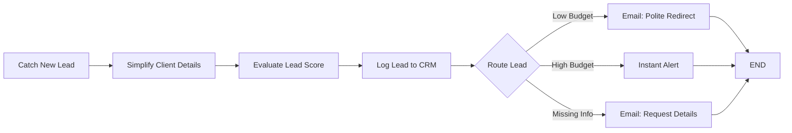
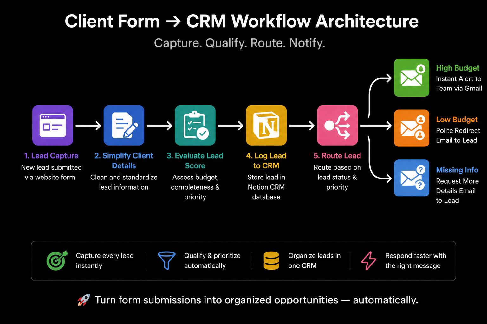
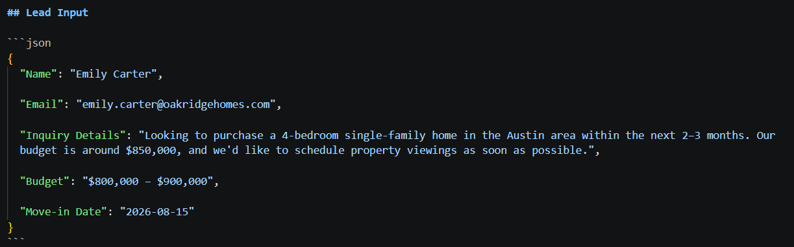
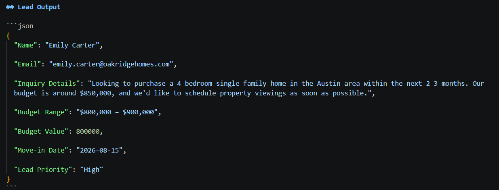

# 📋 Client Form → CRM
 


 
A production-ready n8n automation that handles the complete client intake pipeline — from the moment a prospect submits an inquiry form to the moment the right email lands in their inbox. Every submission is captured, cleaned, scored against business rules, logged to a Notion CRM, and routed to one of three distinct communication paths. No manual review, no repetitive data entry, no missed leads.
 
> **Case study included.** This README documents the general-purpose architecture. A full business case study — problem framing, ROI narrative, and a real-world deployment scenario for a real estate brokerage — is included at [`case-study/client-form-crm-case-study.pdf`](./case-study/client-form-crm-case-study.pdf).
 
---
 
## Problem
 
Real estate teams and brokerages live on lead flow. Website forms, listing inquiries, open-house sign-ins, referral requests, and paid ad campaigns can generate a new inquiry at any moment — the issue was never volume. The issue is handling.
 
- **Manual CRM entry creates lag.** Every minute spent copying a buyer or seller inquiry into a spreadsheet or database by hand is a minute that prospect isn't hearing back, and in a market where the same buyer may be inquiring with more than one brokerage, that lag is often the whole difference between winning the lead and losing it to whoever replies first.
- **Qualification is inconsistent.** Without a defined rule applied automatically, two functionally identical inquiries can be treated completely differently depending on which agent reads them and when. There is no shared definition of what actually counts as a serious lead.
- **Response emails are repetitive and slow.** Writing individual replies to below-threshold inquiries or incomplete submissions is mechanical work that compounds with volume, and it's exactly the kind of work that gets skipped when an agent is busy with showings.
- **Leads sit in inboxes instead of a CRM.** If an inquiry isn't manually logged, there is no record it ever existed — no audit trail, no way to revisit it later, and no visibility for anyone besides whoever happened to open that specific email.
- **Inconsistent follow-up across agents compounds the problem.** Without a shared, automatic intake process, follow-up speed and quality depend entirely on which agent the inquiry happened to land with, rather than being a property of the business itself.
- **High-intent prospects don't surface fast enough.** When every inquiry looks the same in a shared inbox, a serious, ready-to-transact buyer gets buried alongside listing questions and low-fit submissions, with nothing to signal that it should be answered first.
The cost isn't just administrative overhead — it's response speed and consistency, the two things that most directly determine whether a genuinely good lead goes cold before the right person ever sees it.
 
---
 
## Solution
 
Client Form → CRM replaces the entire manual intake process with an automated pipeline. It was built and validated against exactly this scenario for a real estate brokerage's buyer and seller inquiries, and the same architecture generalizes without modification to any inbound intake form — service inquiries, consultation requests, or any other form-driven client capture process.
 
The moment a prospect submits a Typeform inquiry, n8n captures the submission and passes it through a structured qualification sequence. A Set node normalizes the raw field names into clean, consistent keys — the underlying Typeform questions themselves stay generic and reusable ("Please describe your project briefly.", "What is your budget for this project?"), while the output keys are relabeled to read naturally for a real estate CRM: Inquiry Details, Budget Range, Move-in Date. A JavaScript Code node then applies the business scoring logic: any submission with a missing field or an insufficient description is flagged `Missing Info`; budgets at or above the $5,000 threshold are classified `High Budget`; everything else routes as `Low Budget`.
 
Before any email goes out, the lead is logged in full to a Notion CRM — name, email, inquiry details, move-in date, budget range, numeric budget value, and qualification status — regardless of which path it takes downstream. This ensures the CRM is always complete, even for leads that don't qualify.
 
A Switch node then routes execution into one of three paths. High-budget prospects trigger an internal priority alert with a structured prospect brief and a direct CRM link. Low-budget submissions receive a professionally written redirect email that closes the loop graciously. Incomplete inquiries receive a targeted follow-up asking for the specific details that were missing.
 
Every inquiry gets a response. Every lead gets logged. The process is consistent regardless of volume.
 
---
 
## Architecture
 
**Catch New Lead** — A Typeform Trigger node that listens for new form submissions and initiates the workflow immediately on receipt. It passes the raw Typeform response payload — including all field values keyed by their question labels — downstream as the initial data object.
 
**Simplify Client Details** — A Set node that remaps five verbose Typeform field labels into clean, consistent keys: `Name`, `Email`, `Inquiry Details`, `Budget Range`, and `Move-in Date`. Notably, the Typeform questions behind these keys remain generic, business-agnostic phrasing — `"Please describe your project briefly."`, `"What is your budget for this project?"`, `"When are you looking to start?"` — meaning the same intake form can be reused as-is for any client-facing deployment; only the CRM-facing labels this node produces have been tailored to read naturally for a real estate context. This normalization step isolates the rest of the workflow from Typeform's raw question-label format, making downstream references predictable and the workflow portable to other form providers.
 
**Evaluate Lead Score** — A JavaScript Code node that applies the qualification logic. It extracts each field value, trims whitespace, and substitutes explicit per-field `"Missing"` labels — `"Name Missing"`, `"Email Missing"`, `"Inquiry Details Missing"`, `"Budget Range Missing"`, `"Move-in Date Missing"` — for any empty input, so the CRM always receives a populated record rather than a blank property. The budget string is stripped of comma separators before a regex extracts its leading numeric value, which matters in a real estate context where budget figures routinely run into six digits with thousands separators (`"$800,000"` parses cleanly to `800000` rather than truncating at the first comma). The scoring rules are straightforward: if any field is blank or the inquiry description is under ten characters, the lead is flagged `Missing Info`; if the numeric budget is at or above 5,000, it is classified `High Budget`; otherwise, it is classified `Low Budget`. Rather than mutating the incoming item, the node explicitly constructs a new, minimal output object holding exactly seven fields — `Name`, `Email`, `Inquiry Details`, `Budget Range`, `Budget Value`, `Move-in Date`, and `Lead Priority` — guaranteeing no stray fields survive from upstream nodes into the CRM write.
 
**Log Lead to CRM** — A Notion node that creates a new database page in the `CRM Log Lead` database, writing seven properties: Name (title), Email (email field), Inquiry Details (rich text), Move-in Date (date, localized to Asia/Kolkata), Budget Range (rich text), Budget Value (number), and Status (rich text). The Notion property itself is still labeled `Status` even though the field feeding it is internally named `Lead Priority` — a deliberate choice that keeps the CRM-facing schema stable and simple even as the internal computation was renamed. This node runs before the Switch, which means every lead — qualified or not — is guaranteed a CRM record. The Notion page URL returned from this node is referenced downstream in the high-budget alert email.
 
**Route Lead** — A Switch node operating in Rules mode that reads the `Lead Priority` field written by the Code node and branches execution into one of three named outputs: `Low Budget`, `High Budget`, or `Missing Info`. Each output connects to a dedicated email node, keeping the communication paths completely isolated.
 
**Instant Alert** (High Budget path) — An internal Gmail notification sent to the business owner. The email renders a priority-flagged brief containing the prospect's name, email address, stated budget tier, and target move-in date, followed by the project scope description and a three-step SLA checklist. A direct CTA button links to the newly created Notion CRM record. This is not a client-facing email — it is an operational alert designed to surface high-value leads immediately.
 
**Email: Polite Redirect** (Low Budget path) — A client-facing Gmail response that acknowledges the inquiry, explains the agency's minimum engagement threshold, and redirects the prospect toward platforms more suited to their budget tier. The email is warm and professionally branded, closing the loop without leaving the prospect without a response.
 
**Email: Request Details** (Missing Info path) — A client-facing Gmail follow-up that acknowledges the submission, flags the missing information as a blocker for accurate scoping, and asks two targeted questions: what the core bottlenecks are and which tools or platforms need to be accounted for. It positions the request as necessary due diligence rather than a form rejection.
 
**END** — A No-Op node that serves as the shared terminal point for all three routing paths, keeping the workflow graph clean and execution tracking consistent.
 
---
 
## 📊 Workflow Diagram
 
End-to-end orchestration flow for client onboarding and targeted communication routing:
 

 
---
 
## Tech Stack
 
| Technology | Role |
|---|---|
| **n8n** | Workflow orchestration engine — hosts, triggers, and executes the full intake pipeline |
| **Typeform Trigger** | Event listener that fires immediately on form submission, passing the full response payload downstream |
| **Set Node** | Remaps verbose Typeform question labels into clean, CRM-appropriate field keys for downstream use |
| **JavaScript Code Node** | Applies lead qualification logic: field validation, comma-aware numeric budget extraction, and priority assignment |
| **Notion** | CRM destination — each lead creates a new structured database page with all qualification data |
| **Switch Node** | Rules-based router that branches execution by lead priority into three isolated downstream paths |
| **Gmail (×3)** | Three distinct email nodes, each rendering a different branded HTML template for its specific routing outcome |
| **HTML Email Templates** | Custom branded layouts — dark-header design for client emails, purple gradient priority alert for internal notifications |
 
---
 
## Features
 
- **Event-driven execution** — triggers immediately on Typeform submission with no polling or manual initiation
- **Field normalization with a stable intake form** — the underlying Typeform questions stay generic and reusable while the Set node's output keys are relabeled per deployment, letting the same form serve multiple client-facing contexts
- **Rule-based lead scoring** — JavaScript Code node applies consistent qualification logic: field completeness validation, minimum description length check, and numeric budget threshold comparison
- **Comma-aware budget parsing** — the numeric extraction regex strips thousands separators before matching digits, correctly parsing six-figure budgets like `"$800,000"` instead of truncating at the first comma
- **Pre-routing CRM logging** — every lead is written to Notion before the Switch runs, guaranteeing a complete database regardless of qualification outcome
- **Three-path intelligent routing** — Switch node branches execution into High Budget, Low Budget, or Missing Info paths based on the evaluated priority
- **Internal priority alerting** — high-value leads surface as a structured internal briefing with prospect overview, project scope, SLA checklist, and a direct CRM link
- **Graceful low-budget handling** — below-threshold inquiries receive a professional redirect email rather than silence
- **Incomplete submission recovery** — missing-field submissions receive a targeted clarification request rather than rejection
- **Branded HTML email templates** — distinct visual identities for client-facing and internal notifications
- **Stable CRM schema under the hood** — the Notion `Status` property stays fixed even as the internal computed field was renamed to `Lead Priority`, decoupling the CRM's external shape from internal implementation details
- **Explicit missing-field labels** — empty inputs are substituted with per-field descriptive labels before CRM write, preventing blank properties in Notion
- **Clean output reconstruction** — the scoring node builds a new, minimal item rather than mutating the incoming one, ensuring no stray upstream fields leak into the CRM record
- **Modular node design** — each step has a single responsibility; swapping the form provider, CRM, or email channel requires changes to one node
---
 
## Screenshots
 
### Workflow
 
> **`images/workflow.png`**
>
> 
 
The complete eight-node pipeline in the n8n editor. The linear processing chain — Catch New Lead through Log Lead to CRM — feeds into the Route Lead Switch node, whose three labeled output wires read exactly `Low Budget`, `High Budget`, and `Missing Info`, fanning out to three parallel Gmail nodes before all three converge at END. Those exact label strings are what the Code node's `Lead Priority` field must match precisely for routing to work, and they match the Notion CRM's `Status` values one-for-one.
 
---
 
### Workflow Architecture
 
> **`images/workflow-architecture.png`**
>
> 
 
A simplified, presentation-ready version of the same pipeline, built for the case study and intended for a non-technical audience — a brokerage owner or office manager evaluating the system rather than an engineer maintaining it. Five stages are shown as colored icons — Lead Capture, Simplify Client Details, Evaluate Lead Score, Log Lead to CRM, and Route Lead — fanning out into three color-coded outcomes (green for High Budget, orange for Low Budget, blue for Missing Info), closing with the line "Turn form submissions into organized opportunities — automatically." Where the n8n screenshot above documents exactly what executes, this diagram documents exactly what a client needs to understand to trust the system.
 
---
 
### Lead Input
 
> **`images/lead-input.png`**
>
> 
 
A representative inbound submission from Emily Carter, inquiring about a $800,000–$900,000 home purchase in Austin with an August 2026 move-in target. This is the conceptual shape of a lead entering the system — name, email, inquiry details, budget, and timing — before the Evaluate Lead Score node applies its qualification rules.
 
---
 
### Lead Output
 
> **`images/lead-output.png`**
>
> 
 
The same submission after Evaluate Lead Score has processed it: the `Budget` field has become `Budget Range`, a parsed `Budget Value` of `800000` has been added, and a `Lead Priority` of `"High"` has been assigned. The Switch node and the live Notion CRM both use the full string `"High Budget"` for this same tier — visible in the Notion CRM screenshot and the high-budget email subject line below — so `"High"` here represents the same qualification outcome in shortened form for illustration.
 
---
 
### Notion CRM
 
> **`images/notion-crm.png`**
>
> 
 
The `CRM Log Lead` database in Notion, populated across four test executions. Each row captures Name, Email, Inquiry Details, Move-in Date, Budget Range, Budget Value, and Status. Emily Carter and David High both show a Status of `High Budget`, John Incomplete shows `Missing Info`, and Sarah Low shows `Low Budget` — confirming the full-string values the Switch node and this Notion property actually use, and demonstrating the CRM handling both a real estate buyer inquiry and an unrelated service inquiry with the same consistent schema.
 
---
 
### High-Budget Email
 
> **`images/high-budget-email.png`**
>
> 
 
The internal priority alert triggered by Emily Carter's submission, with the subject "High Client Lead Alert!🔥 [High-Value Lead] Emily Carter | Budget: High Budget" — the subject line itself confirms the full `"High Budget"` string is what the live system produces. The purple gradient header carries a "PRIORITY 1" badge, and the Prospect Overview table displays her name, email, stated budget tier, and move-in date, with the Project Scope Summary continuing below the visible crop.
 
---
 
### Branch Email Samples
 
> **`images/branch-emails/low-budget-email.png`** · **`images/branch-emails/missing-info-email.png`**
>
> 
> 
 
The two remaining branded templates, grouped together since both are client-facing rather than internal. The low-budget redirect, sent to Sarah Low, maintains a professional dark header while explaining the $5,000 minimum engagement threshold and pointing toward better-suited alternatives. The missing-info request, sent to John Incomplete, frames the follow-up as a scoping requirement — asking specifically about workflow bottlenecks and required integrations — rather than a rejection of the inquiry.
 
---
 
## How It Works
 
1. **A prospect submits the inquiry form.** The Typeform form captures five fields: name, email address, a project or inquiry description, a budget range, and a target start or move-in date. The n8n Typeform Trigger fires immediately on submission and passes the raw response downstream.
2. **Field labels are normalized.** The Simplify Client Details Set node maps each verbose Typeform question string to a clean key — `Name`, `Email`, `Inquiry Details`, `Budget Range`, `Move-in Date` — so every downstream node references consistent, predictable field names regardless of how the underlying form questions are worded.
3. **The lead is scored.** The Evaluate Lead Score Code node processes all five fields. Any empty input receives an explicit `"[Field] Missing"` label. The inquiry description is length-checked — submissions under ten characters are treated as blank. The budget string has its commas stripped before a regex extracts the leading integer, so six-figure amounts parse correctly. Three rules are evaluated in order: if any field is absent or insufficient, priority is set to `Missing Info`; if the numeric budget is at or above 5,000, priority is `High Budget`; otherwise, priority is `Low Budget`.
4. **The CRM record is created.** Before any routing occurs, the Log Lead to CRM Notion node creates a new database page with all seven properties: the five original fields plus the derived `Budget Value` and `Status`. This step runs unconditionally — every lead is in the CRM from this point forward.
5. **Execution is routed.** The Route Lead Switch node reads the `Lead Priority` field and directs execution to one of three labeled outputs: `Low Budget`, `High Budget`, or `Missing Info`. Each output is wired to a dedicated email node.
6. **High-budget path — internal alert is sent.** The Instant Alert Gmail node renders a priority-flagged email to the business owner. The email includes the prospect's full name, email address, budget tier, and move-in date. A project scope block displays the inquiry description. A three-step SLA checklist prompts the owner to review the CRM entry, research the prospect, and draft a personalized outreach within four hours. A CTA button links directly to the newly created Notion page.
7. **Low-budget path — redirect email is sent.** The Email: Polite Redirect Gmail node sends a client-facing message acknowledging the submission, explaining that the scope falls below the agency's $5,000 minimum engagement threshold, and recommending alternative platforms. The email closes the inquiry loop without a negative tone.
8. **Missing-info path — clarification email is sent.** The Email: Request Details Gmail node sends a targeted follow-up to the prospect, acknowledging the submission and asking specifically for the two pieces of information most critical for scoping. It frames the request as necessary due diligence for producing an accurate response.
9. **All paths terminate at END.** The shared No-Op END node closes execution cleanly across all three paths, maintaining a single terminal point for tracking and future extension.
10. **The CRM reflects the complete picture.** Regardless of which path executed, Notion now holds a structured record of the lead with its qualified status. High-budget prospects are flagged for immediate follow-up. Low-budget and missing-info entries remain available for future outreach or analysis.
---
 
## Sample Input
 
A realistic submission as it arrives from Typeform:
 
```
What is your Name?                     Emily Carter
What's your email address?             emily.carter@oakridgehomes.com
Please describe your project briefly.  Looking to purchase a 4-bedroom single-family
                                        home in the Austin area within the next 2-3
                                        months. Our budget is around $850,000, and
                                        we'd like to schedule property viewings as
                                        soon as possible.
What is your budget for this project?  $800,000 – $900,000
When are you looking to start?         2026-08-15
```
 
The conceptual lead record entering the system — the shape reproduced in the Lead Input screenshot — looks like:
 
```json
{
  "Name": "Emily Carter",
  "Email": "emily.carter@oakridgehomes.com",
  "Inquiry Details": "Looking to purchase a 4-bedroom single-family home in the Austin area within the next 2-3 months. Our budget is around $850,000, and we'd like to schedule property viewings as soon as possible.",
  "Budget": "$800,000 – $900,000",
  "Move-in Date": "2026-08-15"
}
```
 
After the Simplify Client Details Set node, the budget field is renamed to match the CRM schema:
 
```json
{
  "Name":            "Emily Carter",
  "Email":           "emily.carter@oakridgehomes.com",
  "Inquiry Details": "Looking to purchase a 4-bedroom single-family home in the Austin area...",
  "Budget Range":    "$800,000 – $900,000",
  "Move-in Date":    "2026-08-15"
}
```
 
After the Evaluate Lead Score Code node:
 
```json
{
  "Name":            "Emily Carter",
  "Email":           "emily.carter@oakridgehomes.com",
  "Inquiry Details": "Looking to purchase a 4-bedroom single-family home in the Austin area...",
  "Budget Range":    "$800,000 – $900,000",
  "Budget Value":    800000,
  "Move-in Date":    "2026-08-15",
  "Lead Priority":   "High Budget"
}
```
 
---
 
## Sample Output
 
**Notion CRM entry — High Budget:**
 
```
Name            Emily Carter
Email           emily.carter@oakridgehomes.com
Inquiry         Looking to purchase a 4-bedroom single-family home in the Austin area...
Move-in Date    August 15, 2026
Budget Range    $800,000 – $900,000
Budget Value    800000
Status          High Budget
```
 
**High Budget — internal alert:**
 
```
Subject: High Client Lead Alert!🔥 [High-Value Lead] Emily Carter | Budget: High Budget
 
┌─────────────────────────────────────────────────────────────┐
│  PRIORITY 1                                                 │
│  🔥 New High-Value Lead Captured                            │
│                                                             │
│  PROSPECT OVERVIEW                                          │
│  Prospect Name:   Emily Carter                               │
│  Email Address:   emily.carter@oakridgehomes.com             │
│  Stated Budget:   💰 $800,000 – $900,000                    │
│  Move-in Date:    📅 2026-08-15                              │
│                                                             │
│  PROJECT SCOPE SUMMARY                                       │
│  "Looking to purchase a 4-bedroom single-family home..."    │
│                                                             │
│  [ Open Record In CRM → ]                                    │
└─────────────────────────────────────────────────────────────┘
```
 
**Notion CRM entry — Low Budget:**
 
```
Name            Sarah Low
Email           sarah@lowbudget.com
Inquiry         I need a very simple 1-page landing page...
Move-in Date    July 5, 2026
Budget Range    $1000 - $2000
Budget Value    1000
Status          Low Budget
```
 
**Low Budget — client redirect:**
 
```
Subject: Re: Your project inquiry with Hashnab Automation
 
HASHNAB AUTOMATION
 
Hi Sarah Low,
 
Thank you so much for reaching out and sharing the details of your project...
 
After reviewing your goals and estimated budget, it looks like this project
falls just below our current minimum engagement threshold ($5,000).
 
OUR RECOMMENDATION
Consider platforms like Upwork or vetted template marketplaces for
projects within your current budget tier.
```
 
**Notion CRM entry — Missing Info:**
 
```
Name            John Incomplete
Email           Email Missing
Inquiry         We need an industry level AI ch...
Move-in Date    July 1, 2026
Budget Range    $5000 - $9999
Budget Value    5000
Status          Missing Info
```
 
**Missing Info — clarification request:**
 
```
Subject: Quick question regarding your project inquiry - Hashnab Automation
 
Hi John Incomplete,
 
Thanks for submitting your inquiry via our client portal!
 
Our engineering team reviewed your submission but we noticed we are missing
a few crucial details required to accurately scope a custom quote.
 
COULD YOU PLEASE CLARIFY:
- The core workflow bottlenecks you are trying to solve right now.
- Any specific software tools, platforms, or databases you need integrated.
```
 
---
 
## Future Improvements
 
The current workflow handles three qualification outcomes from a single form. The architecture supports significant expansion without structural changes:
 
- **AI lead scoring** — replace the threshold-only Code node with an LLM call that evaluates inquiry quality, urgency signals, and budget fit together for a richer qualification signal
- **CRM integration beyond Notion** — replace or supplement the Notion write with a direct sync to HubSpot, Salesforce, or a real-estate-specific CRM such as Follow Up Boss or kvCORE
- **Slack notifications** — send a parallel high-budget alert to a designated Slack channel so the team sees priority leads without checking email
- **Telegram alerts for field agents** — for teams where agents are mobile rather than at a desk, mirror the high-value alert to a Telegram bot for faster on-the-go response
- **Automated proposal or listing-match generation** — for high-budget leads, trigger a follow-up workflow that generates a tailored response or a matched listing set from the inquiry description
- **Calendly scheduling link** — embed a direct booking link in the high-budget email so qualified prospects can immediately schedule a showing or discovery call
- **Notion CRM dashboard** — connect the database to a filtered Notion view that surfaces open high-budget leads, pending responses, and conversion rates
- **PostgreSQL audit log** — persist all intake records to a relational database for long-term analysis and reporting
- **Automated follow-up sequences** — trigger a multi-day email sequence for non-responders to the missing-info email, with escalating clarification requests
- **Multi-form support** — parameterize the workflow to handle submissions from multiple form sources (Jotform, Tally, Google Forms) through a single intake pipeline
- **Lead deduplication** — check existing Notion records for a matching email before creating a new page, updating rather than duplicating repeat inquiries
- **International currency parsing** — extend the comma-aware budget regex to also handle period-delimited thousands separators and non-USD currency symbols for international deployments
---
 
## Repository Structure
 
```
n8n-workflows/
└── client-form-crm/
    ├── case-study/
    │   └── client-form-crm-case-study.pdf   # Business case study: problem, ROI, and deployment narrative
    ├── images/
    │   ├── workflow.png                     # n8n editor screenshot
    │   ├── workflow-architecture.png        # Simplified pipeline diagram for non-technical stakeholders
    │   ├── lead-input.png                   # Sample inbound lead record
    │   ├── lead-output.png                  # Sample scored lead record
    │   ├── notion-crm.png                   # CRM Log Lead Notion database screenshot
    │   ├── high-budget-email.png            # Internal priority alert email
    │   └── branch-emails/
    │       ├── low-budget-email.png         # Client redirect email
    │       └── missing-info-email.png       # Clarification request email
    ├── client-form-crm.json                 # Exported n8n workflow (importable directly)
    └── README.md
```
 
To deploy: import `client-form-crm.json` into your n8n instance, connect Typeform, Notion, and Gmail credentials, update the Typeform form ID and Notion database ID to your own values, and activate. The workflow begins processing submissions immediately. For the full business case behind this build — including the ROI narrative for a real estate brokerage deployment — see the case study PDF included above.
 
---
 
## Author
 
**Shaban Alam**
Python Automation Developer · n8n Workflow Specialist · AI Automation Builder
 
Building production-ready automation systems for businesses that want to eliminate repetitive manual work.
 
- **GitHub:** [github.com/Shaban27-dev](https://github.com/Shaban27-dev)
- **Email:** shabandev27@gmail.com
- **Available for:** freelance automation projects, workflow consulting, CRM integrations, client intake systems, API pipelines
> Open to projects involving n8n, Python automation, CRM integration, lead qualification pipelines, AI workflow automation, and business process automation — including vertical-specific deployments such as real estate client intake.
 
---
 
## Summary
 
Client Form → CRM is a complete, event-driven lead intake automation built to production standard. It demonstrates Typeform event handling, multi-step data transformation, custom JavaScript business logic with comma-aware numeric parsing, Notion CRM integration, rules-based Switch routing, and three-path branded HTML email delivery — all orchestrated through n8n as a single cohesive workflow.
 
The design separates concerns cleanly: normalization happens in one node, scoring in another, logging before routing, and communication after. The intake form itself stays generic and reusable, while only the CRM-facing field labels are tailored per deployment — the same pipeline has processed a real estate buyer inquiry and an unrelated service inquiry through the identical scoring logic, producing consistent, correctly classified records for both. Each layer is independently configurable: changing the qualification threshold requires editing one line of JavaScript, adding a fourth routing path requires one new Switch rule and one new email node, and swapping Notion for a different CRM requires replacing one node.
 
This project is part of an active automation portfolio. Additional workflows covering AI lead enrichment, document processing, file management, price monitoring, and job alerts are available in the linked GitHub repository.