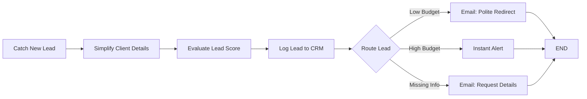
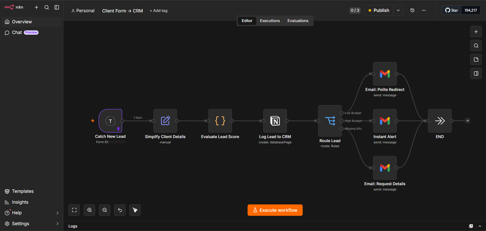
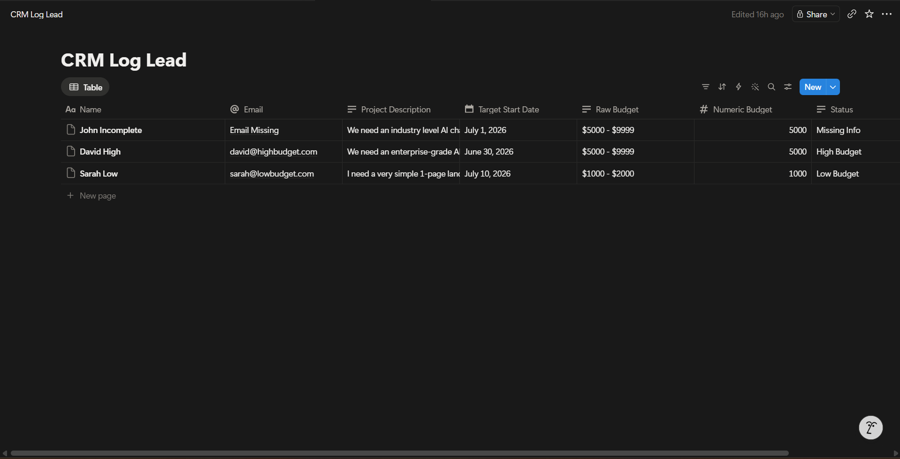
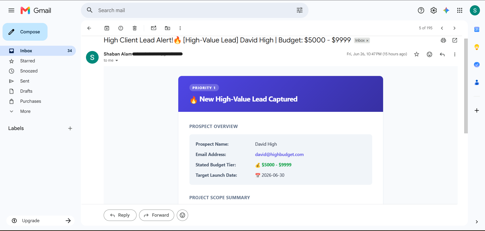
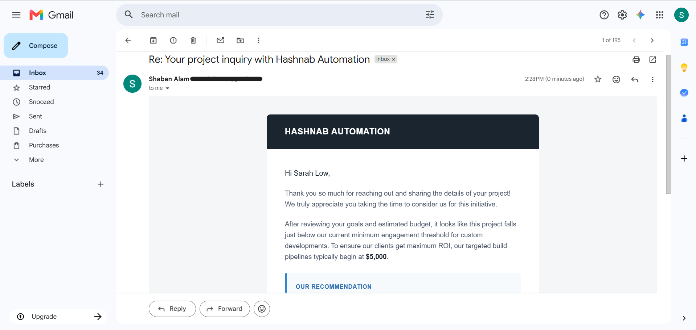
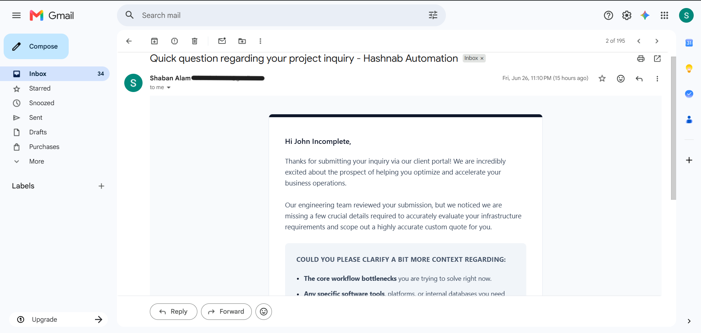

# 📋 Client Form → CRM


A production-ready n8n automation that handles the complete client intake pipeline — from the moment a prospect submits an inquiry form to the moment the right email lands in their inbox. Every submission is captured, cleaned, scored against business rules, logged to a Notion CRM, and routed to one of three distinct communication paths. No manual review, no repetitive data entry, no missed leads.

---

## Problem

Most agencies handle incoming inquiries the same way: someone reads the submission, copies the details into a spreadsheet or CRM, decides whether it's worth pursuing, and sends a reply — or forgets to.

At low volume, this is manageable. As inquiry volume grows, the process breaks down:

- **Manual CRM entry creates lag.** Every minute spent copying form data into a database is a minute the prospect isn't hearing back.
- **Qualification is inconsistent.** Without a defined scoring rule applied automatically, two identical leads can be treated entirely differently depending on who reviews them and when.
- **Response emails are repetitive and slow.** Writing individual replies to low-budget inquiries or incomplete submissions is mechanical work that compounds with volume.
- **No audit trail by default.** If a lead isn't manually logged, there is no record it ever existed — which means no analysis, no follow-up, and no accountability.
- **High-value leads don't surface fast enough.** When every inquiry looks the same in an inbox, priority prospects get buried alongside ones that don't meet the engagement threshold.

The cost isn't just efficiency — it's the response speed and consistency that determines whether a serious prospect moves forward or contacts someone else.

---

## Solution

Client Form → CRM replaces the entire manual intake process with an automated pipeline.

The moment a prospect submits a Typeform inquiry, n8n captures the submission and passes it through a structured qualification sequence. A Set node normalizes the raw field names into clean, consistent keys. A JavaScript Code node then applies the business scoring logic: any submission with missing fields or an insufficient description is flagged as incomplete; budgets at or above the $5,000 threshold are classified as high priority; everything else routes as low budget.

Before any email goes out, the lead is logged in full to a Notion CRM — name, email, project description, start date, budget tier, numeric budget, and qualification status — regardless of which path it takes downstream. This ensures the CRM is always complete, even for leads that don't qualify.

A Switch node then routes execution into one of three paths. High-budget prospects trigger an internal priority alert with a structured prospect brief and a direct CRM link. Low-budget submissions receive a professionally written redirect email that closes the loop graciously. Incomplete inquiries receive a targeted follow-up asking for the specific details that were missing.

Every inquiry gets a response. Every lead gets logged. The process is consistent regardless of volume.

---

## Architecture

**Catch New Lead** — A Typeform Trigger node that listens for new form submissions and initiates the workflow immediately on receipt. It passes the raw Typeform response payload — including all field values keyed by their question labels — downstream as the initial data object.

**Simplify Client Details** — A Set node that remaps the verbose Typeform field labels into clean, consistent keys. Raw question strings like `"What is your budget for this project?"` become `Budget`, `"When are you looking to start?"` becomes `Start Date`, and so on across all five fields. This normalization step isolates the rest of the workflow from Typeform's question-label format, making downstream references predictable and the workflow portable to other form providers.

**Evaluate Lead Score** — A JavaScript Code node that applies the qualification logic. It extracts each field value, trims whitespace, and substitutes explicit `"Missing"` labels for any empty inputs so the CRM always receives a populated record. A regex extracts the leading numeric value from the budget string, enabling a clean integer comparison. The scoring rules are straightforward: if any field is blank or the project description is under ten characters, the lead is flagged `Missing Info`; if the numeric budget is at or above 5,000, it is classified `High Budget`; otherwise, it is classified `Low Budget`. The Code node outputs all original fields alongside the derived `Status` and `Number Budget` values.

**Log Lead to CRM** — A Notion node that creates a new database page in the `CRM Log Lead` database, writing seven properties: Name (title), Email (email field), Project Description (rich text), Target Start Date (date, localized to Asia/Kolkata), Raw Budget (rich text), Numeric Budget (number), and Status (rich text). This node runs before the Switch, which means every lead — qualified or not — is guaranteed a CRM record. The Notion page URL returned from this node is referenced downstream in the high-budget alert email.

**Route Lead** — A Switch node operating in Rules mode that reads the `Status` field written by the Code node and branches execution into one of three named outputs: `Low Budget`, `High Budget`, or `Missing Info`. Each output connects to a dedicated email node, keeping the communication paths completely isolated.

**Instant Alert** (High Budget path) — An internal Gmail notification sent to the business owner. The email renders a priority-flagged brief containing the prospect's name, email address, stated budget tier with emoji formatting, and target launch date, followed by the project scope description and a three-step SLA checklist. A direct CTA button links to the newly created Notion CRM record. This is not a client-facing email — it is an operational alert designed to surface high-value leads immediately.

**Email: Polite Redirect** (Low Budget path) — A client-facing Gmail response that acknowledges the inquiry, explains the agency's minimum engagement threshold, and redirects the prospect toward platforms more suited to their budget tier. The email is warm and professionally branded under the Hashnab Automation identity, closing the loop without leaving the prospect without a response.

**Email: Request Details** (Missing Info path) — A client-facing Gmail follow-up that acknowledges the submission, flags the missing information as a blocker for accurate scoping, and asks two targeted questions: what the core workflow bottlenecks are and which software tools or platforms need integration. It positions the request as necessary engineering due diligence rather than a form rejection.

**END** — A No-Op node that serves as the shared terminal point for all three routing paths, keeping the workflow graph clean and execution tracking consistent.

---

## 📊 Workflow Diagram

End-to-end orchestration flow for client onboarding and targeted communication routing:



---

## Tech Stack

| Technology | Role |
|---|---|
| **n8n** | Workflow orchestration engine — hosts, triggers, and executes the full intake pipeline |
| **Typeform Trigger** | Event listener that fires immediately on form submission, passing the full response payload downstream |
| **Set Node** | Remaps verbose Typeform question labels into clean, consistent field keys for downstream use |
| **JavaScript Code Node** | Applies lead qualification logic: field validation, numeric budget extraction, and status assignment |
| **Notion** | CRM destination — each lead creates a new structured database page with all qualification data |
| **Switch Node** | Rules-based router that branches execution by lead status into three isolated downstream paths |
| **Gmail (×3)** | Three distinct email nodes, each rendering a different branded HTML template for its specific routing outcome |
| **HTML Email Templates** | Custom branded layouts — dark-header Hashnab design for client emails, purple gradient priority alert for internal notifications |

---

## Features

- **Event-driven execution** — triggers immediately on Typeform submission with no polling or manual initiation
- **Field normalization** — a Set node isolates the workflow from Typeform's raw question-label format before any processing occurs
- **Rule-based lead scoring** — JavaScript Code node applies consistent qualification logic: field completeness validation, minimum description length check, and numeric budget threshold comparison
- **Pre-routing CRM logging** — every lead is written to Notion before the Switch runs, guaranteeing a complete database regardless of qualification outcome
- **Three-path intelligent routing** — Switch node branches execution into High Budget, Low Budget, or Missing Info paths based on the evaluated status
- **Internal priority alerting** — high-value leads surface as a structured internal briefing with prospect overview, project scope, SLA checklist, and a direct CRM link
- **Graceful low-budget handling** — below-threshold inquiries receive a professional redirect email rather than silence
- **Incomplete submission recovery** — missing-field submissions receive a targeted clarification request rather than rejection
- **Branded HTML email templates** — distinct visual identities for client-facing and internal notifications, both rendered under the Hashnab Automation brand
- **Numeric budget extraction** — regex parsing converts budget range strings into integers for reliable threshold comparison
- **Explicit missing-field labels** — empty inputs are substituted with descriptive labels before CRM write, preventing blank properties in Notion
- **Modular node design** — each step has a single responsibility; swapping the form provider, CRM, or email channel requires changes to one node

---

## Screenshots

### Workflow

> **`images/workflow.png`**
>
> 

The complete eight-node pipeline in the n8n editor. The linear processing chain feeds into the Switch node, which fans into three parallel Gmail paths before merging at END.

---

### Notion CRM

> **`images/notion-crm.png`**
>
> 

The `CRM Log Lead` database in Notion, populated by the workflow across three test executions. Each row captures Name, Email, Project Description, Target Start Date, Raw Budget, Numeric Budget, and the assigned Status — visible here as `Missing Info`, `High Budget`, and `Low Budget` across John Incomplete, David High, and Sarah Low respectively.

---

### High Budget Alert

> **`images/high-budget-email.png`**
>
> 

The internal priority alert triggered by a high-value submission. The purple gradient header carries a "PRIORITY 1" badge and the prospect's name in the subject line. Below, a structured brief displays the prospect overview table and a CTA button linking directly to the Notion record.

---

### Low Budget Response

> **`images/low-budget-email.png`**
>
> 

The client-facing redirect email sent to below-threshold prospects. The dark Hashnab Automation header and professional tone maintain brand credibility while redirecting the prospect graciously. A callout block surfaces the alternative recommendation.

---

### Missing Information Response

> **`images/missing-info-email.png`**
>
> 

The clarification request sent to incomplete submissions. The email frames the follow-up as an engineering scoping requirement and asks two targeted questions about workflow bottlenecks and platform integrations, maintaining engagement rather than closing the door.

---

## How It Works

1. **A prospect submits the inquiry form.** The Typeform form captures five fields: name, email address, project description, budget range, and target start date. The n8n Typeform Trigger fires immediately on submission and passes the raw response downstream.

2. **Field labels are normalized.** The Simplify Client Details Set node maps each verbose Typeform question string to a clean key — `Name`, `Email`, `Project Description`, `Budget`, `Start Date` — so every downstream node references consistent, predictable field names regardless of how the form questions are worded.

3. **The lead is scored.** The Evaluate Lead Score Code node processes all five fields. Any empty input receives an explicit `"[Field] Missing"` label. The project description is length-checked — submissions under ten characters are treated as blank. The budget string is parsed with a regex to extract the leading integer. Three scoring rules are evaluated in order: if any field is absent or insufficient, status is set to `Missing Info`; if the numeric budget is at or above 5,000, status is `High Budget`; otherwise, status is `Low Budget`.

4. **The CRM record is created.** Before any routing occurs, the Log Lead to CRM Notion node creates a new database page with all seven properties: the five original fields plus the derived `Status` and `Numeric Budget`. This step runs unconditionally — every lead is in the CRM from this point forward.

5. **Execution is routed.** The Route Lead Switch node reads the `Status` field and directs execution to one of three labeled outputs: `Low Budget`, `High Budget`, or `Missing Info`. Each output is wired to a dedicated email node.

6. **High-budget path — internal alert is sent.** The Instant Alert Gmail node renders a priority-flagged email to the business owner. The email includes the prospect's full name, email address as a clickable link, budget tier highlighted in green, and launch date. A project scope block displays the description verbatim. A three-step SLA checklist prompts the owner to review the CRM entry, research the prospect, and draft a personalized outreach within four hours. A CTA button links directly to the newly created Notion page.

7. **Low-budget path — redirect email is sent.** The Email: Polite Redirect Gmail node sends a client-facing message acknowledging the submission, explaining that the project scope falls below the agency's $5,000 minimum engagement threshold, and recommending alternative platforms. The email is professionally written and closes the inquiry loop without a negative tone.

8. **Missing-info path — clarification email is sent.** The Email: Request Details Gmail node sends a targeted follow-up to the prospect, acknowledging the submission and asking specifically for the two pieces of information most critical for scoping: the core workflow bottlenecks and any existing platform dependencies. It frames the request as necessary due diligence for producing an accurate quote.

9. **All paths terminate at END.** The shared No-Op END node closes execution cleanly across all three paths, maintaining a single terminal point for tracking and future extension.

10. **The CRM reflects the complete picture.** Regardless of which path executed, Notion now holds a structured record of the lead with its qualified status. High-budget prospects are flagged for immediate follow-up. Low-budget and missing-info entries remain available for future outreach or analysis.

---

## Sample Input

A realistic submission as it arrives from Typeform:

```
What is your Name?                     David High
What's your email address?             david@highbudget.com
Please describe your project briefly.  We need an enterprise-grade AI chatbot system
                                       integrated into our global customer service desk
                                       to reduce manual ticket response times.
What is your budget for this project?  $5000 - $9999
When are you looking to start?         2026-06-30
```

After the Set node, this becomes:

```json
{
  "Name":                "David High",
  "Email":               "david@highbudget.com",
  "Project Description": "We need an enterprise-grade AI chatbot system...",
  "Budget":              "$5000 - $9999",
  "Start Date":          "2026-06-30"
}
```

After the Code node:

```json
{
  "Name":                "David High",
  "Email":               "david@highbudget.com",
  "Project Description": "We need an enterprise-grade AI chatbot system...",
  "Target Start Date":   "2026-06-30",
  "Raw Budget":          "$5000 - $9999",
  "Number Budget":       5000,
  "Status":              "High Budget"
}
```

---

## Sample Output

**Notion CRM entry:**

```
Name               David High
Email              david@highbudget.com
Project            We need an enterprise-grade AI chatbot system...
Target Start Date  2026-06-30
Raw Budget         $5000 - $9999
Numeric Budget     5000
Status             High Budget
```

**High Budget — internal alert:**

```
Subject: High Client Lead Alert!🔥 [High-Value Lead] David High | Budget: $5000 - $9999

┌─────────────────────────────────────────────────────────────┐
│  PRIORITY 1                                                 │
│  🔥 New High-Value Lead Captured                            │
│                                                             │
│  PROSPECT OVERVIEW                                          │
│  Prospect Name:      David High                             │
│  Email Address:      david@highbudget.com                   │
│  Stated Budget Tier: 💰 $5000 - $9999                       │
│  Target Launch Date: 📅 2026-06-30                          │
│                                                             │
│  PROJECT SCOPE SUMMARY                                      │
│  "We need an enterprise-grade AI chatbot system..."         │
│                                                             │
│  REQUIRED NEXT STEPS (SLA: 4 Hours)                        │
│  ⏹ Step 1: Review the CRM record in Notion                  │
│  ⏹ Step 2: Research the prospect's domain via LinkedIn      │
│  ⏹ Step 3: Draft a personalized pitch for discovery call    │
│                                                             │
│  [ Open Record In CRM → ]                                   │
└─────────────────────────────────────────────────────────────┘
```

**Low Budget — client redirect:**

```
Subject: Re: Your project inquiry with Hashnab Automation

HASHNAB AUTOMATION

Hi Sarah Low,

Thank you so much for reaching out and sharing the details of your project...

After reviewing your goals and estimated budget, it looks like this project
falls just below our current minimum engagement threshold ($5,000).

OUR RECOMMENDATION
Consider platforms like Upwork or vetted template marketplaces for
projects within your current budget tier.
```

**Missing Info — clarification request:**

```
Subject: Quick question regarding your project inquiry - Hashnab Automation

Hi John Incomplete,

Thanks for submitting your inquiry via our client portal!

Our engineering team reviewed your submission but we noticed we are missing
a few crucial details required to accurately scope a custom quote.

COULD YOU PLEASE CLARIFY:
• The core workflow bottlenecks you are trying to solve right now.
• Any specific software tools, platforms, or databases you need integrated.
```

---

## Future Improvements

The current workflow handles three qualification outcomes from a single form. The architecture supports significant expansion without structural changes:

- **AI lead scoring** — replace the threshold-only Code node with an LLM call that evaluates project description quality, scope complexity, and budget fit together for a richer qualification signal
- **OpenAI qualification summary** — generate a one-paragraph strategic summary of the prospect's needs, auto-attached to the internal alert for faster review
- **Slack notifications** — send a parallel high-budget alert to a designated Slack channel so the team sees priority leads without checking email
- **Automated proposal generation** — for high-budget leads, trigger a follow-up workflow that generates a tailored proposal draft from the prospect's project description
- **Calendly scheduling link** — embed a direct booking link in the high-budget email so qualified prospects can immediately schedule a discovery call
- **Notion CRM dashboard** — connect the database to a filtered Notion view that surfaces open high-budget leads, pending responses, and conversion rates
- **HubSpot or Pipedrive integration** — replace or supplement the Notion node with a dedicated CRM platform for pipeline tracking and deal management
- **PostgreSQL audit log** — persist all intake records to a relational database for long-term analysis and reporting
- **Automated follow-up sequences** — trigger a multi-day email sequence for non-responders to the missing-info email, with escalating clarification requests
- **Multi-form support** — parameterize the workflow to handle submissions from multiple form sources (Jotform, Tally, Google Forms) through a single intake pipeline

---

## Repository Structure

```
n8n-workflows/
└── Client-Form-CRM/
    ├── Client-Form-CRM.json        # Exported n8n workflow (importable directly)
    ├── README.md
    └── images/
        ├── workflow.png            # n8n editor screenshot
        ├── notion-crm.png          # Notion CRM database screenshot
        ├── high-budget-email.png   # Internal priority alert email
        ├── low-budget-email.png    # Client redirect email
        └── missing-info-email.png  # Clarification request email
```

To deploy: import `Client-Form-CRM.json` into your n8n instance, connect Typeform, Notion, and Gmail credentials, update the Typeform form ID and Notion database ID to your own values, and activate. The workflow begins processing submissions immediately.

---

## Author

**Shaban Alam**
Python Automation Developer · n8n Workflow Specialist · AI Automation Builder

Building production-ready automation systems for businesses that want to eliminate repetitive manual work.

- **GitHub:** [github.com/Shaban27-dev](https://github.com/Shaban27-dev)
- **Email:** shabandev27@gmail.com
- **Available for:** freelance automation projects, workflow consulting, CRM integrations, client intake systems, API pipelines

> Open to projects involving n8n, Python automation, CRM integration, lead qualification pipelines, AI workflow automation, and business process automation.

---

## Summary

Client Form → CRM is a complete, event-driven lead intake automation built to production standard. It demonstrates Typeform event handling, multi-step data transformation, custom JavaScript business logic, Notion CRM integration, rules-based Switch routing, and three-path branded HTML email delivery — all orchestrated through n8n as a single cohesive workflow.

The design separates concerns cleanly: normalization happens in one node, scoring in another, logging before routing, and communication after. Each layer is independently configurable. Changing the qualification threshold requires editing one line of JavaScript. Adding a fourth routing path requires one new Switch rule and one new email node. Swapping Notion for a different CRM requires replacing one node.

This project is part of an active automation portfolio. Additional workflows covering file management, price monitoring, job alerts, and AI-augmented pipelines are available in the linked GitHub repository.
