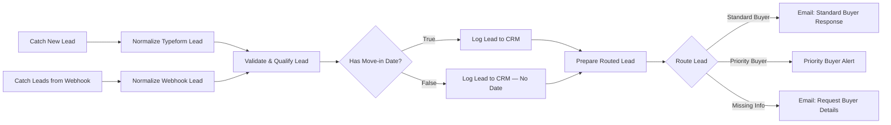
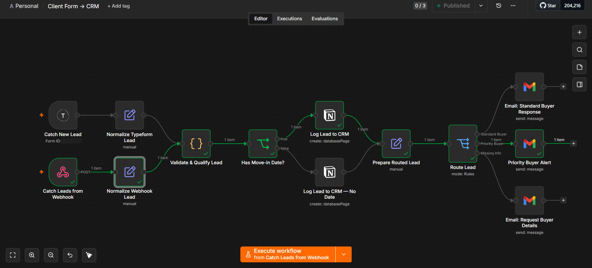
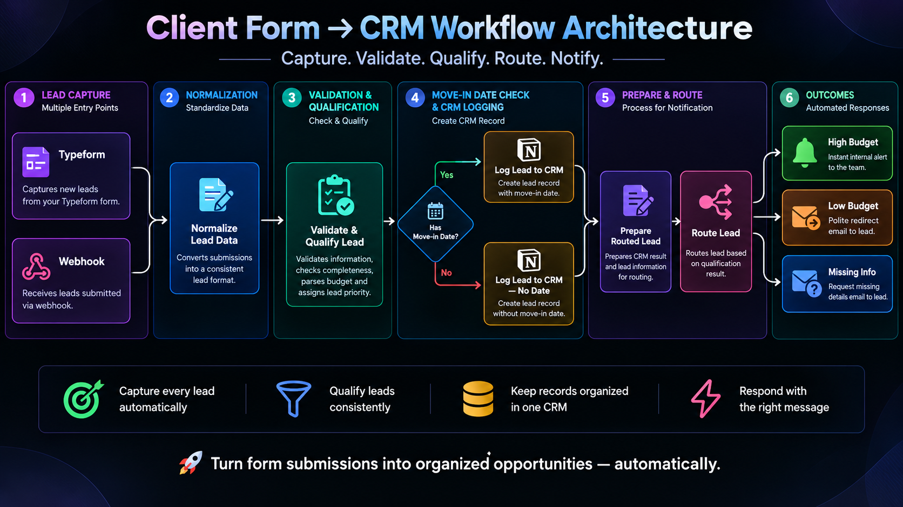
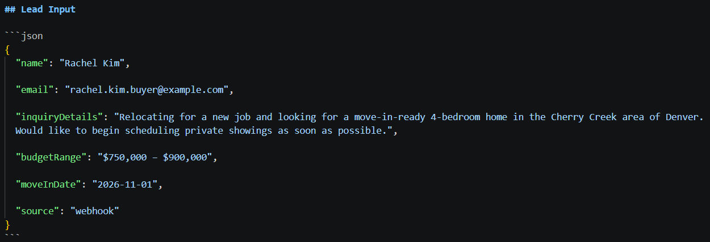
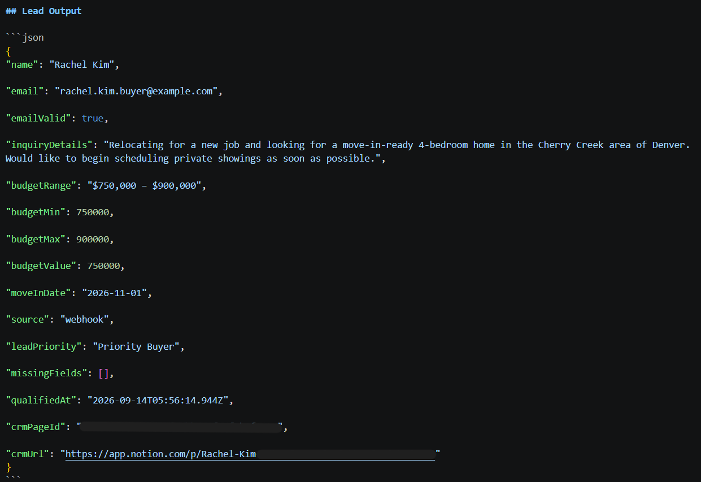
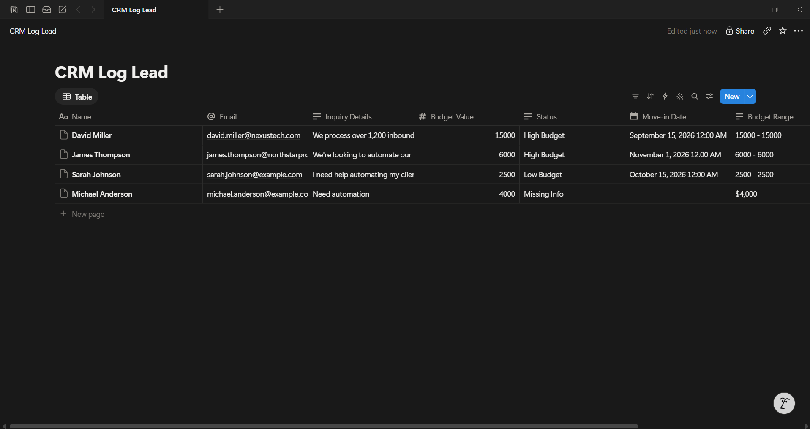
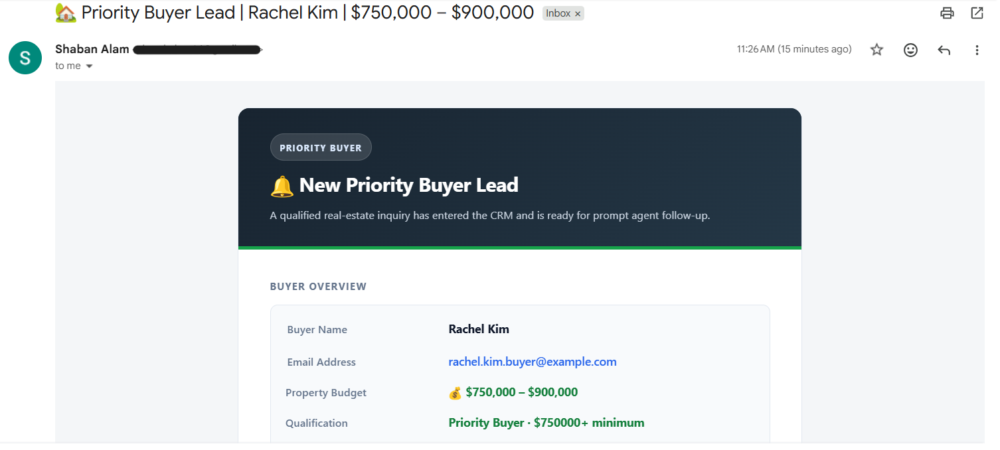
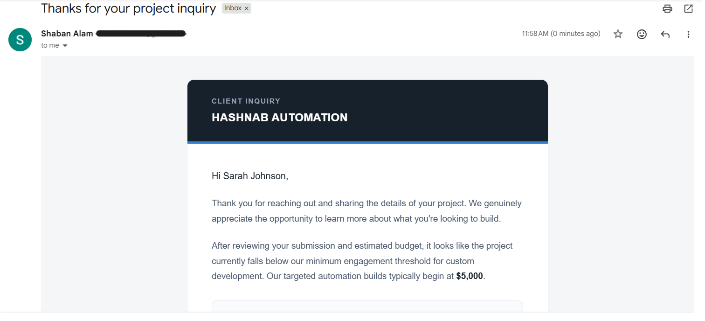
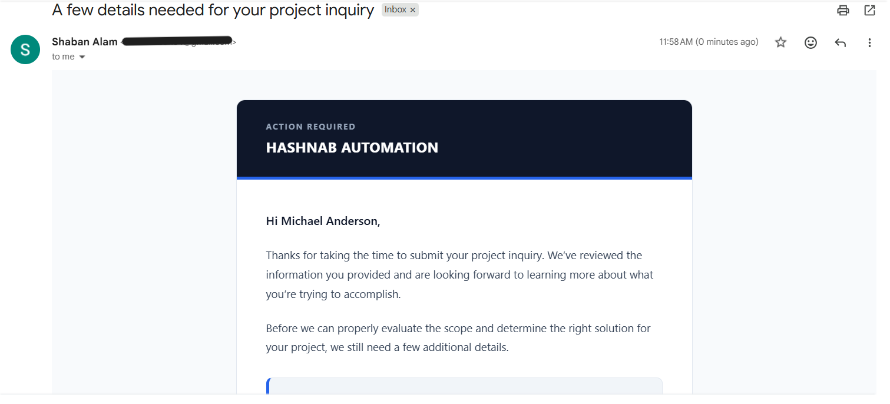

# 📋 Client Form → CRM


-brightgreen?style=flat-square)


An n8n automation that takes a real-estate buyer inquiry from two possible entry points — a Typeform submission or a generic webhook POST — through a shared normalization, validation, and qualification pipeline, logs every lead to a Notion CRM regardless of outcome, and routes it to one of three email responses: an internal Priority Buyer alert, a client-facing Standard Buyer acknowledgment, or a client-facing request for missing details.

> **Case study included.** A full business case study — problem framing, architecture walkthrough, and demonstrated evidence from the live workflow — is included at [`case-study/client-form-crm-case-study.pdf`](./case-study/client-form-crm-case-study.pdf).

---

## Problem

Real-estate teams rarely receive inquiries from just one place. A buyer might fill out a form embedded on the brokerage's website, or a lead might arrive through a different channel entirely — a landing page, a partner tool, or another system posting data directly. Each entry point tends to produce data in its own shape, which makes consistent handling difficult from the first step.

From there the problems compound. Submissions get qualified inconsistently — the same inquiry can be treated as a priority by one agent and overlooked by another, because there's no shared rule for what counts as a serious buyer applied every time. Incomplete submissions are common, and following up to request missing details is repetitive work that competes with an agent's time for showings and calls. Meanwhile, any inquiry that isn't manually logged into a CRM effectively disappears — no record, no audit trail, no way to revisit it. A genuinely qualified buyer can go unanswered simply because of how intake is structured, not because of anything about the lead itself.

---

## Solution

Client Form → CRM replaces manual intake with a single automated pipeline that treats every lead the same way, no matter where it came from. Two entry points — a Typeform trigger and a generic webhook — both feed into one shared processing chain: Capture → Normalize → Validate → Qualify → Log → Route → Act.

Normalization brings both sources into one common shape before anything else happens, so the rest of the pipeline never has to know which channel a lead arrived through. A single validation and qualification step then checks every submission against the same rules — completeness, a valid email format, a minimum level of inquiry detail, a calendar-valid move-in date, and a budget threshold — and assigns one of three outcomes. Every lead is logged to the CRM before any communication goes out, so a record exists regardless of the qualification result. Only then does the workflow route execution to the appropriate next action: an internal alert, a client-facing response, or a request for missing details.

This automates the first operational layer of lead handling — intake, qualification, and routing. It is not a full sales platform or CRM replacement. Qualification is entirely deterministic and rule-based; there is no AI or LLM involved anywhere in the current workflow.

---

## Architecture

The current export contains **13 nodes**. Two of them are entry-point triggers, two are per-source normalization steps that converge on one shared qualification node, two are alternate CRM-logging paths, and three are terminal Gmail nodes — none of the three connects onward to a shared end node (see Known Behavior & Limitations).

**Catch New Lead** is a Typeform Trigger that fires immediately on a new form submission, passing the raw response — keyed by question label — downstream.

**Normalize Typeform Lead** is a Set node that maps five Typeform question labels into a shared schema: `name` ("What is your Name?"), `email` ("What's your email address?"), `inquiryDetails` ("Please describe your project briefly."), `budgetRange` ("What is your budget for this project?"), and `moveInDate` ("When are you looking to start?"). It also sets `source` to the literal string `"typeform"`.

**Catch Leads from Webhook** is a Webhook node listening for `POST` requests on a configurable path.

**Normalize Webhook Lead** is a second Set node mapping the same shared schema from a webhook payload. `name`, `email`, and `moveInDate` each check several possible locations in order — `body.name`, top-level `name`, and a Typeform-style question key, for example — falling back through each until one resolves. `inquiryDetails` and `budgetRange`, by contrast, currently read only from `body.inquiryDetails` and `body.budgetRange`, with no fallback if a caller sends them at the payload's top level instead. `source` is set to `"webhook"`.

**Validate & Qualify Lead** is a JavaScript Code node and the core of the workflow. For every item it: trims and cleans each field; lowercases and regex-validates the email; treats an inquiry description under 10 characters as insufficient; validates `moveInDate` as a real calendar date in `YYYY-MM-DD` format (not just a matching text pattern); and parses `budgetRange` into `budgetMin`, `budgetMax`, and `budgetValue`, handling ranges, comma separators, currency symbols, `k`/`m` shorthand, and ceiling language such as "under," "below," "less than," "up to," "maximum," or "max" (a ceiling phrase like "under $750k" is deliberately excluded from qualifying as Priority Buyer). Any failed or missing field is pushed into a `missingFields` array with a descriptive name (`Name`, `Email`, `Valid Email`, `Inquiry Details`, `Budget Range`, `Move-in Date`). Qualification then follows this order: if `missingFields` is non-empty, `leadPriority` is `"Missing Info"`; else if the parsed budget minimum is at least **$750,000**, `leadPriority` is `"Priority Buyer"`; otherwise it's `"Standard Buyer"`. The node also stamps a plain UTC `qualifiedAt` timestamp via `new Date().toISOString()`.

**Has Move-in Date?** is an IF node checking whether the (already-validated) `moveInDate` from the previous node is non-empty.

**Log Lead to CRM** is a Notion `databasePage` create node, used on the IF node's true branch. It writes Name, Email, Inquiry Details, Move-in Date (dated in `Asia/Kolkata`), Budget Range (written as `{{ budgetMin }} - {{ budgetMax }}`, i.e. parsed plain numbers), Budget Value, and Status (the `leadPriority` string) to the "CRM Log Lead" Notion database.

**Log Lead to CRM — No Date** is a second, separate Notion create node used on the false branch. It writes the same fields except Move-in Date, which is left effectively blank, and Budget Range, which is written as the raw, unparsed `budgetRange` string rather than parsed numbers. This is a deliberate fallback path, not a duplicate — it exists specifically so a missing or invalid move-in date never blocks a lead from reaching the CRM.

**Prepare Routed Lead** is a Set node that runs after both CRM branches reconverge. It rebuilds a single consistent object — `name`, `email`, `emailValid`, `inquiryDetails`, `budgetRange`, `budgetMin`, `budgetMax`, `budgetValue`, `moveInDate`, `source`, `leadPriority`, `missingFields`, `qualifiedAt` — pulled back from the `Validate & Qualify Lead` node, and adds `crmPageId` and `crmUrl` read from whichever Notion node just ran. `crmUrl` is what the Priority Buyer email later links to.

**Route Lead** is a Switch node in Rules mode with three named outputs — `Standard Buyer`, `Priority Buyer`, `Missing Info` — matched against `leadPriority`.

**Priority Buyer Alert** is a Gmail node — an **internal** notification to the business owner, not a client-facing message. Its subject is built dynamically from the buyer's name and budget range. The body shows a Priority Buyer badge, buyer name, email, budget, a "Qualification" line (`{{ leadPriority }} · ${{ budgetMin }}+ minimum`), target move-in date, the inquiry description, three recommended next steps, and a CTA button linking to `crmUrl`.

**Email: Standard Buyer Response** is a Gmail node with a **fixed** subject line ("Regarding your property search inquiry") regardless of the lead's specifics. It's client-facing: it thanks the prospect, states the current $750,000 priority-buyer threshold explicitly, shows their stated budget, and points them toward broader listing marketplaces.

**Email: Request Buyer Details** is a Gmail node whose subject is conditional on `emailValid` — one string if the email itself was valid, a different one if not. It's client-facing and its body is built dynamically from the `missingFields` array, listing exactly which pieces of information are still needed for that specific submission.

---

## Workflow Diagram


```mermaid
flowchart LR
    A1[Catch New Lead] --> B1[Normalize Typeform Lead]
    A2[Catch Leads from Webhook] --> B2[Normalize Webhook Lead]

    B1 --> C[Validate & Qualify Lead]
    B2 --> C

    C --> D{Has Move-in Date?}
    D -- True --> E1[Log Lead to CRM]
    D -- False --> E2[Log Lead to CRM — No Date]

    E1 --> F[Prepare Routed Lead]
    E2 --> F

    F --> G{Route Lead}
    G -- Standard Buyer --> H1[Email: Standard Buyer Response]
    G -- Priority Buyer --> H2[Priority Buyer Alert]
    G -- Missing Info --> H3[Email: Request Buyer Details]
```

All three Gmail nodes are terminal in the current export — none of them connects onward to a shared end node.

---

## Tech Stack

| Technology | Role |
|---|---|
| **n8n** | Workflow orchestration engine |
| **Typeform Trigger** | Fires on a new form submission (`Catch New Lead`) |
| **Webhook** | Accepts `POST` submissions from any other source (`Catch Leads from Webhook`) |
| **Set Node (×3)** | Normalizes each source into a shared schema, and later rebuilds the post-CRM object |
| **JavaScript Code Node** | `Validate & Qualify Lead` — deterministic, rule-based validation and qualification; no AI/LLM |
| **IF Node** | Branches on move-in-date presence (`Has Move-in Date?`) |
| **Notion (×2 write nodes)** | Creates a CRM record with or without a move-in date |
| **Switch Node** | Rules-based routing on qualification tier (`Route Lead`) |
| **Gmail (×3)** | One internal alert, two client-facing responses, each with its own HTML template |

---

## Features

| Feature | Description |
|---|---|
| Dual-source intake | Typeform trigger and a generic POST webhook both feed the same pipeline |
| Shared normalization | Both sources converge on one identical schema before validation |
| Real email-format validation | Regex-based, not just a presence check |
| Minimum inquiry-length check | Descriptions under 10 characters count as insufficient |
| Structured missing-field tracking | A `missingFields` array names exactly what failed, per lead |
| Flexible budget parsing | Ranges, commas, currency symbols, `k`/`m` shorthand, and ceiling language |
| $750,000 Priority Buyer threshold | Applied consistently regardless of how the budget was phrased |
| Three-tier classification | Priority Buyer / Standard Buyer / Missing Info |
| Calendar-aware date validation | Move-in date must be a real `YYYY-MM-DD` date, not just pattern-matched |
| Conditional CRM logging | Two dedicated Notion paths so a bad date never blocks a CRM record |
| CRM ID/URL propagation | The created Notion page's ID and URL travel forward for the alert email |
| Rules-based routing | Switch node dispatches on the qualification tier |
| Internal Priority Buyer alert | With a direct CRM deep link |
| Client-facing Standard Buyer response | States the current threshold explicitly |
| Client-facing Missing Info follow-up | Content generated from that lead's specific missing fields |
| Deterministic, non-AI qualification | No language model anywhere in the pipeline |

---

## Screenshots

### Workflow



The live canvas: two entry points on the left (Typeform and Webhook), each with its own normalization node, converging on `Validate & Qualify Lead`. `Has Move-in Date?` branches to the two Notion nodes, which reconverge at `Prepare Routed Lead` before `Route Lead` fans out to the three Gmail nodes — each ending in a "+" add-node placeholder rather than a shared terminator. The highlighted execution trace shows a webhook submission flowing through the Priority Buyer path.

### Workflow Architecture



A six-stage, presentation-ready version of the same pipeline for a non-technical audience: Lead Capture, Normalization, Validate & Qualify Lead (with the $750K+ priority threshold called out), Move-in Date Check & CRM Logging, Prepare & Route, and Outcomes (green/orange/blue for Priority Buyer/Standard Buyer/Missing Info).

### Lead Input



A representative webhook submission from Rachel Kim: relocating to the Cherry Creek area of Denver, budget $750,000–$900,000, move-in date 2026-11-01.

### Lead Output



The same submission after `Validate & Qualify Lead` and `Prepare Routed Lead`: `emailValid: true`, `budgetMin: 750000`, `budgetMax: 900000`, `budgetValue: 750000`, `leadPriority: "Priority Buyer"`, an empty `missingFields` array, and the `crmPageId`/`crmUrl` attached from the Notion write.

### Notion CRM



The "CRM Log Lead" database after three test submissions. Rachel Kim (Priority Buyer) and Marcus Webb (Standard Buyer) both have a Move-in Date and a Budget Range written as plain parsed numbers (`750000 - 900000`, `1200 - 1500`) — the dated CRM path. Grace Whitfield (Missing Info) has no Move-in Date and her Budget Range is the raw submitted string (`$650,000 - $700,000`) — the fallback path. This is direct, visible evidence the two CRM nodes populate the same fields differently rather than duplicating each other.

### Priority Buyer Alert (internal)



Triggered by Rachel Kim's submission, subject "🏡 Priority Buyer Lead | Rachel Kim | $750,000 – $900,000." Goes to the business owner, not the prospect. Note: this asset's filename retains the workflow's earlier "high-budget" terminology even though the current tier name is Priority Buyer.

### Standard Buyer & Missing Info (client-facing)




The Standard Buyer response, sent to Marcus Webb with the fixed subject "Regarding your property search inquiry," states the $750,000 threshold directly. The Missing Info follow-up, sent to Grace Whitfield with the subject "A few details needed for your property search," lists her specific missing fields rather than a generic message. As with the Priority Buyer asset, `low-budget-email.png` keeps the workflow's earlier tier name in its filename even though the current label is Standard Buyer.

---

## How It Works

1. **Capture** — the Typeform Trigger and the Webhook each listen independently and fire the moment a submission arrives, regardless of source.
2. **Normalize** — `Normalize Typeform Lead` and `Normalize Webhook Lead` translate each source's raw payload into the same shared shape.
3. **Validate** — `Validate & Qualify Lead` checks field presence, email format, inquiry length, and move-in-date validity.
4. **Qualify** — the same node parses the budget and assigns Priority Buyer, Standard Buyer, or Missing Info against the $750,000 threshold.
5. **Handle Move-in Date** — `Has Move-in Date?` checks whether a valid date survived validation.
6. **Log to CRM** — `Log Lead to CRM` or `Log Lead to CRM — No Date` creates the Notion record accordingly.
7. **Prepare Routed Lead** — the two CRM paths reconverge into one consistent object carrying the new CRM page's ID and URL.
8. **Route** — `Route Lead` reads `leadPriority` and dispatches to exactly one of three outputs.
9. **Act** — the matching Gmail node sends its message. Execution ends there; none of the three email nodes connects to anything further.

---

## Sample Input

A webhook submission from Rachel Kim:

```json
{
  "name": "Rachel Kim",
  "email": "rachel.kim.buyer@example.com",
  "inquiryDetails": "Relocating for a new job and looking for a move-in-ready 4-bedroom home in the Cherry Creek area of Denver. Would like to begin scheduling private showings as soon as possible.",
  "budgetRange": "$750,000 – $900,000",
  "moveInDate": "2026-11-01",
  "source": "webhook"
}
```

## Sample Output

After `Validate & Qualify Lead` and `Prepare Routed Lead`:

```json
{
  "name": "Rachel Kim",
  "email": "rachel.kim.buyer@example.com",
  "emailValid": true,
  "inquiryDetails": "Relocating for a new job and looking for a move-in-ready 4-bedroom home in the Cherry Creek area of Denver. Would like to begin scheduling private showings as soon as possible.",
  "budgetRange": "$750,000 – $900,000",
  "budgetMin": 750000,
  "budgetMax": 900000,
  "budgetValue": 750000,
  "moveInDate": "2026-11-01",
  "source": "webhook",
  "leadPriority": "Priority Buyer",
  "missingFields": [],
  "qualifiedAt": "2026-09-14T05:56:14.944Z",
  "crmPageId": "<notion-page-id>",
  "crmUrl": "https://app.notion.com/p/Rachel-Kim"
}
```

**Notion CRM (three test records):**

```
Name             Email                              Budget Value  Status           Move-in Date            Budget Range
Rachel Kim       rachel.kim.buyer@example.com        750000        Priority Buyer   November 1, 2026        750000 - 900000
Marcus Webb      marcus.webb.renter@example.com      1200          Standard Buyer   October 15, 2026        1200 - 1500
Grace Whitfield  grace.whitfield.buyer@example.com   650000        Missing Info     (blank)                 $650,000 - $700,000
```

These are synthetic test records used to exercise the workflow — not real clients.

---

## Known Behavior & Limitations

- **13 nodes, not 14 — there is no shared END node.** `Priority Buyer Alert`, `Email: Standard Buyer Response`, and `Email: Request Buyer Details` each terminate independently in the current export; none of them connects to a No-Op or any other downstream node. If other project documentation states a 14-node / END-node count, that does not match this export.
- **An invalid or missing move-in date always produces "Missing Info."** `Validate & Qualify Lead` adds `"Move-in Date"` to `missingFields` whenever the value isn't a real calendar date, and any non-empty `missingFields` forces `leadPriority` to `"Missing Info"` regardless of budget. Because `Has Move-in Date?` checks that same validated value, the "No Date" CRM path and the Missing Info email branch always co-occur — Grace Whitfield's record (blank Move-in Date, Status "Missing Info") demonstrates this directly.
- **The two CRM nodes intentionally write Budget Range differently.** `Log Lead to CRM` writes the parsed `budgetMin - budgetMax` as plain numbers; `Log Lead to CRM — No Date` writes the raw, unparsed `budgetRange` string. Both are visible side by side in the Notion CRM screenshot.
- **Webhook fallback coverage is uneven.** `name`, `email`, and `moveInDate` each check several possible payload locations in `Normalize Webhook Lead`; `inquiryDetails` and `budgetRange` currently read only from `body.inquiryDetails` and `body.budgetRange`, with no fallback.
- **`qualifiedAt` is a plain UTC timestamp**, not localized to Asia/Kolkata the way the Notion Move-in Date property is.
- **Subject-line behavior differs by email.** `Email: Standard Buyer Response` uses one fixed subject regardless of the lead; `Priority Buyer Alert` and `Email: Request Buyer Details` both build their subjects dynamically per lead.
- **Legacy filenames in the image assets.** `high-budget-email.png` and `low-budget-email.png` retain the workflow's earlier tier names even though the current labels are Priority Buyer and Standard Buyer.
- **Placeholder configuration throughout.** The Typeform form ID, the webhook path, the Notion database ID, the Gmail recipient, and all credentials are placeholder values in this export, though the workflow itself is marked active.
- **This is a demonstration build**, not a live client deployment — there's no ROI or conversion data to report. Business impact is described qualitatively: standardized handling across entry points, centralized and recorded leads (including incomplete ones), and an immediate surface for high-value buyers.

---

## Future Improvements

- **AI-assisted qualification** for richer signal beyond threshold-based rules
- **CRM integrations beyond Notion** — HubSpot, Salesforce, Follow Up Boss, or other real-estate-specific systems
- **Lead deduplication** against existing CRM records before creating a new page
- **Slack or Telegram alerts** alongside the existing Gmail notification
- **Scheduling links** embedded directly in the Priority Buyer alert
- **Automated follow-up sequences** for non-responders to the Missing Info email
- **International currency parsing** — extending the budget parser beyond `$`/comma-based US formatting

---

## Repository Structure

```
n8n-workflows/
└── client-form-crm/
    ├── case-study/
    │   └── client-form-crm-case-study.pdf
    ├── images/
    │   ├── workflow.png
    │   ├── workflow-architecture.png
    │   ├── lead-input.png
    │   ├── lead-output.png
    │   ├── notion-crm.png
    │   ├── high-budget-email.png
    │   └── branch-emails/
    │       ├── low-budget-email.png
    │       └── missing-info-email.png
    ├── client-form-crm.json
    └── README.md
```

**To deploy:** import `client-form-crm.json`; connect Typeform, Notion, and Gmail credentials; set the Typeform form ID; set the webhook path; point both Notion nodes at your own "CRM Log Lead" database; set the recipient address across all three Gmail nodes; review the $750,000 threshold inside `Validate & Qualify Lead` if a different tier boundary is wanted; then activate. For the full business framing behind this build, see the case study PDF included above.

---

## Author

**Shaban Alam**
Python Automation Developer · n8n Workflow Specialist · AI Automation Builder

Building automation systems for businesses that want to eliminate repetitive manual work.

- **GitHub:** [github.com/Shaban27-dev](https://github.com/Shaban27-dev)
- **Email:** shabandev27@gmail.com
- **Available for:** freelance automation projects, workflow consulting, CRM integrations, client intake systems, API pipelines

> Open to projects involving n8n, Python automation, CRM integration, lead qualification pipelines, and business process automation — including vertical-specific deployments such as real estate client intake.

---

## Summary

Client Form → CRM is a dual-entry lead intake pipeline: a Typeform trigger and a generic webhook both normalize into one shared schema, pass through a single deterministic (non-AI) validation and qualification step, log to a Notion CRM through one of two conditional paths, and route to one of three Gmail outcomes — an internal Priority Buyer alert, a client-facing Standard Buyer response, or a client-facing Missing Info follow-up. Every lead reaches the CRM before any email goes out, and the CRM record's shape differs intentionally depending on whether a valid move-in date was present. As exported, credentials, the form ID, the webhook path, and the database ID are placeholders, and the three outcome nodes are each terminal with no shared end node — this is a demonstrated, active reference build rather than a live client deployment.

This project is part of an active automation portfolio. Additional workflows covering AI lead enrichment, file management, price monitoring, and news aggregation are available in the linked GitHub profile.
