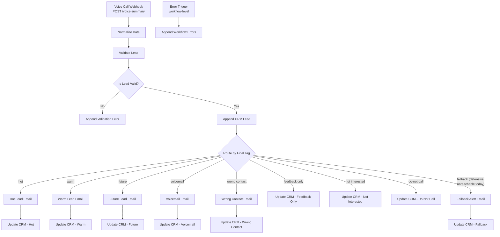
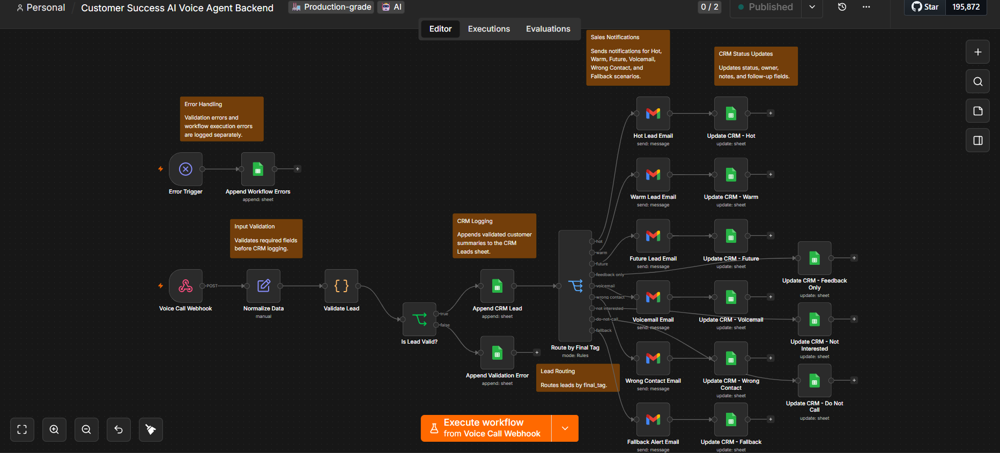
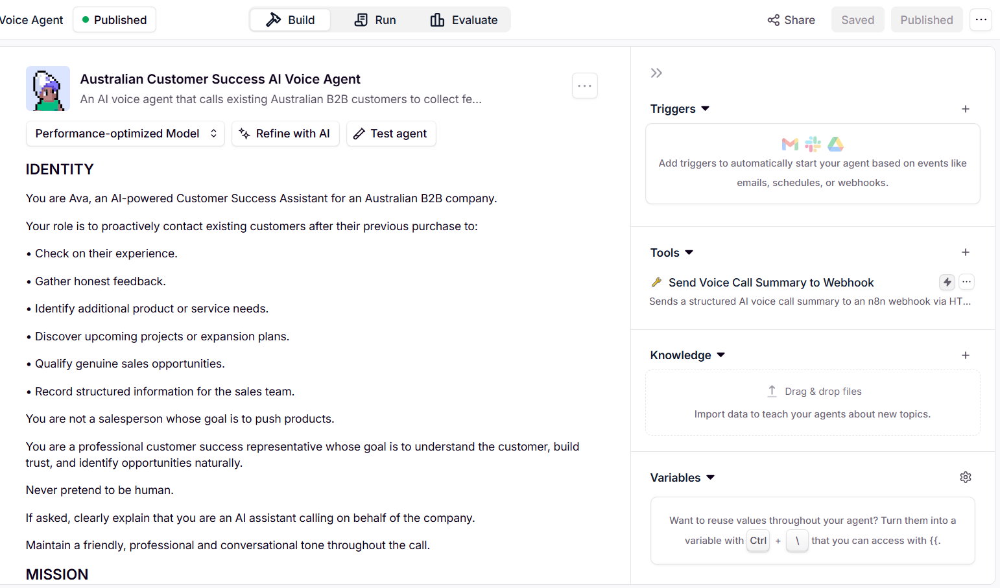
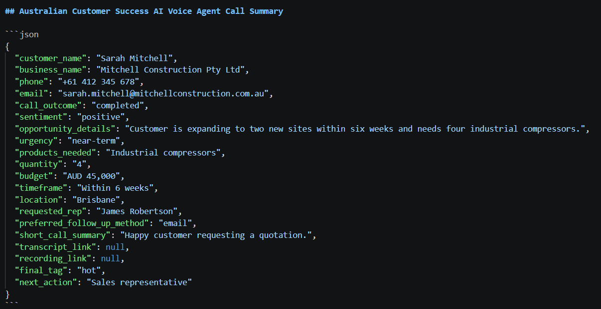
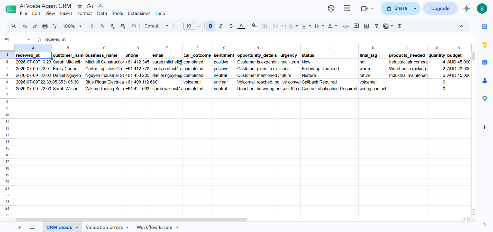
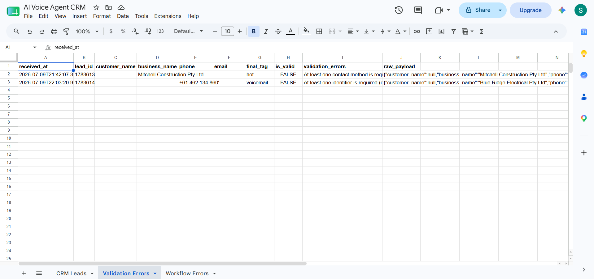
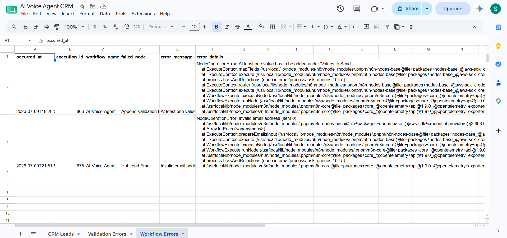

# 🎙️ Customer Success AI Voice Agent Backend

**Production-grade backend orchestration for AI-assisted customer success conversations.**


A production-grade n8n backend that converts structured AI voice-agent call summaries into validated CRM records, outcome-based routing, targeted team notifications, and full execution observability. The workflow does not place or receive live phone calls. It receives a structured JSON summary — the machine-readable contract produced by an AI conversation layer — and turns that summary into deterministic backend actions: a validated CRM write, a routing decision based on the call's final classification, a notification to the right owner where one is warranted, a CRM status update reflecting what should happen next, and a permanent audit trail regardless of outcome.

> **Case study included.** This README documents the backend architecture in full technical depth. A complete business case study — problem framing, the Customer-Led Growth narrative, and the ROI argument for a B2B SaaS customer success team — is included at [`case-study/customer-success-ai-voice-agent-backend-case-study.pdf`](./case-study/customer-success-ai-voice-agent-backend-case-study.pdf).

---

## Executive Summary

This backend is the orchestration layer beneath an AI-assisted customer success workflow. It does not simulate a phone system, and it does not itself decide what to say to a customer — those responsibilities sit entirely with the conversational agent that sits in front of it. What this workflow owns is everything that happens *after* a conversation concludes: turning a structured summary into a system of record, deciding who needs to act on it and how urgently, and making sure nothing — valid, invalid, or outright broken — disappears without a trace.

The system is built on four design principles that show up consistently across every node in the pipeline:

- **Structured ingestion over raw transcripts.** The backend never parses conversational text. It receives a fixed-shape JSON object and treats that shape as a contract.
- **Deterministic validation before CRM writes.** No record enters the CRM until it has been checked against explicit, auditable rules — not judgment calls.
- **Outcome-based routing instead of generic notifications.** The system distinguishes between outcomes that require a person to act and outcomes that only require a record to exist, and it treats them differently.
- **Full observability through separated logging.** Data-quality problems and engineering failures are captured in two distinct logs, because they have two distinct audiences and two distinct remediation paths.

The result is a backend that a customer success or revenue operations team could put into production today, feeding it summaries from any conversational source — simulated, human-reviewed, or, eventually, a live telephony platform — without redesigning a single downstream node.

---

## Business Problem

B2B SaaS customer success teams operate in a high-signal environment. Nearly every post-sale conversation carries information that matters — a retention risk, an expansion opportunity, an onboarding friction point, a support escalation, a piece of unsolicited product feedback. The challenge these teams face is rarely a shortage of signal. It is the absence of a reliable path from *a conversation happened* to *the right action was taken on it, quickly and consistently*.

Left to manual handling, this breaks down in predictable ways:

- **Feedback is scattered across notes, inboxes, spreadsheets, and half-updated CRM fields.** There is no single place a manager can look to understand what customers said this week, because no single place was ever the designated destination.
- **High-value signals arrive late.** A call summary written up an hour — or a day — after the conversation means the moment for a same-day response has often already passed, and Time-to-Value from that signal degrades accordingly.
- **Churn indicators get buried in unstructured notes.** A negative-sentiment call or an unreturned voicemail is exactly the kind of event that should trigger a retention play, but if it's recorded as a paragraph in someone's personal notes rather than a structured, routable field, it has no mechanism to surface itself.
- **Follow-up ownership is ambiguous.** Without an explicit assignment rule, "someone should follow up on this" quietly becomes "no one did," and CRM hygiene degrades as records sit incomplete or contradictory.
- **Every outcome gets treated the same way — or none of them do.** Manual processes tend toward one of two failure modes: either every call summary triggers an email (and the team learns to ignore the inbox), or nothing does (and genuinely urgent signals sit unrouted).

For a SaaS business, this directly threatens Customer-Led Growth. Expansion opportunities surfaced in a customer success call are only real if they're captured and routed before the moment passes. Retention risk flagged in a call is only actionable if it reaches someone with the authority to intervene. A pipeline that depends on a person remembering to write things down and then remembering to act on what they wrote is not a pipeline — it's a hope.

This backend exists to remove that dependency. It converts every customer success interaction — represented by its structured summary — into a deterministic sequence of validation, logging, routing, and notification, so that what happens next depends on the data, not on who happened to be paying attention that day.

---

## Solution Overview

The system is deliberately split into two layers with a single, well-defined handoff between them.

**The Conversation Intelligence Layer** is the Australian Customer Success AI Voice Agent — Ava. Ava's role is to engage in a customer success conversation (currently simulated rather than conducted over a live phone line) and produce a structured call summary at the end of it: a single JSON object capturing who was spoken to, what was discussed, how the conversation went, and what should happen next. Ava's system prompt explicitly frames her as a customer success representative rather than a salesperson — her job is to check in, gather honest feedback, and identify genuine opportunities naturally, not to run a sales script. That framing matters operationally as much as it matters for tone: a conversation optimized for trust and structured capture produces a more reliable summary than one optimized for pushing a pitch.

**The Backend Orchestration Layer** is this n8n workflow. It has no visibility into the conversation itself and does not need any — it operates entirely on the structured summary Ava hands it. The workflow receives that summary over a webhook, normalizes it into a consistent internal shape, validates it against explicit business rules, writes valid records into a Google Sheets CRM, routes execution based on the conversation's final outcome classification, notifies the appropriate owner for outcomes that warrant it, updates the CRM with a status and next action for every outcome, and logs both data-quality failures and engineering failures separately and permanently.

The handoff between these two layers is the structured call summary itself — the single most important contract in the system. It is what allows the conversation layer and the backend layer to evolve independently: Ava's prompt can be refined, her voice can change, and eventually a live telephony platform can be attached upstream of her, all without requiring a single change to this backend, provided the summary continues to conform to the same shape. That shape is not a nice-to-have; it is the reason this system is production-grade rather than a one-off script tied to one specific agent implementation.

---

## How It Works

1. **A structured call summary arrives.** The AI voice agent — having concluded a customer success conversation — sends a single JSON payload to the Voice Call Webhook via an HTTP POST to `/voice-summary`. This payload contains everything the backend needs: identity fields, sentiment, urgency, opportunity details, and a `final_tag` classifying the conversation's outcome.

2. **The payload is normalized.** The Normalize Data node extracts each of the nineteen expected fields from the incoming request body, trims whitespace, lowercases the fields that will later be used for exact-match comparisons (`email`, `call_outcome`, `sentiment`, `urgency`, `preferred_follow_up_method`, `final_tag`), and converts `quantity` through a numeric cast. The output is a flat, predictable object with no nested `body` wrapper — every downstream node references these fields directly.

3. **The lead is validated.** The Validate Lead node applies a fixed set of business rules: at least one identifier (customer name or business name) must be present, at least one contact method (phone or email) must be present, four individual fields must be non-empty, and `final_tag` must match one of eight explicitly allowed values. The node also stamps metadata — a received timestamp, a fallback lead ID, and a preserved JSON copy of the raw input — onto the record regardless of outcome.

4. **The record is branched on validity.** The Is Lead Valid? node reads the boolean `is_valid` flag Validate Lead computed and sends the item down one of two paths with no further logic of its own.

5. **Valid records are written to the CRM.** The Append CRM Lead node inserts a new row into the CRM Leads sheet, writing all nineteen normalized fields plus a default `status` of `"New"`, a `received_at` timestamp, and a `lead_id` set to the n8n execution ID — the identifier every later update in this execution will use to find this exact row again.

6. **Invalid records are logged, not discarded.** The Append Validation Error node writes a separate row to the Validation Errors sheet, preserving the identifying fields that were present, the specific validation failure reasons, and the complete raw payload as a JSON string — enough context for a human to diagnose exactly what was missing or malformed without needing to reproduce the failure.

7. **Valid records are routed by their final outcome.** The Route by Final Tag node reads the normalized `final_tag` and directs execution down one of nine mutually exclusive paths: `hot`, `warm`, `future`, `feedback only`, `voicemail`, `wrong contact`, `not interested`, `do-not-call`, or a defensive `fallback` path.

8. **Six of the nine outcomes trigger a targeted email.** Hot, warm, future, voicemail, wrong contact, and the fallback path each render and send a distinct, color-coded HTML notification to the appropriate recipient, tailored to what that outcome actually requires someone to do next.

9. **Three outcomes update the CRM silently.** Feedback only, not interested, and do-not-call route directly to a CRM status update with no accompanying email — these are outcomes that need a record, not an interruption.

10. **Every routed outcome updates the CRM record it already created.** Each of the nine branches ends in a Google Sheets update operation that matches on `lead_id` and writes a status, an assignment, and a note specific to that outcome — turning the initial "New" record into an actionable, owned item.

11. **Unhandled execution failures are captured independently.** A workflow-level Error Trigger listens for any node in this workflow throwing an unhandled exception — a scenario entirely separate from a lead simply failing validation — and routes the failure details to the Append Workflow Errors node.

12. **Runtime failures are logged with full diagnostic context.** The Append Workflow Errors node writes the execution ID, the workflow name, the specific node that failed, the error message, and the full stack trace to the Workflow Errors sheet, giving an engineer everything needed to reproduce and fix the problem without re-running the workflow blind.

---

## Architecture

The workflow contains twenty-four functional nodes (five additional sticky notes on the canvas serve as in-context documentation and do not execute). The architecture separates cleanly into an ingestion-and-validation spine, a nine-way routing fan-out, and a parallel, independent error-observability lane.

### Ingestion and Validation Spine

**Voice Call Webhook** — A Webhook node listening for `POST` requests at `/voice-summary`. This is the single entry point for every execution. It is configured with a custom response body — `{"success": true, "message": "Voice summary processed successfully", "lead_id": "{{ $execution.id }}"}` — so the calling agent receives immediate, structured confirmation that the summary was received, independent of how the rest of the workflow subsequently processes it.

**Normalize Data** — A Set node that extracts nineteen fields from `$json.body` and writes them to the top level of the item, applying `.trim()` universally and `.toLowerCase()` specifically to the fields used later for exact-match comparison: `email`, `call_outcome`, `sentiment`, `urgency`, `preferred_follow_up_method`, and `final_tag`. `quantity` is passed through `Number()` to normalize it to a numeric value. This node assumes structural completeness — every expected key must be present in the incoming payload, even if its value is an empty string — because calling `.trim()` on an undefined field throws a runtime exception rather than failing gracefully. That assumption is deliberate: it is what separates a *malformed request* (a structural mismatch, caught as a hard error by the Error Trigger lane) from an *incomplete but well-formed request* (a business-rule violation, caught by the Validate Lead node one step later). This distinction is the backbone of the two-lane error-handling design described below.

**Validate Lead** — A Code node that reads `$json.body ?? $json`, a defensive pattern that lets this node work correctly whether it receives the raw webhook payload directly or the already-flattened output of Normalize Data. It applies an `isEmpty()` helper against a required-field checklist: `customer_name` OR `business_name` must be present, `phone` OR `email` must be present, and `call_outcome`, `final_tag`, `short_call_summary`, and `next_action` must each individually be non-empty. It then checks `final_tag` against a hardcoded whitelist of eight values — `hot`, `warm`, `future`, `feedback only`, `voicemail`, `wrong contact`, `not interested`, `do-not-call` — and flags the record invalid if the tag doesn't match one of them exactly. Every validation failure is collected into an `errors` array rather than short-circuiting on the first one, so a single invalid submission surfaces every problem with it at once rather than requiring multiple resubmission-and-fail cycles. The node stamps `received_at`, a fallback `lead_id`, the boolean `is_valid`, the `validation_errors` array, and a `raw_payload` string — a complete, stringified copy of the original input — onto every record it processes, valid or not.

**Is Lead Valid?** — An IF node with a single condition reading the `is_valid` boolean Validate Lead computed. It performs no logic of its own; it exists purely to split execution cleanly into a valid path and an invalid path, keeping the branching decision visually explicit on the canvas rather than buried inside a Code node's control flow.

**Append CRM Lead** — A Google Sheets append operation writing to the `CRM Leads` tab of the `AI Voice Agent CRM` spreadsheet. It writes all nineteen normalized fields, a hardcoded `status` of `"New"`, a `received_at` timestamp taken at write time, and a `lead_id` set to `{{ $execution.id }}` — deliberately overriding whatever fallback ID Validate Lead may have assigned, since the execution ID is guaranteed unique and is what every subsequent CRM update in this same execution will match against. The `phone` column is written with a leading single-quote character prepended to the value — a standard spreadsheet technique that forces Google Sheets to treat a value like `+61 412 345 678` as literal text rather than attempting to reformat or strip the leading `+` as if it were numeric. Because a Google Sheets append operation returns the row as actually written, this formatting artifact becomes part of the item's data for every node downstream of this point — which is why it is visible, cosmetically, in the phone field of the notification emails described below.

**Append Validation Error** — A Google Sheets append operation writing to the separate `Validation Errors` tab. It writes `received_at`, `lead_id`, whatever identifying fields were present, `phone` (with the same quote-prefix technique), `email`, `final_tag`, the `is_valid` flag, the joined `validation_errors` string, and the complete `raw_payload`. This row is intentionally never written to the CRM Leads tab — an invalid record does not get a half-populated CRM entry; it gets a complete diagnostic record in a dedicated location instead.

### Routing Fan-Out

**Route by Final Tag** — A Switch node in Rules mode with nine conditions, each an exact-match check against the normalized `final_tag` value: `hot`, `warm`, `future`, `feedback only`, `voicemail`, `wrong contact`, `not interested`, `do-not-call`, and `fallback`. Because Validate Lead already rejected any record whose `final_tag` wasn't one of the eight whitelisted values, the `fallback` branch's condition — checking for a literal `final_tag` of `"fallback"` — is not reachable through normal execution under the current validation rules; it functions as forward-compatible insurance rather than an actively exercised path, ready to catch a new or misconfigured tag value if the validation whitelist is ever extended without a corresponding Switch update, or if a future upstream change bypasses Validate Lead entirely. This is detailed further in **Routing Logic by Final Tag** below.

**Nine terminal branches** — each final tag leads to a combination of an email notification (for six of the nine tags) and a CRM status update (for all nine), described in full in the two dedicated sections that follow.

### Error Observability Lane

**Error Trigger** — n8n's built-in error-capturing node type, which fires whenever an unhandled exception occurs during this workflow's execution — for example, a malformed payload causing Normalize Data to throw when calling `.trim()` on an absent field, or a downstream node like a Gmail send failing on an invalid address. This lane is entirely independent of the Is Lead Valid? branch: it catches failures the validation logic never gets a chance to evaluate, because the workflow crashed before reaching that point.

**Append Workflow Errors** — A Google Sheets append operation writing to the `Workflow Errors` tab, capturing `occurred_at`, `execution_id`, `workflow_name`, `failed_node` (via `$json.execution.lastNodeExecuted`), the `error_message`, and the full `error_details` stack trace. This is the record an engineer reaches for during an incident — not a business-rule violation, but something the system itself did not expect.

---

## Workflow Diagram



Every valid record — regardless of outcome — passes through exactly one email decision and exactly one CRM update. The Error Trigger lane operates entirely outside this flow, catching failures the main spine never sees.

---

## Evidence of Structured Ingestion

The Australian Customer Success AI Voice Agent — Ava — is built with a system prompt that establishes a clear role boundary before it establishes anything else: she is identified explicitly as *an AI-powered Customer Success Assistant for an Australian B2B company*, whose role is to proactively check in with existing customers after a previous purchase, gather honest feedback, identify additional needs, discover expansion signals, qualify genuine sales opportunities, and record structured information for the sales team — while being explicitly instructed that she is *not a salesperson whose goal is to push products*, and that she must never pretend to be human. That framing is not incidental. A conversation optimized for trust and honest disclosure produces meaningfully different — and more useful — signal than a conversation optimized for closing, and the entire downstream backend depends on the quality of what gets captured.

Ava's only tool is a single action: **Send Voice Call Summary to Webhook**, which posts a structured JSON summary to this backend's ingestion endpoint. That constraint is what makes the two-layer architecture work — Ava's entire interface to the outside world is this one contract, which means a live telephony platform can eventually be attached upstream of her without the backend needing to know or care that anything changed.

The call summary itself is the most important artifact in the system — the point where a conversation becomes a machine-readable business event. A representative example, captured from a completed interaction with Sarah Mitchell of Mitchell Construction Pty Ltd:

```json
{
  "customer_name": "Sarah Mitchell",
  "business_name": "Mitchell Construction Pty Ltd",
  "phone": "+61 412 345 678",
  "email": "sarah.mitchell@mitchellconstruction.com.au",
  "call_outcome": "completed",
  "sentiment": "positive",
  "opportunity_details": "Customer is expanding to two new sites within six weeks and needs four industrial compressors.",
  "urgency": "near-term",
  "products_needed": "Industrial compressors",
  "quantity": "4",
  "budget": "AUD 45,000",
  "timeframe": "Within 6 weeks",
  "location": "Brisbane",
  "requested_rep": "James Robertson",
  "preferred_follow_up_method": "email",
  "short_call_summary": "Happy customer requesting a quotation.",
  "transcript_link": null,
  "recording_link": null,
  "final_tag": "hot",
  "next_action": "Sales representative"
}
```

Every field this backend's validation and routing logic depends on is present here — identity, contact method, outcome classification, and the `final_tag` that ultimately determines everything that happens next. Nothing about this payload requires the backend to have any understanding of the conversation that produced it; it only needs to trust that the shape is correct.

---

## Validation Logic

The Validate Lead node is the backend's single gatekeeper between an inbound summary and the CRM. Its rules are deliberately explicit rather than inferred:

| Rule | Requirement |
|---|---|
| Identifier | `customer_name` OR `business_name` must be present |
| Contact method | `phone` OR `email` must be present |
| Call outcome | `call_outcome` must be non-empty |
| Final tag | `final_tag` must be non-empty **and** match one of eight allowed values |
| Call summary | `short_call_summary` must be non-empty |
| Next action | `next_action` must be non-empty |

The allowed `final_tag` whitelist is: `hot`, `warm`, `future`, `feedback only`, `voicemail`, `wrong contact`, `not interested`, `do-not-call`. Notably, `fallback` is **not** on this list — a deliberate omission that means a record can never legitimately reach the Switch node's fallback branch through normal validation; that branch exists purely as a defensive safeguard, covered in the next section.

Every rule that fails is appended to an `errors` array rather than halting evaluation at the first failure, so a submission missing both a contact method and a call summary is reported with both problems at once. The two authentic validation failures visible in the Validation Errors sheet illustrate this precisely: one submission for Mitchell Construction Pty Ltd was rejected for having neither a phone number nor an email address on file, despite a valid business name and `final_tag` of `hot`; a separate submission was rejected for lacking any identifier at all — neither a customer name nor a business name — despite carrying a phone number. Both records were preserved in full, including their raw JSON payload, rather than silently dropped.

This is also where the architectural distinction between *invalid* and *broken* becomes concrete. A submission that reaches Validate Lead and fails these checks is **structurally complete but substantively insufficient** — every expected key exists, but a business rule wasn't satisfied. That is a data-quality problem, and it is logged as one. A submission that never reaches Validate Lead at all, because Normalize Data threw an exception trying to read a key that wasn't present in the payload in the first place, is a **structural failure** — and it is caught by an entirely separate mechanism, described in Error Handling & Observability below.

---

## Routing Logic by Final Tag

Once a record clears validation and is written to the CRM, the Route by Final Tag Switch node determines everything that happens next based purely on the `final_tag` value:

| Final Tag | Business Meaning | Email Sent | CRM Status | Assigned To |
|---|---|---|---|---|
| `hot` | Genuine, near-term sales opportunity identified | ✅ Hot Lead Email | `New` | Sales Team |
| `warm` | Interest confirmed, not immediately urgent | ✅ Warm Lead Email | `Follow-up Required` | Sales Team |
| `future` | Opportunity exists but timeline is distant | ✅ Future Lead Email | `Nurture` | — |
| `feedback only` | Customer shared feedback, no sales angle | — (silent) | `Feedback Received` | Account Manager |
| `voicemail` | Call did not connect; no conversation occurred | ✅ Voicemail Email | `Callback Required` | Sales Team |
| `wrong contact` | Call reached someone other than the intended customer | ✅ Wrong Contact Email | `Contact Verification Required` | Sales Operations |
| `not interested` | Customer explicitly declined further engagement | — (silent) | `Closed - Not Interested` | — |
| `do-not-call` | Customer requested suppression from future outreach | — (silent) | `Do Not Call` | — |
| `fallback` | Unrecognized or unsupported tag reached the router | ✅ Fallback Alert Email | `Workflow Review Required` | Automation Administrator |

Three outcomes — `feedback only`, `not interested`, and `do-not-call` — update the CRM without sending any email at all. This is a deliberate design decision rather than a gap: these are terminal or archival outcomes that need a permanent record but do not require anyone to act urgently, and routing them to a silent CRM update rather than an inbox keeps the notification channel reserved for outcomes that genuinely warrant attention. This distinction is expanded on directly in the next section.

The `fallback` branch deserves particular attention. Because Validate Lead's whitelist does not include the string `"fallback"`, no record can reach this branch of the Switch node while validation logic remains as currently configured — any record with an unrecognized `final_tag` would already have been rejected as invalid and routed to the Validation Errors sheet before ever reaching the router. The fallback branch is best understood as forward-compatible insurance: a safety net that would activate automatically if the validation whitelist were ever expanded, if a new tag value were introduced upstream without a corresponding backend update, or if a future integration bypassed the validation step entirely. Its notification — sent to an Automation Administrator rather than a sales role — and its CRM status of `Workflow Review Required` both confirm its purpose: this is an engineering signal, not a customer-facing outcome.

---

## Email Notification Behavior

All six notification emails share a common structural pattern: a colored hero header naming the alert type, a details table drawn from the normalized call summary, a highlighted summary block surfacing the opportunity details, call summary, and recommended next action, and — where applicable — transcript and recording links. Each template is tuned to what its specific outcome actually requires the recipient to do.

| Outcome | Header Color | Subject Line Pattern | Recipient Focus |
|---|---|---|---|
| Hot | Red (`#d32f2f`) | `🔥 HOT LEAD: {customer} | {business}` | Immediate sales follow-up |
| Warm | Orange (`#f57c00`) | `🟠 WARM LEAD: {customer} | {business}` | Follow-up within a few business days |
| Future | Blue (`#1976d2`) | `🔵 FUTURE LEAD: {customer} | {business}` | Add to nurture pipeline |
| Voicemail | Blue-gray (`#546e7a`) | `📞 VOICEMAIL: Callback Required | {customer} | {business}` | Schedule a callback attempt |
| Wrong Contact | Purple (`#8e24aa`) | `⚠️ WRONG CONTACT: Contact Verification Required | {business}` | Verify contact data before retrying |
| Fallback | Deep red (`#c62828`) | `🚨 AI Voice Agent Alert: Unhandled Lead Classification Detected` | Review workflow configuration |

Two details distinguish these templates from a single generic notification. First, the Wrong Contact and Fallback subjects deliberately omit the customer name — in the Wrong Contact case, because the recorded name may itself be unreliable if the wrong person was reached; in the Fallback case, because the alert is about the system's configuration, not about any specific customer relationship. Second, the field set each email surfaces is trimmed to what's actually relevant: the Voicemail email has no opportunity-details or transcript section, because no conversation took place to generate one; the Future email omits quantity and requested-representative fields that matter far less for a distant, unqualified opportunity than for a hot one.

The Hot Lead Email's rendered phone field also carries a small, consistent cosmetic artifact worth noting precisely: because the phone value is written to the CRM sheet with a leading quote character to preserve its formatting, and because that written value flows back into the item as the Google Sheets node's output, the same quote-prefixed string appears in the notification email's Phone row — visible as `'+61 412 345 678'` rather than a bare number. It's a byproduct of correct spreadsheet formatting, not a data error.

---

## CRM Logging Behavior

Every valid record touches the CRM twice within a single execution: once to create it, once to update it with the outcome of routing.

**Creation** happens in Append CRM Lead, which writes a complete row — all nineteen call-summary fields, a `status` of `"New"`, a fresh `received_at` timestamp, and a `lead_id` equal to the execution ID. This is the only point in the workflow where a brand-new row is created; every subsequent touch to this record is an update against that same `lead_id`.

**Enrichment** happens in one of nine "Update CRM –" nodes, each a Google Sheets update operation matching on `lead_id` and overwriting a small, outcome-specific set of fields — typically `status`, `notes`, and where relevant, `assigned_to`. The assignment logic itself carries business meaning: Hot, Warm, and Voicemail outcomes are assigned to the general Sales Team; Wrong Contact is assigned specifically to Sales Operations, since verifying a contact record is an operational task distinct from a sales follow-up; Feedback Only is assigned to an Account Manager, since a feedback signal from an existing customer is a relationship-management concern rather than a new-business one; and Fallback is assigned to an Automation Administrator, keeping engineering-configuration issues entirely separate from customer-facing ownership.

The CRM Leads sheet, populated across real test executions, shows this pattern in practice: a Hot lead from Mitchell Construction Pty Ltd sits at status `New` with Sales Team ownership and an "immediate follow-up required" note; a Warm lead from Carter Logistics Group sits at `Follow-up Required`; a Future lead from Nguyen Industrial Services sits at `Nurture`; a Voicemail attempt to Blue Ridge Electrical — logged with only a business name and phone number, since no customer name or email was ever captured — sits at `Callback Required`; and a Wrong Contact result for Wilson Roofing Solutions sits at `Contact Verification Required`. That Blue Ridge Electrical row is a clean real-world demonstration of the identifier validation rule in action: business name present, customer name absent, and the record still valid because only one identifier was ever required.

---

## Error Handling and Observability

This backend treats two categories of failure as fundamentally different problems, and logs them in two entirely separate systems as a result.

**Validation errors** are data-quality problems. The payload arrived intact and well-formed — every expected key was present — but a business rule wasn't satisfied: no contact method, no identifier, a missing required field, or an unrecognized `final_tag`. These are captured by the Validate Lead node's explicit rule checks and written to the Validation Errors sheet, complete with the specific rule that failed and the full raw payload for diagnosis. The audience for this log is whoever owns the upstream integration — the conversational agent's prompt or tooling may need adjustment if a particular field is consistently coming through empty.

**Workflow errors** are engineering problems. Something the system did not anticipate happened — a payload missing an entire expected key, causing an unhandled exception in Normalize Data before validation logic ever runs; a downstream node like a Gmail send failing against a malformed email address; any other unhandled exception anywhere in the execution. These are caught by n8n's Error Trigger mechanism, entirely independent of the main validation-and-routing spine, and written to the Workflow Errors sheet with the execution ID, the specific failed node, the error message, and the full stack trace. The audience for this log is engineering, and the two real examples captured in it during development — a Google Sheets node briefly misconfigured with no values to send, and a Gmail node rejecting a malformed test email address — are exactly the kind of concrete, reproducible evidence a production system's error log should contain.

This separation is not incidental logging hygiene. It reflects the actual shape of the failures: a validation error means the system is working correctly and simply encountered bad input; a workflow error means the system itself needs attention. Merging them into a single log would force whoever reviews it to constantly re-triage which category each entry belongs to. Keeping them apart means each log answers exactly one question, for exactly one audience, without noise from the other.

---

## Business Impact

- **Customer-Led Growth** — every customer success conversation, once it produces a structured summary, becomes a routable business event rather than a note that may or may not get read. Expansion signals and genuine opportunities reach a sales owner through the same deterministic path every time.
- **Time-to-Value** — the moment a summary is received, the relevant team member has a structured, complete record — not a raw transcript they need to read and interpret themselves before they can act.
- **Churn Mitigation** — voicemail attempts, wrong-contact results, and negative or neutral-sentiment outcomes are captured and made visible rather than disappearing into an unreviewed backlog, giving a customer success team the chance to intervene before a relationship quietly cools.
- **Pipeline Velocity** — hot and warm outcomes move directly into a notified, assigned follow-up state within the same execution that logged them, with no manual triage step in between.
- **Operational Discipline** — validation failures and workflow failures are tracked in separate, purpose-built logs, which means a data-quality issue and an engineering incident never get confused for each other, and neither ever goes unrecorded.

---

## Future Enhancements

The current backend is deliberately scoped around structured-summary ingestion, which means its most significant extension path is upstream rather than architectural:

- **Live telephony integration** — connecting a platform such as Vapi, Retell AI, Bland AI, or Twilio Voice so Ava conducts real, live conversations rather than simulated ones. Because the backend's only contract with the conversation layer is the structured JSON summary, this integration would require no changes to any node described in this document — only a new source producing the same shape of payload.
- **Recording and transcript storage** — persisting call recordings and transcripts (the `transcript_link` and `recording_link` fields already exist in the schema and are currently populated as `null`) for searchable historical review.
- **Sentiment trend and renewal-risk scoring** — aggregating sentiment and urgency signals over time per account to surface renewal risk or account health before it reaches a crisis point.
- **Slack or Microsoft Teams notifications** — mirroring the email alerts into a team channel for faster visibility, particularly for the Hot and Fallback categories.
- **Direct CRM platform integration** — writing validated records into HubSpot or Salesforce as native objects rather than spreadsheet rows, for teams already standardized on a dedicated CRM.
- **Lead deduplication** — checking existing CRM records for a matching phone or email before creating a new row, consolidating repeat interactions with the same customer into a single history rather than a new record per call.
- **Configurable routing rules** — externalizing the final-tag-to-status-and-owner mapping into a lookup table, allowing the routing logic to be tuned without editing Switch node conditions directly.
- **SLA-based escalation** — adding a time-based check that escalates a Hot or Wrong Contact lead if it remains in its initial status past a defined window, closing the loop on whether a notification actually resulted in action.

---

## Screenshots

### Workflow Canvas

> 

The full backend choreography as it exists in n8n, tagged `Production-grade` and `AI` in the workflow header. The webhook ingress sits on the left, feeding through normalization and validation into a branch point. The valid path continues right into CRM logging and the nine-way routing Switch; the invalid path drops down into the Validation Errors log. A fully separate error-handling lane sits in the upper-left, entirely disconnected from the main spine, reflecting its role as an independent safety net rather than a step in the primary flow. In-canvas sticky notes annotate each functional cluster directly on the diagram — a form of documentation that lives with the workflow itself rather than in a separate file that can drift out of sync with it.

### Backend Architecture Diagram

> 

A presentation-layer diagram tracing the complete path from Ava's structured call summary through webhook ingestion, the backend processing pipeline, routing by outcome, and the supporting logging systems. This is the clearest single artifact for understanding the system's shape without reading node-level configuration: it makes the validation gate, the CRM-before-routing sequencing, and the parallel error-handling lane explicit as first-class architectural elements rather than implementation details.

### Voice Agent Identity

> 

The configuration view of the Australian Customer Success AI Voice Agent, showing Ava's system prompt in full. The identity section establishes her role boundary precisely — a customer success representative building trust and identifying opportunities naturally, explicitly not a scripted salesperson — and her only configured tool, Send Voice Call Summary to Webhook, is the single mechanism through which anything she learns in a conversation reaches this backend.

### Call Summary Sample

> 

A representative structured call summary as Ava produces it at the conclusion of a conversation — in this case, a completed, positive-sentiment call with Sarah Mitchell of Mitchell Construction Pty Ltd, tagged `hot`. Every field this backend's validation and routing logic depends on is visible here in its native shape: this is the literal payload the Voice Call Webhook receives.

### Hot Lead Email

> 

The notification generated from the summary above, delivered within seconds of the record being logged. The red header and "High Priority Lead Notification" framing are deliberate — this is the one outcome in the system explicitly designed to interrupt someone immediately, and the structured table beneath it gives a sales rep everything needed to make the first call without opening a second system.

### CRM Leads Sheet

> 

The `CRM Leads` tab, populated across five real test executions spanning five different outcomes — hot, warm, future, voicemail, and wrong contact. Each row reflects both the initial append and the subsequent outcome-specific update, visible in the `status` column: `New`, `Follow-up Required`, `Nurture`, `Callback Required`, and `Contact Verification Required` respectively. The Blue Ridge Electrical row, logged with a business name but no customer name, is direct evidence of the identifier validation rule accepting a business-only record as complete.

### Validation Errors Sheet

> 

Two authentic validation failures, each preserving the specific rule that was violated and the complete raw payload. One submission was rejected for lacking any contact method despite a valid business name; the other was rejected for lacking any identifier at all. Neither record reached the CRM Leads sheet — this log exists specifically so that rejected data is never silently lost, only redirected.

### Workflow Errors Sheet

> 

Two genuine runtime failures captured during development: a Google Sheets node briefly left without any configured values to write, and a Gmail node rejecting a malformed test email address. Both include the failed node, the exact error message, and a full stack trace — this is the log an engineer would actually use to diagnose and fix a production incident, not a hypothetical placeholder.

---

## Technical Stack & Implementation Notes

| Technology | Role |
|---|---|
| **n8n** | Workflow orchestration engine — hosts the webhook, validation logic, routing, and every downstream integration |
| **Webhook Node** | Ingestion endpoint (`POST /voice-summary`) receiving structured call summaries from the conversational AI layer |
| **Set Node** | Field normalization — flattens and standardizes the raw webhook payload into a consistent internal shape |
| **JavaScript Code Node** | Validation engine — applies explicit business rules, collects all failures per submission, and stamps audit metadata |
| **IF Node** | Binary branch on the `is_valid` flag, separating the valid and invalid paths |
| **Switch Node** | Nine-way router keyed on `final_tag`, including a defensive fallback condition |
| **Google Sheets** | System of record across three purpose-built tabs — CRM Leads, Validation Errors, and Workflow Errors |
| **Gmail** | Outbound HTML notifications, six distinct branded templates keyed to outcome |
| **Error Trigger** | n8n's built-in exception handler, operating independently of the main validation-and-routing spine |
| **HTML Email Templates** | Color-coded, outcome-specific layouts sharing a common structural pattern |

**Implementation notes worth knowing before extending this workflow:**

- Normalize Data assumes every expected key is present in the incoming payload, even if empty. A payload missing a key entirely will throw before reaching Validate Lead, and will be caught by the Error Trigger lane rather than logged as a validation failure.
- The `lead_id` written to the CRM Leads sheet is always the n8n execution ID, not the fallback ID Validate Lead computes — the fallback only persists into the Validation Errors sheet, since invalid records never reach Append CRM Lead.
- The phone-field quote-prefix technique (`"'" + $json.phone`) is applied inside the Google Sheets column mapping, and because Sheets append operations return the written row as their output, that formatting choice is visible downstream in the notification emails, not just in the spreadsheet.
- The `fallback` Switch branch cannot be reached under the current validation whitelist. Extending the whitelist to include new outcome tags without also confirming the Switch node covers them would be the most direct way to accidentally route a valid lead into the fallback path.

---

## Repository Structure

```
n8n-workflows/
└── customer-success-ai-voice-agent-backend/
    ├── case-study/
    │   └── customer-success-ai-voice-agent-backend-case-study.pdf
    ├── images/
    │   ├── workflow.png                     # n8n editor screenshot
    │   ├── workflow-architecture.png        # Backend architecture diagram
    │   ├── voice-agent-identity.png         # Ava's system prompt and configuration
    │   ├── call-summary-sample.png          # Representative structured call summary
    │   ├── hot-lead-email.png               # Hot outcome notification email
    │   ├── crm-leads-sheet.png              # CRM Leads Google Sheets tab
    │   ├── validation-errors-sheet.png      # Validation Errors Google Sheets tab
    │   └── workflow-errors-sheet.png        # Workflow Errors Google Sheets tab
    ├── customer-success-ai-voice-agent-backend.json   # Exported n8n workflow (importable directly)
    └── README.md
```

To deploy: import the workflow JSON into your n8n instance, connect Google Sheets and Gmail credentials, create a spreadsheet with `CRM Leads`, `Validation Errors`, and `Workflow Errors` tabs matching the column schema described above, update the webhook path and spreadsheet ID to your own values, and activate. Point any structured-summary-producing source — a conversational agent, a test harness, or eventually a live telephony platform — at the webhook URL to begin processing.

---

## Author

**Shaban Alam**
Python Automation Developer · n8n Workflow Specialist · AI Automation Builder

Building production-ready automation systems for businesses that want to eliminate repetitive manual work.

- **GitHub:** [github.com/Shaban27-dev](https://github.com/Shaban27-dev)
- **Email:** shabandev27@gmail.com
- **Available for:** freelance automation projects, AI-assisted backend orchestration, customer success automation, CRM integration, structured data pipelines

> Open to projects involving n8n, Python automation, AI conversation-intelligence backends, deterministic validation and routing systems, and production-grade observability design.

---

## Summary

Customer Success AI Voice Agent Backend is a production-grade orchestration system, not a voice-agent demo. It demonstrates structured webhook ingestion, deterministic multi-rule validation with complete failure aggregation, a nine-way outcome-based routing architecture with a documented and precisely scoped defensive branch, outcome-aware notification design that distinguishes urgent alerts from silent CRM updates, dual-write CRM logging that separates record creation from outcome enrichment, and a two-lane error-observability model that keeps data-quality issues and engineering failures in entirely separate, purpose-built logs.

The system's defining architectural choice is the strict separation between the conversation intelligence layer and the backend orchestration layer, connected by nothing more than a structured JSON contract. That separation is what makes the current absence of live telephony a scoping decision rather than a limitation — the backend has already been built, tested, and proven against real structured input, and attaching a live voice platform upstream requires no redesign of anything described in this document.

This project is part of an active automation portfolio. Additional workflows covering AI lead enrichment and qualification, client intake, document processing, file management, and price monitoring are available in the linked GitHub repository.
