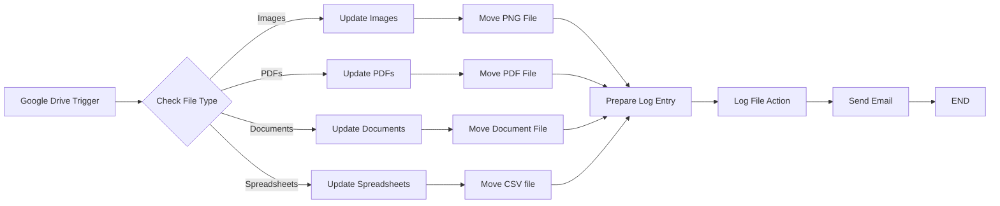
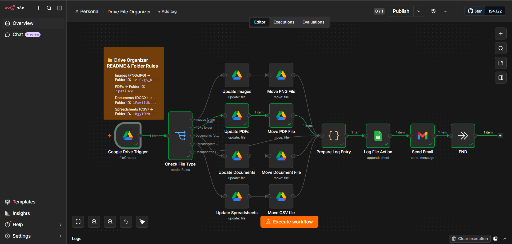
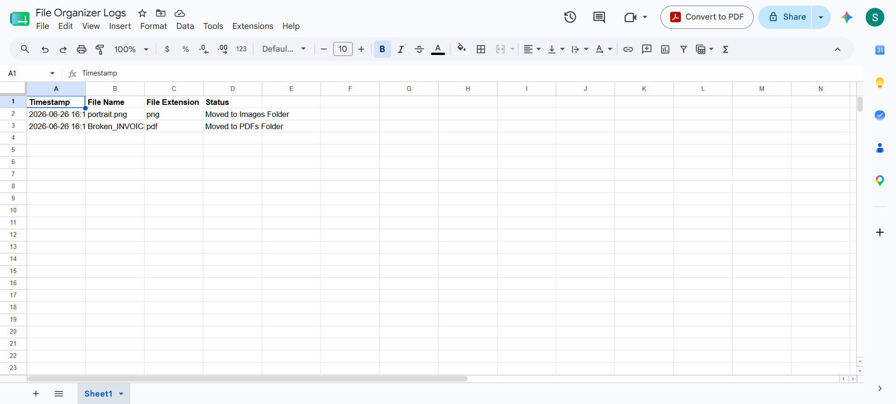
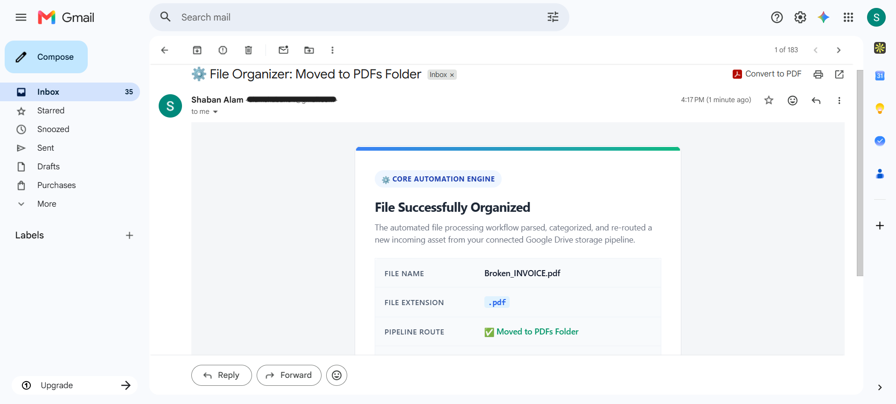

# ⚙️ Drive File Organizer


A production-ready n8n automation that turns Google Drive into a self-organizing file system. The moment a file lands in a monitored root folder, this workflow detects it, reads its extension, routes it into the correct destination folder, appends a structured log entry to Google Sheets, and fires a confirmation email — all within seconds, with no human involvement.

---

## Problem

Shared Google Drive folders accumulate clutter fast. Without enforced structure, every team member uploads files wherever is convenient, and within weeks a root folder holds invoices, images, reports, and source code side by side with no discernible organization.

The downstream effects compound quickly:

- **File discovery becomes a search problem.** Finding the right document means scrolling through hundreds of unrelated files or guessing at someone else's naming convention.
- **No audit trail.** There is no record of what was uploaded, when, or where it ended up. Compliance and accountability become manual exercises.
- **Sorting is repetitive manual work.** Someone eventually has to go through the folder, identify file types, and move things — work that yields no business value and scales poorly.
- **Inconsistency is the default.** Without automation enforcing structure, organization depends entirely on individual discipline, which erodes over time.

The root cause is that Google Drive provides storage, not governance. This workflow provides the governance layer.

---

## Solution

Drive File Organizer sits upstream of your storage and enforces structure automatically.

When a file is uploaded to the monitored root folder, n8n detects the event immediately via the Google Drive Trigger. A Switch node reads the file extension and routes execution down the correct path — images go to the Images folder, PDFs go to the PDFs folder, documents and spreadsheets follow the same logic. Each file is updated with metadata, physically moved, and removed from the root folder, all within a single workflow execution.

Once the file is in its destination, a JavaScript Code node constructs a structured log entry containing the filename, extension, destination, and a precise timestamp. That entry is appended to a Google Sheets audit log, and a branded HTML email is dispatched to the administrator confirming the action.

The result is a Drive folder that stays clean by default, with a complete audit trail and instant visibility into every file that passes through it.

---

## Architecture

**Google Drive Trigger** — Listens for `fileCreated` events on the monitored root folder. This is the entry point: every upload fires a trigger event that initiates the workflow immediately without polling or scheduled checks.

**Check File Type** — A Switch node operating in Rules mode. It inspects the incoming file's MIME type or extension and branches execution into one of five paths: Images (PNG/JPG), PDFs, Documents (DOCX), Spreadsheets (CSV), or Unsupported Files. Each path is mapped to a specific Google Drive destination folder ID, configured via the sticky note reference card embedded in the workflow canvas.

**Update [Type] nodes** — For each file category, a Google Drive node first updates the file record with relevant metadata before the physical move. This ensures the file carries accurate information into its destination folder rather than inheriting stale metadata from the upload event.

**Move [Type] File nodes** — A second Google Drive node per category executes the actual folder transfer, moving the file from the root into its designated destination. The two-step update-then-move pattern ensures metadata integrity throughout the operation.

**Prepare Log Entry** — A JavaScript Code node that runs after all routing paths converge. It processes execution metadata — filename, detected extension, destination folder name, ISO timestamp — and formats it into a structured object ready for Sheets ingestion. This is where raw trigger data gets shaped into a clean, queryable audit record.

**Log File Action** — A Google Sheets node that appends the prepared log entry to the `File Organizer Logs` spreadsheet. Each row records the timestamp, file name, file extension, and a human-readable status string describing where the file was moved. This sheet becomes the persistent audit trail for every file the workflow has ever processed.

**Send Email** — A Gmail node that renders and delivers a branded HTML notification to the administrator. The email confirms the file name, displays the detected extension as a styled badge, and shows the pipeline route with a success indicator. Subject lines include the destination folder name, making inbox scanning fast.

**END** — Execution terminates cleanly after every successful run.

---

## 📊 Workflow Diagram

The pipeline's structural topology and conditional execution paths are mapped below:



---

## Tech Stack

| Technology | Role |
|---|---|
| **n8n** | Workflow orchestration engine — hosts the automation, manages triggers, and connects all services |
| **Google Drive Trigger** | Event listener that fires on `fileCreated` — provides instant detection without polling |
| **Switch Node** | Rules-based router that classifies files by extension and directs execution to the correct branch |
| **Google Drive** | Performs metadata updates and physical file moves into destination folders |
| **JavaScript Code Node** | Constructs structured log entries from raw execution metadata with precise timestamps |
| **Google Sheets** | Append-only audit log — every processed file is recorded with its name, extension, destination, and timestamp |
| **Gmail** | Delivers branded HTML confirmation emails to the administrator after each successful file operation |
| **HTML Email Template** | Custom email layout with extension badge, pipeline route, and status display |

---

## Features

- **Event-driven execution** — triggers immediately on file upload; no polling, no delay
- **Automatic file classification** — reads file extensions and routes without any configuration per upload
- **Extension-based routing** — dedicated pipeline paths for images, PDFs, documents, and spreadsheets
- **Smart Switch branching** — rules-based logic with an unsupported-files fallback path
- **Dual-step file processing** — metadata update followed by folder move ensures clean file records in the destination
- **JavaScript metadata processing** — custom Code node constructs structured, queryable log objects
- **Google Sheets audit logging** — persistent, append-only record of every file processed with full context
- **Branded HTML email notifications** — confirms file name, extension, and destination route after each operation
- **Modular per-type architecture** — each file category has its own isolated pipeline path, making individual routes easy to modify
- **Unsupported file handling** — files with unrecognized extensions are routed to a fallback path rather than dropped silently
- **Fully unattended operation** — no manual interaction required at any stage
- **Extensible routing** — adding a new file type requires one additional Switch rule and a paired Update + Move node pair

---

## Screenshots

### Workflow

> **`images/workflow.png`**
>
> 

The complete workflow as it appears in the n8n editor, showing the Switch node's branching paths, the parallel Update + Move node pairs for each file type, and the shared logging and notification pipeline downstream.

---

### Google Sheets Audit Log

> **`images/google_sheet.png`**
>
> 

The `File Organizer Logs` spreadsheet, capturing a live execution record. Each row represents one processed file and includes the timestamp, original file name, detected extension, and destination status.

---

### Email Notification

> **`images/email_alert.png`**
>
> 

A live example of the administrator notification. The email displays the "CORE AUTOMATION ENGINE" status badge, a confirmation heading, and a structured table with the file name, extension badge, and a green pipeline route confirmation.

---

## How It Works

1. **A file is uploaded to the root folder.** The Google Drive Trigger detects the `fileCreated` event instantly and passes the file's metadata — name, MIME type, ID, and parent folder — downstream as the initial payload.

2. **The file extension is read.** The Check File Type Switch node evaluates the file against a set of configured rules. The extension determines which branch receives execution: Images, PDFs, Documents, Spreadsheets, or Unsupported Files.

3. **File metadata is updated.** The first Google Drive node on the matched branch updates the file record with any required metadata before the move operation begins.

4. **The file is moved to its destination.** A second Google Drive node physically relocates the file from the root folder to the designated destination folder, mapped by the folder ID configured in the Switch rule.

5. **Execution paths converge.** Once the file is in its destination, all branching paths merge back into a single downstream pipeline for logging and notification.

6. **A log entry is prepared.** The JavaScript Code node runs and constructs a structured object from the execution data: file name, detected extension, destination folder name, and an ISO-formatted timestamp.

7. **The log is written to Google Sheets.** The Log File Action node appends the structured entry to the `File Organizer Logs` spreadsheet as a new row under the Timestamp, File Name, File Extension, and Status columns.

8. **A confirmation email is generated.** The Send Email node renders the HTML email template, populating it with the file name, extension badge, and pipeline route string derived from the current execution.

9. **The email is delivered.** Gmail dispatches the notification to the configured recipient. The subject line names the destination folder, making it scannable without opening the message.

10. **Execution ends.** The workflow terminates cleanly. The root folder remains empty, the Sheets log has a new row, and the administrator has a confirmation in their inbox.

---

## Sample Input

Any file uploaded to the monitored root folder triggers the workflow. Representative examples:

```
portrait.png          →  Images folder
Broken_INVOICE.pdf    →  PDFs folder
Q3_Report.docx        →  Documents folder
Sales_Data.csv        →  Spreadsheets folder
archive.zip           →  Unsupported Files path
```

No configuration is required per upload. The routing rules handle classification automatically.

---

## Sample Output

**Google Sheets row (one per execution):**

```
Timestamp            | File Name            | File Extension | Status
---------------------|----------------------|----------------|-------------------------
2026-06-26 16:14 IST | portrait.png         | png            | Moved to Images Folder
2026-06-26 16:14 IST | Broken_INVOICE.pdf   | pdf            | Moved to PDFs Folder
```

**Email notification:**

```
Subject: ⚙️ File Organizer: Moved to PDFs Folder

┌─────────────────────────────────────────────────────────────┐
│  ⚙️ CORE AUTOMATION ENGINE                                  │
│                                                             │
│  File Successfully Organized                                │
│                                                             │
│  The automated file processing workflow parsed,             │
│  categorized, and re-routed a new incoming asset from       │
│  your connected Google Drive storage pipeline.             │
│                                                             │
│  FILE NAME        Broken_INVOICE.pdf                        │
│  FILE EXTENSION   .pdf                                      │
│  PIPELINE ROUTE   ✅ Moved to PDFs Folder                   │
└─────────────────────────────────────────────────────────────┘

Timestamp:   2026-06-26 16:17 IST
```

---

## Future Improvements

The current workflow handles four file types across a single monitored folder. The architecture is designed to scale with minimal structural changes:

- **Additional file type support** — extend the Switch node with rules for `.xlsx`, `.pptx`, `.mp4`, `.zip`, `.txt`, and any other extension the use case requires
- **AI-powered document classification** — use an LLM node to classify ambiguous files by content rather than extension alone
- **OCR processing for scanned PDFs** — route PDF uploads through an OCR API before logging, extracting searchable text from scanned documents
- **Duplicate file detection** — check the Sheets log before moving a file; flag or skip duplicates with the same name and extension
- **Slack and Microsoft Teams notifications** — add parallel notification branches alongside Gmail for team-facing alerts
- **Google Drive Shared Drive support** — extend trigger and move operations to work with shared organizational drives
- **File versioning** — before moving, create a versioned copy in an archive folder for rollback capability
- **Metadata tagging** — apply Drive labels or custom properties to moved files for richer filtering and search
- **PostgreSQL or Airtable logging** — replace or supplement the Sheets log with a queryable relational store
- **Dashboard analytics** — connect the Sheets data to Looker Studio for a live file volume and type breakdown dashboard
- **Error path handling** — build a dedicated notification for upload events that fail to match any route, with full diagnostic context
- **Docker deployment** — containerize the n8n instance for consistent, portable production hosting

---

## Repository Structure

```
n8n-workflows/
└── drive-file-organizer/
    ├── drive-file-organizer.json   # Exported n8n workflow (importable directly)
    ├── README.md
    └── images/
        ├── workflow.png            # n8n editor screenshot
        ├── google-sheet.png        # Google Sheets audit log screenshot
        └── email-alert.png         # Gmail notification screenshot
```

To deploy: import `Drive-File-Organizer.json` into your n8n instance, connect Google Drive, Google Sheets, and Gmail credentials, update the destination folder IDs in the Switch node rules, and activate. The workflow begins organizing uploads immediately.

---

## Author

**Shaban Alam**
Python Automation Developer · n8n Workflow Specialist · AI Integration Engineer

Building production-ready automation systems for businesses that want to eliminate repetitive manual work.

- **GitHub:** [github.com/Shaban27-dev](https://github.com/Shaban27-dev)
- **Email:** shabandev27@gmail.com
- **Available for:** freelance automation projects, workflow consulting, Google Workspace integrations, API pipelines

> Open to projects involving n8n, Python automation, Google Workspace automation, event-driven systems, file processing pipelines, AI workflow integration, and process automation.

---

## Summary

Drive File Organizer is a complete, event-driven file management automation built for production use. It demonstrates real-time Google Drive event handling, rules-based conditional routing across multiple parallel branches, dual-step file processing with metadata management, JavaScript-based log construction, Google Sheets audit logging, and branded HTML email delivery — all orchestrated through n8n without application code.

The architecture is intentionally modular: the routing layer, the logging layer, and the notification layer are independently configurable. Adding a new file type, a new notification channel, or a new logging destination requires targeted changes to one section of the workflow without touching the rest.

This project is part of an active automation portfolio. Additional workflows covering price monitoring, invoice processing, lead enrichment, and job alert systems are available in the linked GitHub repository.
