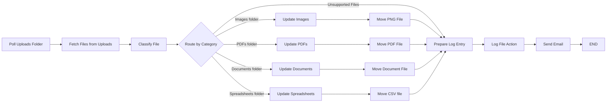
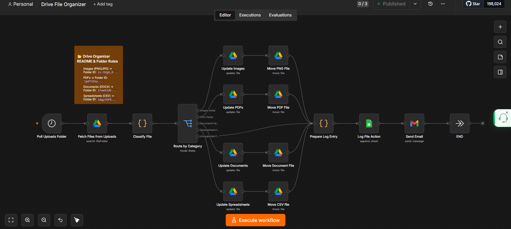
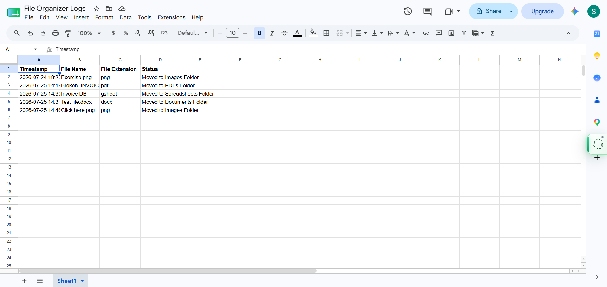
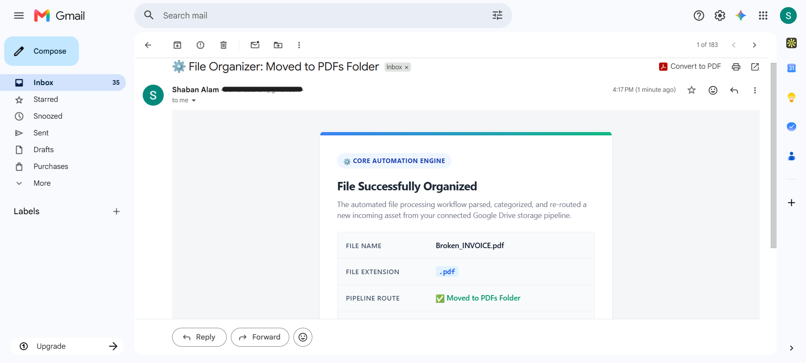

# ⚙️ Drive File Organizer


An n8n automation that keeps a monitored Google Drive folder organized. A Schedule Trigger polls the folder every 10 seconds; a JavaScript classifier reads each file's extension and MIME type; a Switch node routes it into one of four supported categories; matching files are renamed and moved into their destination folder; and every outcome — including unsupported files — is written to a Google Sheets audit log and confirmed by email.

---

## Problem

Shared Google Drive folders accumulate clutter fast. Without enforced structure, uploads land wherever is convenient, and within weeks a root folder holds invoices, images, reports, and spreadsheets side by side with no discernible organization.

The downstream effects compound quickly:

- **File discovery becomes a search problem.** Finding the right document means scrolling through unrelated files or guessing at someone else's naming convention.
- **No audit trail.** There's no record of what was uploaded, when, or where it ended up.
- **Sorting is repetitive manual work** that yields no business value and scales poorly.
- **Consistency depends entirely on individual discipline**, which erodes over time.

---

## Solution

Drive File Organizer polls a designated uploads folder on a fixed interval and enforces structure automatically.

Every 10 seconds, the workflow checks the uploads folder for files. A JavaScript node reads each file's extension (falling back to its MIME type when the extension is ambiguous or absent) and classifies it as an image, PDF, document, spreadsheet, or unsupported. A Switch node routes execution accordingly. For the four supported categories, the matching Google Drive file is renamed with a category suffix and then moved into its configured destination folder. Files that don't match any category are left where they are — they aren't renamed or moved.

Regardless of outcome, a JavaScript node builds a structured log entry (file name, extension, timestamp, and a status string describing what happened), appends it as a new row in a Google Sheets audit log, and a branded HTML email confirms the result.

---

## Architecture

The workflow is 16 functional nodes plus a sticky note on the canvas documenting the four destination folder IDs.

**Poll Uploads Folder** is a Schedule Trigger configured with a `seconds` interval of `10`. This is a polling trigger, not an event listener — there is no Drive webhook or `fileCreated` event subscription in this workflow. Every 10 seconds the trigger fires and the workflow checks the uploads folder from scratch.

**Fetch Files from Uploads** is a Google Drive node using the `fileFolder` search operation. It queries for files whose parent is the configured uploads folder and that are not trashed, returning all matches on each run.

**Classify File** is a JavaScript Code node. It resolves the file's effective MIME type (checking a shortcut's target MIME type first, then falling back to the file's own MIME type), extracts the extension from the file name, and — if no extension is present — infers one from the MIME type for native Google files (spreadsheet → `gsheet`, document → `gdoc`, presentation → `gslides`, pdf → `pdf`, image → `png`). It then categorizes the file:

| Category | Matched by extension | Also matched by MIME type |
|---|---|---|
| `image` | png, jpg/jpeg, webp, gif, svg | contains "image" |
| `pdf` | pdf | contains "pdf" |
| `document` | doc, docx, txt, rtf, gdoc | contains "document" |
| `spreadsheet` | csv, xls, xlsx, ods, gsheet | contains "spreadsheet" |
| `unsupported` | anything else | anything else |

The node outputs the original file properties plus `cleanCategory` and `cleanExtension`.

**Route by Category** is a Switch node in Rules mode with four explicit rules — matching `cleanCategory` against `image`, `pdf`, `document`, and `spreadsheet` — each renamed to a named output (`Images folder`, `PDFs folder`, `Documents folder`, `Spreadsheets folder`). Anything that matches none of the four rules falls through the node's built-in fallback output, renamed `Unsupported Files`.

**Update Images / Update PDFs / Update Documents / Update Spreadsheets** are Google Drive nodes using the `update` operation. Each one renames the matched file by appending a category suffix to its existing name — `_IMG`, `_PDF`, `_DOC`, and `_CSV` respectively. These are rename steps, not general metadata updates.

**Move PNG File / Move PDF File / Move Document File / Move CSV file** are Google Drive nodes using the `move` operation. Each relocates the just-renamed file from the uploads folder into its configured destination folder (the folder IDs in this export are placeholders with cached display names alongside them).

**The unsupported branch** skips the Update/Move pair entirely and connects straight to `Prepare Log Entry`. Unsupported files are not renamed and are not moved — they remain in the uploads folder and are only reflected in the log and email.

**Prepare Log Entry** is a JavaScript Code node. It reads the original file's data primarily from the `Classify File` node's output (falling back to the current item if that lookup fails), determines which branch actually ran by probing for output on the four `Move ...` nodes (with a category-based fallback if that check comes back empty), resolves a file extension through several fallback layers, and generates a timestamp in the `Asia/Kolkata` timezone formatted as `YYYY-MM-DD HH:mm:ss`. It outputs one object with `Timestamp`, `FileName`, `FileExtension`, and `Status` — where `Status` is a string like `Moved to PDFs Folder` or, for the unsupported branch, `Skipped - Unsupported File Type`.

**Log File Action** is a Google Sheets node that appends a row to the "File Organizer Logs" spreadsheet, `Sheet1`, with exactly four columns: Timestamp, File Name, File Extension, and Status. There is no separate destination/folder column — that information lives inside the Status string.

**Send Email** is a Gmail node that sends a branded HTML confirmation after the Sheets row is written. The subject line is built from the Status value (`⚙️ File Organizer: {{ Status }}`), and the body shows the file name, the extension as a styled badge, the pipeline route, and the processed timestamp.

**END** is a No-Op node reached after every run that completes an email send, regardless of which branch — including the unsupported path — produced it.

---

## 📊 Workflow Diagram


```mermaid
flowchart LR
    A[Poll Uploads Folder] --> B[Fetch Files from Uploads]
    B --> C[Classify File]
    C --> D{Route by Category}

    D -- Images folder --> E1[Update Images] --> F1[Move PNG File]
    D -- PDFs folder --> E2[Update PDFs] --> F2[Move PDF File]
    D -- Documents folder --> E3[Update Documents] --> F3[Move Document File]
    D -- Spreadsheets folder --> E4[Update Spreadsheets] --> F4[Move CSV file]
    D -- Unsupported Files --> G[Prepare Log Entry]

    F1 --> G
    F2 --> G
    F3 --> G
    F4 --> G

    G --> H[Log File Action]
    H --> I[Send Email]
    I --> J[END]
```

---

## Tech Stack

| Technology | Role |
|---|---|
| **n8n** | Workflow orchestration engine |
| **Schedule Trigger** | Polls the uploads folder on a fixed `seconds` interval (10s in this export) |
| **Google Drive** | Folder search, file rename (update operation), and file move across five nodes |
| **Switch Node** | Rules-based router with an explicit fallback output for unmatched categories |
| **JavaScript Code Node (×2)** | Classifies files by extension/MIME (`Classify File`) and builds the audit log object (`Prepare Log Entry`) |
| **Google Sheets** | Append-only audit log with four columns: Timestamp, File Name, File Extension, Status |
| **Gmail** | Sends a branded HTML confirmation email after each run |

---

## Features

| Feature | Description |
|---|---|
| Scheduled polling | Checks the uploads folder every 10 seconds via a Schedule Trigger — not an event-driven Drive trigger |
| Folder-scoped file discovery | Queries only files inside the configured uploads folder that aren't trashed |
| Extension + MIME classification | JavaScript node categorizes files by extension first, MIME type as a fallback, including native Google file types |
| Four-category routing | Images, PDFs, Documents, and Spreadsheets each get a dedicated rename-then-move path |
| Unsupported-file fallback | Files matching no category skip renaming and moving, and are only logged |
| Rename-before-move | Matched files are renamed with a category suffix (`_IMG`/`_PDF`/`_DOC`/`_CSV`) before relocation |
| JavaScript-built audit entries | Log rows are constructed in code from execution metadata, including a status string per branch |
| Timezone-aware timestamps | Log timestamps are generated in Asia/Kolkata, formatted `YYYY-MM-DD HH:mm:ss` |
| Google Sheets logging | Every run — supported or unsupported — appends one row to the audit spreadsheet |
| Branded email confirmation | Gmail notification with a status badge, file details, and the resulting pipeline route |

---

## Screenshots

### Workflow



The full canvas: the Schedule Trigger and fetch/classify/route nodes on the left, the four Update→Move pairs branching from the Switch node, and the shared logging and email pipeline on the right. The sticky note documents the four destination folder IDs.

### Google Sheets Audit Log



The "File Organizer Logs" spreadsheet with its four columns — Timestamp, File Name, File Extension, Status — capturing a mix of image, PDF, spreadsheet, and document runs.

### Email Notification



A captured confirmation email for a PDF run: the "CORE AUTOMATION ENGINE" badge, the "File Successfully Organized" heading, and a table showing the file name, extension badge, and pipeline route.

---

## How It Works

1. **The Schedule Trigger fires** every 10 seconds.
2. **Files are fetched** from the configured uploads folder via a Drive folder-scoped search.
3. **Each file is classified** by the `Classify File` code node using its extension, with MIME-type inference as a fallback.
4. **The Switch node routes** the file into one of four supported categories, or into the unsupported fallback if nothing matches.
5. **Supported branches rename the file**, appending a category suffix (`_IMG`, `_PDF`, `_DOC`, or `_CSV`).
6. **Supported branches move the renamed file** into its configured destination folder.
7. **Unsupported files skip renaming and moving** entirely and go straight to logging.
8. **`Prepare Log Entry` builds the audit object** — file name, extension, Asia/Kolkata timestamp, and a status string describing the outcome.
9. **The row is appended to Google Sheets.**
10. **A confirmation email is sent** via Gmail, with the subject and body built from the status string.
11. **Execution reaches `END`** on every path, supported or not.

---

## Sample Input

The classifier supports more than the four examples below — see the extension/MIME table in the Architecture section for the full set. These are representative:

```
portrait.png          →  Images folder
Broken_INVOICE.pdf    →  PDFs folder
Q3_Report.docx        →  Documents folder
Sales_Data.csv        →  Spreadsheets folder
archive.zip           →  Unsupported Files path (stays in the uploads folder, only logged)
```

---

## Sample Output

**Google Sheets rows** (four columns only — no separate destination column; the destination is embedded in Status):

```
Timestamp            | File Name           | File Extension | Status
----------------------|--------------------|-----------------|--------------------------
2026-07-24 18:22:xx   | Exercise.png       | png             | Moved to Images Folder
2026-07-25 14:19:xx   | Broken_INVOICE.pdf | pdf             | Moved to PDFs Folder
2026-07-25 14:30:xx   | Invoice DB         | gsheet          | Moved to Spreadsheets Folder
2026-07-25 14:3x:xx   | Test file.docx     | docx            | Moved to Documents Folder
```

**Email notification:**

```
Subject: ⚙️ File Organizer: Moved to PDFs Folder

┌─────────────────────────────────────────────────────────────┐
│  ⚙️ CORE AUTOMATION ENGINE                                  │
│                                                             │
│  File Successfully Organized                                │
│                                                             │
│  The automated file processing workflow parsed,             │
│  categorized, and re-routed a new incoming asset from       │
│  your connected Google Drive storage pipeline.             │
│                                                             │
│  FILE NAME        Broken_INVOICE.pdf                        │
│  FILE EXTENSION   .pdf                                      │
│  PIPELINE ROUTE   ✅ Moved to PDFs Folder                   │
└─────────────────────────────────────────────────────────────┘
```

---

## Known Behavior & Limitations

- **Polling, not events.** The trigger is a 10-second Schedule Trigger poll of the uploads folder, not a Google Drive `fileCreated` event subscription.
- **Unsupported files aren't relocated.** They're logged with a `Skipped - Unsupported File Type` status but stay in the uploads folder — there's no Move node on that branch.
- **Presentation files fall through to unsupported.** The classifier infers a `gslides` extension for presentation MIME types, but no category rule matches `gslides`, so these files are routed as unsupported rather than to a dedicated folder.
- **No dedicated destination column in the audit log.** The Sheets schema is Timestamp / File Name / File Extension / Status only; where a file went is read from the Status text.
- **Placeholder configuration throughout.** The uploads folder ID, the four destination folder IDs, the logging spreadsheet ID, and the email recipient are all placeholder values in this export.
- **Exported as inactive.** The workflow JSON has `"active": false`.
- **"Update" nodes rename, they don't set broader metadata.** The only field changed is the file name, via a category suffix.

---

## Future Improvements

- **Event-based triggering** — replace the 10-second poll with a genuine Drive change/event trigger if execution volume becomes a concern
- **Additional categories** — presentations, video, and archive types, each with their own destination folder
- **AI-powered content classification** — classify ambiguous files by content rather than extension/MIME alone
- **Duplicate detection** — check the Sheets log before moving a file with a name that's already been processed
- **Slack or Teams notifications** — alongside the existing Gmail confirmation
- **Destination column in the audit log** — split the folder name out of the Status string into its own field
- **Error-path handling** — dedicated diagnostics for failed Drive operations, distinct from the unsupported-file path
- **Dashboard analytics** — connect the Sheets log to a BI tool for volume and type breakdowns over time

---

## Repository Structure

```
drive-file-organizer/
├── images/
│   ├── email-alert.png
│   ├── google-sheet.png
│   └── workflow.png
├── drive-file-organizer.json
└── README.md
```

**To deploy:** import `drive-file-organizer.json` into your n8n instance; connect Google Drive, Google Sheets, and Gmail credentials; set the uploads folder ID being polled and the four destination folder IDs referenced in the sticky note; point the Sheets node at your logging spreadsheet; set the recipient address in `Send Email`; review the 10-second polling interval on the Schedule Trigger and adjust if needed; then activate.

---

## Author

**Shaban Alam**
Python Automation Developer · n8n Workflow Specialist · AI Integration Engineer

Building automation systems for businesses that want to eliminate repetitive manual work.

- **GitHub:** [github.com/Shaban27-dev](https://github.com/Shaban27-dev)
- **Email:** shabandev27@gmail.com
- **Available for:** freelance automation projects, workflow consulting, Google Workspace integrations, API pipelines

> Open to projects involving n8n, Python automation, Google Workspace automation, file processing pipelines, AI workflow integration, and process automation.

---

## Summary

Drive File Organizer is a polling-based file management automation: a 10-second Schedule Trigger, Drive-based file discovery, JavaScript classification by extension and MIME type, Switch-based routing across four categories with an explicit unsupported fallback, rename-then-move Drive operations, JavaScript-built audit entries with Asia/Kolkata timestamps, Google Sheets logging, and a branded Gmail confirmation. Two of the workflow's steps run as JavaScript Code nodes rather than pre-built n8n operations. As exported, the folder IDs, spreadsheet ID, and recipient address are placeholders and the workflow is inactive — it's a reference implementation to configure and activate, not a live production deployment.

This project is part of an active automation portfolio. Additional workflows covering price monitoring, invoice processing, lead enrichment, and related pipelines are available in the linked GitHub profile.
