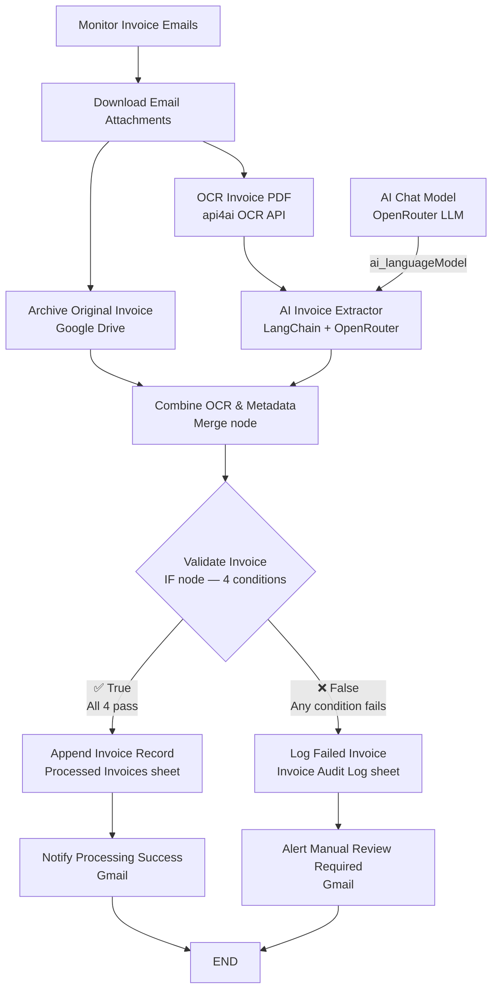
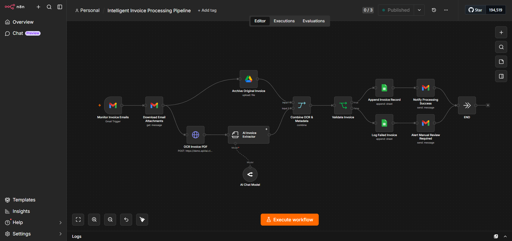
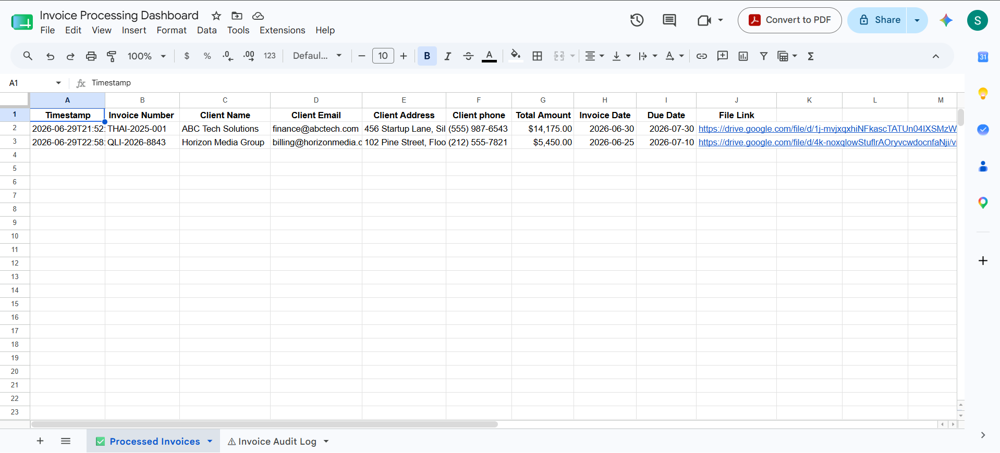
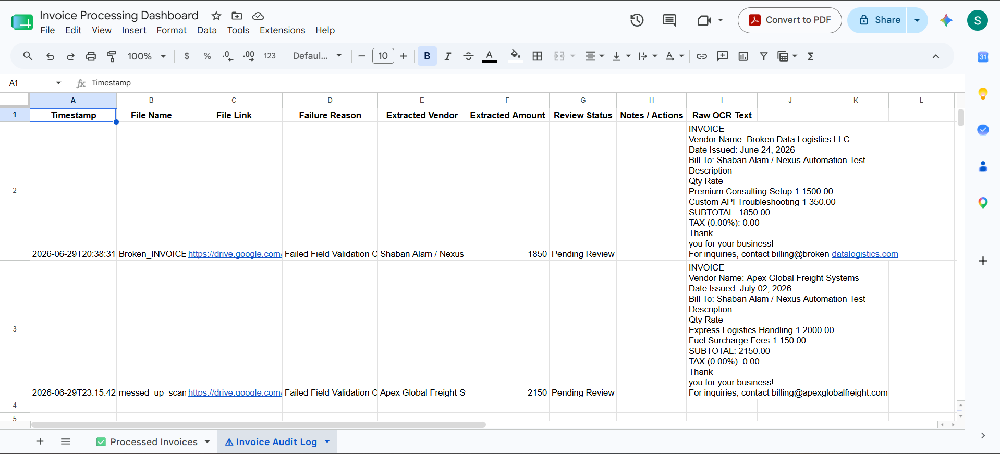
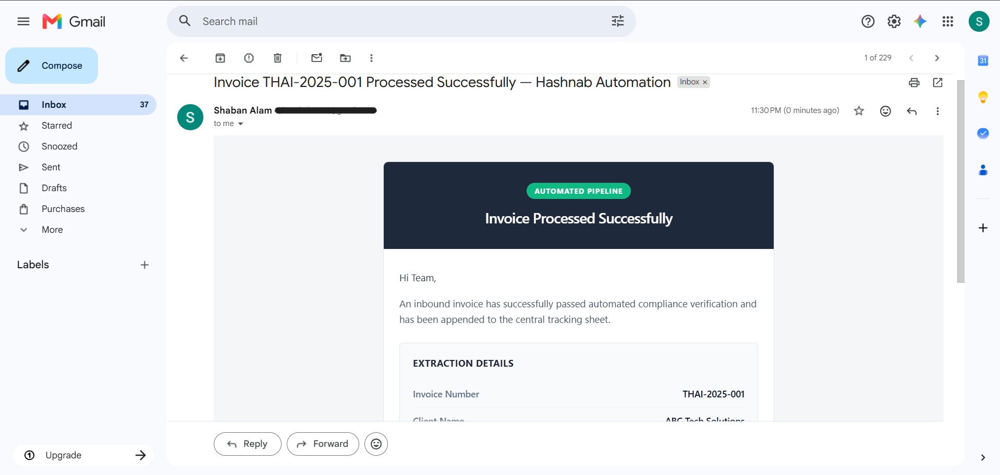
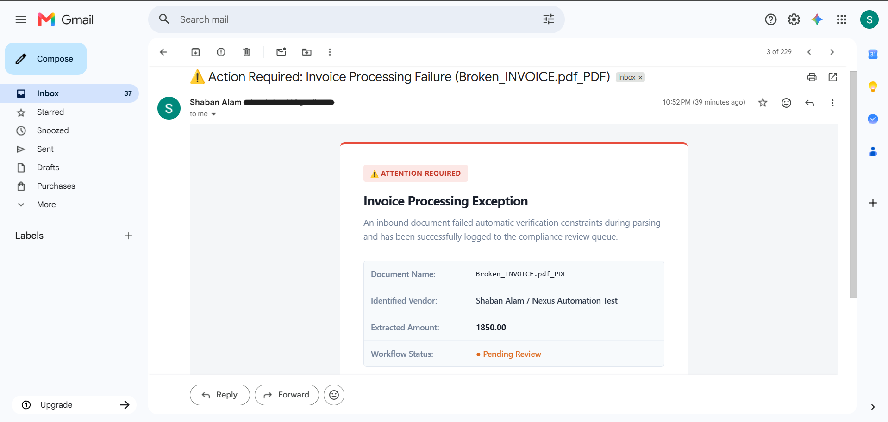

# 🧾 Intelligent Invoice Processing Pipeline


A production-ready n8n pipeline that monitors a Gmail inbox for incoming invoice attachments, performs OCR on the PDF using an AI vision API, extracts structured invoice fields with a LangChain Information Extractor, archives the original document to Google Drive, validates the extracted data against four compound conditions, routes the result into either a structured success log or a compliance audit trail, and dispatches branded HTML email notifications for both outcomes — with no manual data entry at any stage.

---

## Problem

Invoice processing is one of the most persistently manual workflows in business operations. Regardless of company size, the core sequence is nearly always the same: an email arrives with a PDF attached, someone opens it, reads it, types the data into a spreadsheet or accounting system, files the original, and moves on. When volume is low, the overhead is manageable. As invoice volume scales, the process becomes an operational liability.

The specific failure modes are consistent across organizations:

- **Manual data entry is error-prone by design.** Transcribing invoice numbers, amounts, due dates, and client contact details from a PDF into a spreadsheet introduces transcription errors at a rate that compounds with volume. A misread digit in a total amount or an incorrectly entered due date can create downstream payment failures that are difficult to trace.
- **No archival discipline by default.** PDF attachments sit in email inboxes. They get deleted, buried, or lost when staff accounts change. There is no reliable source of truth for what invoices were received, when, and in what form.
- **Compliance and audit trails are afterthoughts.** When a payment dispute arises or an audit requires documentation of what was received and processed, organizations without automated logging have to manually reconstruct records from email history — if that history still exists.
- **Failed documents disappear silently.** When a scanned invoice is unreadable, a required field is missing, or the PDF doesn't contain the expected structure, the manual process typically either fails silently or routes the document to a shared inbox where it waits indefinitely. Neither outcome produces a traceable record.
- **Validation is inconsistent.** Manual reviewers apply different standards. One person accepts an invoice with a missing due date; another flags it. Automation applies the same validation rules every time, on every document, with no variance.
- **Processing bottlenecks at volume.** The time from invoice receipt to record entry is bounded by human throughput. During high-volume periods — end of quarter, large project completions — the backlog grows and payment timelines slip.

The compounded effect is that organizations spend significant time on a task that is entirely deterministic: if the document is readable and the data is present, the record can be created. This pipeline automates that determination and acts on it immediately.

---

## Solution

The Intelligent Invoice Processing Pipeline replaces the manual intake sequence with an event-driven automation that triggers the moment a new invoice email lands in the inbox.

Gmail is monitored continuously via a trigger that polls for new messages. When a new email is detected, the workflow downloads the attached PDF, then dispatches two simultaneous operations: the original file is uploaded to a designated Google Drive archive folder, and the PDF binary is sent to an OCR API that converts the document's visual content into machine-readable text. The OCR output is passed to a LangChain Information Extractor — an AI node that reads the raw text and extracts eight named fields into a clean, structured JSON object.

The Drive archive metadata and the AI extraction output are then merged into a single data object. A four-condition validation gate evaluates the extraction: the invoice number must be present, the amount must be a positive number, the due date must be a valid ISO date, and the raw OCR text must exceed 100 characters (confirming that the document produced meaningful content). All four conditions must pass.

If validation succeeds, the extracted fields are appended as a new row to the `✅ Processed Invoices` sheet of a Google Sheets dashboard, and a confirmation email is sent to the team with the full extraction detail table and a direct link to the archived document.

If validation fails, the filename, raw OCR text, partially extracted vendor and amount, and a failure reason are written to the `⚠ Invoice Audit Log` sheet, and an exception alert email is dispatched with document details and a link for manual review.

Every document that passes through the pipeline produces a record — in Drive, in Sheets, and in email — regardless of outcome.

---

## Architecture

The workflow contains thirteen nodes organized across a single entry point, a parallel processing branch, a convergence merge, a validation gate, and two separate terminal paths.

---

**Monitor Invoice Emails** — A Gmail Trigger node that polls the inbox every minute for new messages. The trigger fires once per new email regardless of sender or subject, making the workflow unfiltered and complete — every incoming message is evaluated. The trigger outputs the email's metadata including message ID, headers, and a summary of attachments, which is passed downstream to the attachment download node.

**Download Email Attachments** — A Gmail node operating in `get` message mode, using the message ID from the trigger. It is configured with `downloadAttachments: true` and `simple: false`, which instructs n8n to download the raw binary content of all attachments alongside the email metadata. The attachment binary is stored in the `attachment_0` field and is referenced by both downstream processing branches. This node's output simultaneously feeds the Archive node and the OCR node.

**Archive Original Invoice** — A Google Drive node that uploads the raw attachment binary to a designated archive folder called `Invoices_To_Process`. The upload filename is derived directly from `$binary.attachment_0.fileName`, preserving the original document name as received. This archival step runs in parallel with OCR processing — the original file is secured in Drive before any extraction occurs, ensuring a recoverable source document exists regardless of what happens downstream. The node outputs the Drive file's metadata, including its `webViewLink`, which is used later in both notification emails.

**OCR Invoice PDF** — An HTTP Request node that POSTs the attachment binary to the `api4ai.cloud` OCR endpoint at `https://demo.api4ai.cloud/ocr/v1/results`. The request is formatted as `multipart/form-data` with the attachment binary in the `image` field and the API key in the `A4A-API-KEY` request header. The api4ai OCR service returns a structured JSON response containing the extracted text nested at `results[0].entities[0].objects[0].entities[0].text`. This raw text string — the complete machine-readable content of the PDF — is passed to the AI Invoice Extractor.

**AI Invoice Extractor** — An n8n LangChain Information Extractor node (distinct from an AI Agent) that applies structured attribute extraction against the raw OCR text. The node is configured to extract eight named attributes: Invoice Number, Client Name, Client Email, Client Address, Client Phone, Total Amount, Invoice Date, and Due Date. All eight are marked as required. The system prompt instructs the model to act as an expert extraction algorithm and, critically, to set any attribute it cannot locate to the literal string `"Not Found"` rather than leaving the field empty or omitting it. This guarantees that the downstream validation node always receives a fully populated output object to evaluate, even for incomplete documents. The extraction is backed by the OpenRouter AI Chat Model node.

**AI Chat Model** — An OpenRouter LLM node (`lmChatOpenRouter`) connected as the `ai_languageModel` provider for the Information Extractor. Configured with a 2,000-token maximum output, it supplies the language model backend for the structured extraction task. Because the Information Extractor node constrains the output format — eight named fields with explicit fallback values — the LLM operates within a tightly defined schema rather than generating free-form text.

**Combine OCR & Metadata** — A Merge node operating in `combineByPosition` mode that takes two inputs: Input 1 receives the Google Drive archival metadata (including the file's `webViewLink`), and Input 2 receives the AI extractor's structured output. Combining by position produces a single item per invoice that carries both the Drive metadata and the extracted invoice fields together. This merged object is the data source for the validation node and for all downstream Sheets and email nodes.

**Validate Invoice** — An IF node that applies four conditions in AND logic — all must pass for the invoice to be considered valid. The conditions are: (1) the extracted `Invoice Number` field does not equal the string `"Not Found"`, confirming the AI successfully located a document number; (2) the `Total Amount` field, after stripping currency symbols and commas, converts to a numeric value greater than zero; (3) the `Due Date` field parses as a valid ISO date object, confirming the date is present and structurally correct; and (4) the raw OCR text extracted from the `OCR Invoice PDF` node exceeds 100 characters in length, confirming the OCR produced a meaningful document reading and not a blank or corrupted output. Condition 4 acts as a document quality gate that catches corrupt scans or empty attachments before they reach the extraction layer. The true path routes to `Append Invoice Record`; the false path routes to `Log Failed Invoice`.

**Append Invoice Record** — A Google Sheets node that appends a new row to the `✅ Processed Invoices` tab of the `Invoice Processing Dashboard` spreadsheet. Ten fields are written: a UTC timestamp, Invoice Number, Client Name, Client Email, Client Address, Client Phone, Total Amount, Invoice Date, Due Date, and the Drive file's `webViewLink`. This sheet is the primary operational record — the source of truth for every invoice the pipeline has successfully processed.

**Notify Processing Success** — A Gmail node that dispatches a branded HTML confirmation email. The subject line reads `Invoice [Invoice Number] Processed Successfully — Hashnab Automation`, embedding the extracted invoice number directly. The email opens with a dark navy header carrying a green "AUTOMATED PIPELINE" badge and the headline "Invoice Processed Successfully." The body confirms the document passed verification and was appended to the tracking sheet, followed by an "EXTRACTION DETAILS" table displaying all key invoice fields. A green CTA button links directly to the archived Drive document. The footer notes that no manual action is required.

**Log Failed Invoice** — A Google Sheets node that appends a new row to the `⚠ Invoice Audit Log` tab of the same `Invoice Processing Dashboard` spreadsheet. Eight fields are written: a UTC timestamp, the original filename, the Drive file link, a failure reason string, the extracted vendor name, the extracted amount (if partially available), the `Review Status` field set to the literal string `"Pending Review"`, and the complete raw OCR text from the document. The raw OCR text column is particularly significant — it allows a human reviewer to see exactly what the OCR engine read from the document, enabling diagnosis of whether the failure was due to OCR quality, document format, or a genuinely missing field.

**Alert Manual Review Required** — A Gmail node that dispatches a red-bordered exception alert email. The subject line reads `⚠️ Action Required: Invoice Processing Failure ([filename])`. The email opens with a red top border and an "⚠️ ATTENTION REQUIRED" badge. A concise summary confirms the document failed verification and was logged to the compliance review queue. Below, a table surfaces the document name, identified vendor, extracted amount, and workflow status displayed as "● Pending Review" in amber. A red CTA button links to the original file in Drive for manual review.

**END** — A No-Op terminal node shared by both the success path and the failure path, providing a single, clean execution endpoint for tracking and future extension.

---

## Workflow Diagram



Both terminal paths — successful processing and exception handling — converge at END, keeping execution tracking unified regardless of outcome.

---

## Tech Stack

| Technology | Role |
|---|---|
| **n8n** | Workflow orchestration engine — hosts, triggers, and executes the complete pipeline |
| **Gmail Trigger** | Monitors the inbox every minute and fires one execution per new email |
| **Gmail (get message)** | Downloads the full email with attachment binaries for processing |
| **Google Drive** | Archives the original invoice PDF to a designated folder before processing begins |
| **api4ai OCR API** | Converts the invoice PDF binary into machine-readable text via HTTP POST |
| **LangChain Information Extractor** | Applies structured attribute extraction against raw OCR text with explicit fallback values |
| **OpenRouter LLM** | Language model backend powering the Information Extractor node |
| **Merge Node** | Combines Drive archival metadata and AI extraction output into a unified data object |
| **IF Node** | Four-condition validation gate that routes execution to success or failure paths |
| **Google Sheets** | Dual-tab dashboard — `✅ Processed Invoices` for successes, `⚠ Invoice Audit Log` for failures |
| **Gmail (send message ×2)** | Delivers success confirmation and exception alert emails with branded HTML templates |
| **HTML Email Templates** | Dark-header success layout and red-bordered exception alert, both with structured data tables and Drive CTA buttons |

---

## Features

- **Continuous Gmail inbox monitoring** — Gmail Trigger polls every minute, catching invoices immediately on arrival without manual triggering
- **Full attachment binary download** — the Gmail get-message node retrieves the raw PDF binary alongside email metadata in a single operation
- **Parallel processing on attachment receipt** — Drive archival and OCR run simultaneously from the same attachment, minimizing end-to-end latency
- **Pre-processing document archival** — the original invoice is secured in Google Drive before extraction begins, ensuring a recoverable source document exists regardless of downstream outcome
- **Filename preservation in archive** — the Drive upload uses the original attachment filename, maintaining the document's identity in storage
- **OCR via HTTP API** — the api4ai vision API converts PDF binary to text via a POST request, making the OCR layer swappable without workflow restructuring
- **Structured LLM extraction with explicit fallbacks** — the LangChain Information Extractor extracts eight named fields and enforces `"Not Found"` for any absent attribute, preventing silent null values from reaching validation
- **OpenRouter LLM backend** — model-agnostic extraction layer; the underlying language model can be changed in the AI Chat Model node without modifying the extraction schema
- **Four-condition compound validation** — the IF node applies AND logic across invoice number presence, amount positivity, due date validity, and OCR text length, catching distinct failure modes independently
- **OCR quality gate via text length** — validation condition 4 (OCR text > 100 characters) catches corrupt scans, blank pages, and empty attachments before they reach field-level evaluation
- **Dual-tab Google Sheets dashboard** — successful and failed invoices write to separate tabs of the same spreadsheet, creating a unified dashboard with split operational and compliance views
- **Complete structured record for successes** — ten fields appended per processed invoice, including all client contact data and a direct Drive file link
- **Raw OCR text preserved in audit log** — failed invoice records include the complete OCR output, enabling human reviewers to diagnose whether failure was caused by OCR quality, document format, or genuinely absent data
- **Branded HTML success notification** — dark-header email with green badge, extraction detail table, and direct document link, delivered immediately after successful processing
- **Branded HTML exception alert** — red-bordered failure notification with "Attention Required" badge, partial extraction data, and a direct link to the original document in Drive
- **Invoice number embedded in success email subject** — recipients can identify the processed document without opening the email
- **Filename embedded in failure email subject** — recipients can identify the failed document immediately from inbox view
- **Full traceability** — every invoice produces at minimum a Drive file and a Sheets record; successful invoices additionally produce a notification; failed invoices produce an audit entry and an alert
- **No manual action required on success** — the success notification explicitly confirms that payment processing will proceed automatically under standard Net terms
- **Modular node design** — OCR provider, AI model, storage destination, and notification channel are each isolated to individual nodes, making individual components replaceable

---

## Screenshots

### Workflow

> **`images/workflow.png`**
>
> 

The complete thirteen-node pipeline as it appears in the n8n editor. The linear entry sequence — Gmail Trigger, Download Attachments — fans into two parallel branches: Archive (top) runs simultaneously with the OCR + AI Extractor sequence (bottom). Both paths feed into the Merge node, which passes the combined object to the IF validation gate. From there, the true path continues through Append and Notify on the upper right, while the false path routes through Log and Alert on the lower right. Both paths terminate at the shared END node. The AI Chat Model node is visible below the AI Invoice Extractor, connected as the LLM provider.

---

### Processed Invoices — Google Sheets

> **`images/processed-invoices.png`**
>
> 

The `✅ Processed Invoices` tab of the `Invoice Processing Dashboard` spreadsheet, showing two successfully processed invoices. Row 2 records invoice THAI-2025-001 from ABC Tech Solutions, with a total of $14,175.00, invoice date 2026-06-30, and due date 2026-07-30. Row 3 records invoice QLI-2026-8843 from Horizon Media Group, totalling $5,450.00. Both rows include the client's email address, physical address, phone number, and a direct Google Drive link to the archived PDF. The `⚠ Invoice Audit Log` tab is visible in the sheet tab bar below, confirming both logs exist within the same spreadsheet.

---

### Invoice Audit Log — Google Sheets

> **`images/invoice-audit-log.png`**
>
> 

The `⚠ Invoice Audit Log` tab, showing two failed invoices captured during testing. The columns record Timestamp, File Name, File Link, Failure Reason, Extracted Vendor, Extracted Amount, Review Status, Notes/Actions, and Raw OCR Text. Row 2 shows `Broken_INVOICE` with failure reason "Failed Field Validation C..." and status "Pending Review." The Raw OCR Text column — the widest column — contains the verbatim OCR output from the api4ai API, including the full invoice text for "Broken Data Logistics LLC" with individual line items (Premium Consulting Setup: 1500.00, Custom API Troubleshooting: 350.00, Subtotal: 1850.00). This column is what enables human reviewers to diagnose exactly what the pipeline read from the document and why it failed validation.

---

### Success Notification Email

> **`images/success-email.png`**
>
> 

The success notification as it appears in Gmail, with the subject "Invoice THAI-2025-001 Processed Successfully — Hashnab Automation" delivered at 11:30 PM. The email opens with a dark navy header containing a green pill badge reading "AUTOMATED PIPELINE" and the bold white heading "Invoice Processed Successfully." The body opens with "Hi Team," followed by a summary confirming the document passed verification. Below, the "EXTRACTION DETAILS" section renders a structured table with Invoice Number (THAI-2025-001) and Client Name (ABC Tech Solutions) visible, with additional fields below the scroll. The email subject embeds the invoice number directly, allowing recipients to identify the document from the inbox without opening the message.

---

### Manual Review Alert Email

> **`images/manual-review-email.png`**
>
> 

The exception alert delivered when validation fails, with the subject "⚠️ Action Required: Invoice Processing Failure (Broken_INVOICE.pdf_PDF)". The email carries a red top border and opens with a pink-red "⚠️ ATTENTION REQUIRED" badge. The heading reads "Invoice Processing Exception" in bold, followed by a summary confirming the document was logged to the compliance review queue. A structured table below presents four fields: Document Name (Broken_INVOICE.pdf_PDF), Identified Vendor (Shaban Alam / Nexus Automation Test — the partially extracted vendor value), Extracted Amount (1850.00), and Workflow Status displayed as "● Pending Review" in amber. A red "Open Original Document Securely" button links to the Drive file.

---

## How It Works

1. **A new email arrives in the monitored inbox.** The Gmail Trigger polls every minute. When a new message is detected, n8n initiates one workflow execution and passes the message ID and metadata downstream. The trigger is unfiltered — it fires on every new email, ensuring no invoice is missed regardless of subject line or sender.

2. **The full email and attachments are downloaded.** The Download Email Attachments Gmail node uses the message ID to fetch the complete email with `simple: false` and `downloadAttachments: true`. The raw binary content of all attachments is downloaded and stored in `attachment_0`, available to downstream nodes by binary field reference.

3. **Two operations run simultaneously.** From the Download node, execution splits into two parallel branches. The Archive branch begins uploading the PDF binary to Google Drive immediately, preserving the original document before any processing that might fail. Simultaneously, the OCR branch sends the same binary to the api4ai OCR endpoint for text extraction. Both operations run in parallel, and their outputs converge at the Merge node.

4. **The invoice PDF is OCR-processed.** The OCR Invoice PDF HTTP Request POSTs the attachment binary to `https://demo.api4ai.cloud/ocr/v1/results` as multipart form data with the API key in the request header. The API returns a JSON response containing the full text content of the document at `results[0].entities[0].objects[0].entities[0].text` — a single string representing everything the OCR engine read from the PDF.

5. **The AI extractor identifies and structures the invoice fields.** The AI Invoice Extractor LangChain Information Extractor node receives the raw OCR text string and applies a structured extraction prompt against it. Eight fields are extracted: Invoice Number, Client Name, Client Email, Client Address, Client Phone, Total Amount, Invoice Date, and Due Date. For any field the model cannot locate, it writes the literal string `"Not Found"` rather than leaving the field empty. The extraction is powered by the OpenRouter LLM connected as the chat model provider.

6. **OCR metadata and extraction output are merged.** The Merge node waits for both branches — the Drive archival response (carrying the file's `webViewLink`) and the AI extraction output (carrying the eight structured fields) — and combines them by position into a single item. The merged object now contains the Drive link alongside the invoice field data, making both available to all downstream nodes.

7. **The validation gate evaluates the extraction.** The Validate Invoice IF node applies four conditions simultaneously with AND logic. The invoice number must not equal `"Not Found"`. The total amount, after stripping dollar signs and commas, must convert to a number greater than zero. The due date must parse as a valid ISO date. The raw OCR text retrieved directly from the OCR node must exceed 100 characters. If any single condition fails, execution routes to the failure path.

8. **Successful invoices are logged to Google Sheets.** The Append Invoice Record node writes a new row to the `✅ Processed Invoices` tab. Ten fields are recorded: a UTC timestamp, all eight extracted invoice fields, and the Drive `webViewLink`. Each row in this sheet represents one invoice that cleared all four validation conditions.

9. **A success notification is dispatched.** The Notify Processing Success Gmail node sends a branded HTML email with the invoice number in the subject line. The email body presents the full extraction table with all key fields and a green "Open Processed Document" button linking directly to the archived Drive file. The closing note confirms no manual action is required, and that payment will proceed under standard Net terms.

10. **Failed invoices are logged to the audit sheet.** When validation fails, the Log Failed Invoice Google Sheets node appends a row to the `⚠ Invoice Audit Log` tab. The record includes the filename, Drive link, failure reason, partially extracted vendor and amount values, the `"Pending Review"` status, and — critically — the complete raw OCR text from the document. This text gives reviewers the full picture of what the pipeline read, enabling root-cause analysis of the failure.

11. **An exception alert is dispatched.** The Alert Manual Review Required Gmail node sends a red-bordered HTML exception email with the filename in the subject line. The email surfaces the document name, identified vendor, extracted amount, and pending review status. A red CTA button links directly to the Drive file for immediate manual access.

12. **Execution terminates cleanly.** Both paths end at the shared END No-Op node. Regardless of outcome, the pipeline has produced at minimum a Drive-archived original file, a Sheets record, and an email notification. The inbox remains monitored for the next incoming email.

---

## Sample Input

An invoice email arriving in the monitored inbox:

```
From:     billing@abctech.com
To:       accounts@hashnab.com
Subject:  Invoice THAI-2025-001 — Payment Due July 30, 2026
Attach:   THAI-2025-001_ABC_Tech_Solutions.pdf

Hi,

Please find attached our invoice for the services rendered in June 2026.
Kindly process payment by the due date.

Thank you,
ABC Tech Solutions Finance Team
```

The attached PDF contains:

```
INVOICE

Invoice Number: THAI-2025-001
Invoice Date:   June 30, 2026
Due Date:       July 30, 2026

Bill To:
ABC Tech Solutions
456 Startup Lane, Silicon Valley, CA 94025
finance@abctech.com | (555) 987-6543

Description                              Qty    Rate        Total
─────────────────────────────────────────────────────────────────
Enterprise Automation Suite License       1    $9,500.00    $9,500.00
Custom Workflow Integration (40hrs)       1    $4,175.00    $4,175.00
Priority Support Package (6 months)       1      $500.00      $500.00
─────────────────────────────────────────────────────────────────
                                                  TOTAL   $14,175.00
```

After OCR processing, the raw text string passed to the AI extractor resembles:

```
INVOICE Invoice Number: THAI-2025-001 Invoice Date: June 30 2026 Due Date: July 30 2026
Bill To: ABC Tech Solutions 456 Startup Lane Silicon Valley CA 94025
finance@abctech.com (555) 987-6543 Description Qty Rate Total
Enterprise Automation Suite License 1 9500.00 9500.00
Custom Workflow Integration 40hrs 1 4175.00 4175.00
Priority Support Package 6 months 1 500.00 500.00 TOTAL 14175.00
```

The AI extractor produces:

```json
{
  "Invoice Number":  "THAI-2025-001",
  "Client Name":     "ABC Tech Solutions",
  "Client Email":    "finance@abctech.com",
  "Client Address":  "456 Startup Lane, Silicon Valley, CA 94025",
  "Client Phone":    "(555) 987-6543",
  "Total Amount":    "$14,175.00",
  "Invoice Date":    "2026-06-30",
  "Due Date":        "2026-07-30"
}
```

All four validation conditions pass: Invoice Number ≠ "Not Found", $14,175.00 → 14175 > 0, 2026-07-30 is a valid ISO date, OCR text length ≫ 100 characters.

---

## Sample Output

**Google Sheets — `✅ Processed Invoices` row:**

```
Timestamp              Invoice Number  Client Name          Client Email              Client Address                   Client Phone    Total Amount  Invoice Date  Due Date    File Link
2026-06-29T21:52:...   THAI-2025-001   ABC Tech Solutions   finance@abctech.com       456 Startup Lane, Silicon...     (555) 987-6543  $14,175.00    2026-06-30    2026-07-30  https://drive.google.com/file/d/...
```

**Success notification email:**

```
Subject: Invoice THAI-2025-001 Processed Successfully — Hashnab Automation

┌──────────────────────────────────────────────────────────────┐
│  AUTOMATED PIPELINE (green badge)                            │
│  Invoice Processed Successfully                              │
├──────────────────────────────────────────────────────────────┤
│  Hi Team,                                                    │
│                                                              │
│  An inbound invoice has successfully passed automated        │
│  compliance verification and has been appended to the        │
│  central tracking sheet.                                     │
│                                                              │
│  EXTRACTION DETAILS                                          │
│  Invoice Number    THAI-2025-001                             │
│  Client Name       ABC Tech Solutions                        │
│  Invoice Date      2026-06-30                                │
│  Due Date          2026-07-30                                │
│  Total Amount      $14,175.00                                │
│                                                              │
│  [ Open Processed Document → ] (green button)                │
│                                                              │
│  No manual action is required at this time.                  │
└──────────────────────────────────────────────────────────────┘
```

**Google Sheets — `⚠ Invoice Audit Log` row (failed document):**

```
Timestamp              File Name         File Link                Failure Reason               Extracted Vendor              Extracted Amount  Review Status    Raw OCR Text
2026-06-29T20:38:31    Broken_INVOICE    https://drive.google...  Failed Field Validation C... Shaban Alam / Nexus Autom...  1850.00           Pending Review   INVOICE Vendor Name: Broken Data Logistics LLC...
```

**Exception alert email:**

```
Subject: ⚠️ Action Required: Invoice Processing Failure (Broken_INVOICE.pdf_PDF)

┌──────────────────────────────────────────────────────────────┐ (red top border)
│  ⚠️ ATTENTION REQUIRED (pink-red badge)                      │
│                                                              │
│  Invoice Processing Exception                                │
│                                                              │
│  An inbound document failed automatic verification           │
│  constraints during parsing and has been successfully        │
│  logged to the compliance review queue.                      │
│                                                              │
│  Document Name:     Broken_INVOICE.pdf_PDF                   │
│  Identified Vendor: Shaban Alam / Nexus Automation Test      │
│  Extracted Amount:  1850.00                                  │
│  Workflow Status:   ● Pending Review (amber)                 │
│                                                              │
│  [ Open Original Document Securely → ] (red button)          │
└──────────────────────────────────────────────────────────────┘
```

---

## Future Improvements

The current pipeline processes single-attachment emails against a single inbox with a fixed extraction schema. The architecture supports substantial extension:

- **Duplicate invoice detection** — before appending to the Processed sheet, query existing records for a matching invoice number; flag duplicates to the audit log rather than creating duplicate entries
- **Vendor master validation** — cross-reference the extracted client name against a maintained vendor list in Sheets or Airtable; flag unrecognized vendors for review even when all other fields pass
- **ERP and accounting system integration** — replace or supplement the Google Sheets append with a direct API write to QuickBooks, Xero, FreshBooks, or SAP, eliminating the intermediate spreadsheet as the final destination
- **AI-powered confidence scoring** — extend the extraction prompt to return a confidence score per field; route low-confidence extractions to the audit log even when field values are technically present
- **Line-item extraction** — expand the extraction schema to capture individual invoice line items as structured rows rather than only the totals, enabling line-level accounting verification
- **Purchase order matching** — after extraction, query a PO database to verify the invoice amount matches an approved purchase order; flag mismatches before logging
- **Multi-language OCR** — configure the OCR and extraction nodes to handle invoices in non-English languages through language detection and model selection
- **Tax field extraction and validation** — add VAT number, tax rate, and tax amount as extraction targets; validate tax calculations against the line items
- **Fraud detection signals** — add a Code node that checks for common fraud indicators: round-number amounts, mismatched vendor and email domains, invoice numbers that duplicate existing records
- **Slack and Microsoft Teams notifications** — add parallel notification branches that post a compact invoice summary to a finance channel in real time, separate from the email alerts
- **Multi-attachment support** — extend the pipeline to handle emails containing multiple invoice PDFs in a single message, processing each attachment as an independent workflow branch
- **Confidence-weighted routing** — implement a three-path validation gate: high confidence (auto-approve), medium confidence (notify and approve), low confidence (flag for full manual review)
- **Analytics dashboard** — connect the processed invoice sheet to Looker Studio to surface total invoice volume, processing success rate, average invoice value, and top vendors over time
- **Automated payment scheduling** — for invoices from approved vendors within approved amount ranges, trigger a payment scheduling API call immediately after successful logging
- **Vector search over invoice history** — store embeddings of invoice text to enable semantic search across processed invoices, supporting queries like "all invoices from logistics vendors above $5,000 in Q2"

---

## Repository Structure

```
n8n-workflows/
└── intelligent-invoice-processing-pipeline/
    ├── intelligent-invoice-processing-pipeline.json   # Exported n8n workflow (importable directly)
    ├── README.md
    └── images/
        ├── workflow.png                               # n8n editor screenshot
        ├── processed-invoices.png                     # Processed Invoices Google Sheets tab
        ├── invoice-audit-log.png                      # Invoice Audit Log Google Sheets tab
        ├── success-email.png                          # Success notification email
        └── manual-review-email.png                    # Exception alert email
```

To deploy: import the workflow JSON into your n8n instance, connect Gmail (OAuth2), Google Drive, Google Sheets, and OpenRouter credentials, update the Drive folder ID and Sheets spreadsheet ID to your own values, and activate. The workflow begins monitoring the inbox immediately.

---

## Author

**Shaban Alam**
Python Automation Developer · n8n Workflow Specialist · AI Automation Builder

Building production-ready automation systems for businesses that want to eliminate repetitive manual work.

- **GitHub:** [github.com/Shaban27-dev](https://github.com/Shaban27-dev)
- **Email:** shabandev27@gmail.com
- **Available for:** freelance automation projects, document processing pipelines, OCR integrations, AI extraction systems, Google Workspace automation

> Open to projects involving n8n, Python automation, AI-powered document processing, invoice automation, LLM extraction pipelines, and business process automation.

---

## Summary

Intelligent Invoice Processing Pipeline is a production-grade, end-to-end document automation system built on n8n. It demonstrates continuous Gmail inbox monitoring, binary attachment handling, parallel processing across Drive archival and OCR extraction, LangChain structured information extraction with OpenRouter as the LLM backend, compound validation logic with four independent conditions, dual-path exception routing, dual-tab Google Sheets audit logging, and two distinct branded HTML email notification templates — all orchestrated as a single cohesive pipeline with no manual steps between email receipt and final record.

The architecture reflects the requirements of a real operational environment. Every document is archived before processing, ensuring recoverability. Every document produces a record regardless of outcome, satisfying audit requirements. Validation conditions are specific and independently testable, making failure diagnosis straightforward. The Raw OCR Text field in the audit log gives human reviewers the complete diagnostic picture without having to locate and re-read the original PDF.

Each layer — the OCR provider, the LLM backend, the storage destination, the notification channel — is isolated to a single node or node pair and replaceable without structural refactoring. The same pipeline pattern applies equally to any document-centric intake process: purchase orders, contracts, receipts, or compliance submissions.

This project is part of an active automation portfolio. Additional workflows covering client intake, file management, price monitoring, AI news digestion, and lead qualification pipelines are available in the linked GitHub repository.
