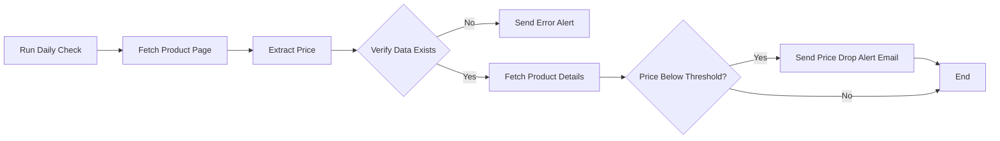
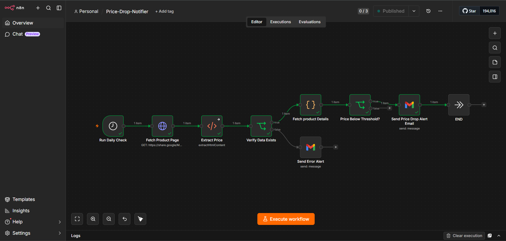
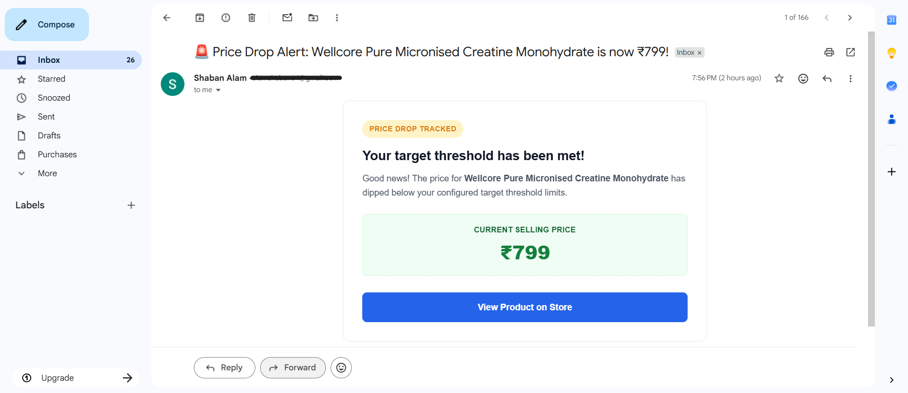

# 🔔 Price Drop Notifier


A production-ready n8n automation that monitors e-commerce product prices on a daily schedule, scrapes live pricing data, validates the result, and fires a polished HTML email alert the instant a product drops to your target price. Zero manual effort. Zero missed deals.

---

## Problem

Most people track product prices the same way — by opening the same product page every day, hoping the number changed. It rarely does, and when it finally does, the sale is already gone.

Flash discounts on e-commerce platforms last hours, not days. Prices shift without notice. A product sitting at ₹1,199 one morning can hit ₹799 by afternoon and bounce back by evening. Manual monitoring can't keep up with that, and no one wants to babysit a browser tab.

The real cost isn't missing a deal — it's the accumulated time wasted checking prices that haven't changed.

---

## Solution

This workflow handles price monitoring entirely on autopilot.

Every day, without any human input, it visits the target product page, extracts the current price from the live HTML, runs it through a validation check, compares it against a configured threshold, and — if the price has dropped far enough — sends an immediate, well-formatted email alert with a direct link to the product.

If scraping fails or the price data comes back empty, the workflow catches that too and routes an error notification instead of silently failing.

The result: you hear about price drops the day they happen, not a week later.

---

## Architecture

The workflow is structured as a linear pipeline with two branching decision points — one for data validation, one for price comparison.

**Run Daily Check** — A Schedule Trigger that fires the workflow automatically once per day. No cron expressions to manage; the timing is configured directly in n8n's UI and runs unattended in the background.

**Fetch Product Page** — An HTTP Request node that performs a GET request against the target product URL and returns the full HTML body. This is the raw data source for everything downstream.

**Extract Price** — An HTML Extraction node that parses the page HTML and pulls the current price using a CSS selector. This step isolates the single data point the workflow needs, discarding everything else.

**Verify Data Exists** — The first IF node. Before doing anything else with the price, the workflow checks that the extraction actually returned a value. This guards against scraping failures, layout changes, or network hiccups that could produce empty or null data. Two paths branch from here:

- **False** → `Send Error Alert`: A Gmail node dispatches a diagnostic email alerting you that the scrape returned no data. The workflow stops here.
- **True** → continues downstream.

**Fetch Product Details** — Retrieves supplementary product metadata (name, URL) to populate the notification email. Keeping this step separate from the price extraction keeps the pipeline modular and easy to reconfigure.

**Price Below Threshold?** — The second IF node compares the extracted price against a numeric threshold defined in the workflow configuration. Two paths branch from here:

- **False** → `END`: The price hasn't dropped low enough. The workflow terminates quietly — no email, no noise.
- **True** → `Send Price Drop Alert Email`

**Send Price Drop Alert Email** — A Gmail node that renders and sends a branded HTML email containing the product name, current price, a visual price display, and a direct call-to-action button. This is the only notification the user receives under normal operation.

**END** — Execution terminates cleanly after either a successful alert or a quiet no-action exit.

---

## 📊 Workflow Diagram

The pipeline's structural topology and conditional execution paths are mapped below:



---

## Tech Stack

| Technology | Role |
|---|---|
| **n8n** | Workflow orchestration engine — hosts, schedules, and executes the entire pipeline |
| **Schedule Trigger** | Time-based trigger that fires the workflow once per day without external cron |
| **HTTP Request** | Fetches the raw HTML of the target product page via GET request |
| **HTML Extraction** | Parses the page HTML and extracts the price field using a CSS selector |
| **IF Node (×2)** | Implements branching logic — data validation gate and price threshold gate |
| **Gmail** | Delivers both price drop alerts and error notifications via authenticated SMTP |
| **HTML Email Template** | Custom-designed email body with branded layout, price display, and CTA button |

---

## Features

- **Automated daily execution** — runs on a schedule with no manual trigger required
- **Live web scraping** — fetches and parses real-time product page HTML on every run
- **Data validation gate** — catches empty or null scraping results before they reach downstream logic
- **Threshold-based alerting** — only sends a notification when the price actually meets the target
- **Dual-path error handling** — routes scraping failures to a dedicated error email rather than silent failure
- **Branded HTML email notifications** — polished, responsive email layout with price display and direct product link
- **Fully unattended operation** — no dashboards, logins, or manual checks required
- **Modular node structure** — each step is isolated and independently configurable
- **Easily reconfigurable threshold** — changing the target price requires editing a single IF node condition
- **Lightweight execution** — no external databases, no browser automation, minimal resource footprint
- **Extendable architecture** — additional products, channels, or storage layers can be added without restructuring the core pipeline

---

## Screenshots

### Workflow

> **`images/workflow.png`**
>
> 

The complete 8-node pipeline as it appears in the n8n editor. The two branching IF nodes are visible — one handling data validation, one handling price comparison.

---

### Email Notification

> **`images/email-alert.png`**
>
> 

A live example of the price drop alert delivered to Gmail. The notification includes a "PRICE DROP TRACKED" status badge, the product name, current selling price displayed prominently in a green price card, and a blue CTA button linking directly to the product page.

---

## How It Works

1. **The Schedule Trigger fires.** Once per day, n8n wakes the workflow and begins execution. No input is required.

2. **The product page is fetched.** An HTTP GET request is sent to the target URL. The full HTML response body is passed to the next node.

3. **The price is extracted.** An HTML Extraction node applies a CSS selector to locate the price element in the raw HTML and outputs its text value as a clean field.

4. **Data validation is checked.** An IF node evaluates whether the extracted price field is non-empty. If extraction failed or returned nothing, the false path activates.

5. **Error alert dispatched (if applicable).** If validation fails, a Gmail node sends a diagnostic email and execution stops. This prevents bad data from reaching the price comparison logic.

6. **Product details are retrieved.** With a valid price confirmed, the workflow fetches supplementary metadata — product name and URL — to populate the email template.

7. **Price is compared to threshold.** An IF node compares the current price (as a number) to the configured target price. If the price is still above the threshold, execution ends quietly — no notification sent.

8. **Price drop alert is sent.** If the price has met the threshold, a Gmail node renders the branded HTML email and delivers it. The email includes the product name, the current selling price in a styled price card, and a "View Product on Store" button.

9. **Execution ends.** The workflow terminates cleanly. On the next scheduled run, the cycle repeats from step one.

---

## Sample Configuration

```yaml
Target Product:  Wellcore Pure Micronised Creatine Monohydrate
Target Price:    ₹799
Alert Channel:   Gmail
Schedule:        Once daily (configurable — hourly runs also supported)
Product URL:     https://example-store.com/product/creatine-monohydrate
Price Selector:  .product-price span  (configurable per site)
```

---

## Sample Output

When the price threshold is met, the following email is delivered:

```
Subject: 🚨 Price Drop Alert: Wellcore Pure Micronised Creatine Monohydrate is now ₹799!

┌──────────────────────────────────────────────────┐
│  PRICE DROP TRACKED                              │
│                                                  │
│  Your target threshold has been met!             │
│                                                  │
│  Good news! The price for Wellcore Pure          │
│  Micronised Creatine Monohydrate has dipped      │
│  below your configured target threshold limits.  │
│                                                  │
│  ┌────────────────────────────────────────────┐  │
│  │        CURRENT SELLING PRICE               │  │
│  │                  ₹799                      │  │
│  └────────────────────────────────────────────┘  │
│                                                  │
│  [ View Product on Store → ]                     │
└──────────────────────────────────────────────────┘

Timestamp:      2026-06-25 19:58 IST
Target Price:   ₹799
Current Price:  ₹799
```

---

## Future Improvements

The current architecture is intentionally minimal — a single product, a single channel, no persistence. That makes it easy to audit, debug, and extend. Planned enhancements include:

- **Multi-product tracking** — parameterize the workflow to monitor multiple products from a single run
- **Google Sheets price history** — log every daily price check to a spreadsheet for trend analysis
- **Telegram & Slack notifications** — add parallel notification channels alongside email
- **WhatsApp alerts** — integrate with WhatsApp Business API or Twilio for mobile push
- **Price history charts** — visualize price trends over time using Sheets or a charting API
- **AI-based buying recommendations** — use an LLM node to analyze price history and suggest optimal buy timing
- **Playwright-based scraping** — replace HTTP + HTML Extraction with a headless browser node for JavaScript-rendered pages
- **Database storage** — persist price history in PostgreSQL or Airtable for richer querying
- **Price drop percentage alerts** — trigger on percentage drops rather than fixed thresholds
- **Docker deployment** — self-hosted n8n instance containerized for consistent production environments

---

## Repository Structure

```
price-drop-notifier/
├── workflow.json           # Exported n8n workflow (importable directly)
├── README.md
├── screenshots/
│   ├── workflow.png        # n8n editor screenshot
│   └── email-alert.png     # Gmail notification screenshot
└── LICENSE
```

To use this workflow: import `workflow.json` into your n8n instance, connect your Gmail credentials, update the target URL and price threshold in the IF node, and activate.

---

## Author

**Shaban Alam**
Python Automation Developer · n8n Workflow Specialist · AI Integration Engineer

Building production-ready automation systems for businesses that want to eliminate repetitive manual work.

- **GitHub:** [github.com/Shaban27-dev](https://github.com/Shaban27-dev)
- **Email:** shabandev27@gmail.com
- **Available for:** freelance automation projects, workflow consulting, API integrations

> Open to projects involving n8n, Python automation, web scraping pipelines, notification systems, AI workflow integration, and process automation.

---

## Summary

Price Drop Notifier demonstrates a complete, production-grade automation pipeline — scheduled execution, live HTTP scraping, HTML parsing, multi-branch conditional logic, error handling, and automated email delivery, all orchestrated through n8n without writing a single line of application code.

It is the kind of workflow a business would actually deploy: reliable, fault-tolerant, quietly running in the background, and actionable when it matters. The architecture is deliberately modular, meaning any component — the data source, the notification channel, the threshold logic — can be replaced or extended without touching the rest of the pipeline.

This project is part of an active automation portfolio. Additional workflows covering lead enrichment, invoice processing, job alert systems, and multi-channel notification pipelines are available in the linked GitHub profile.
