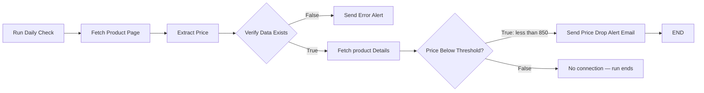
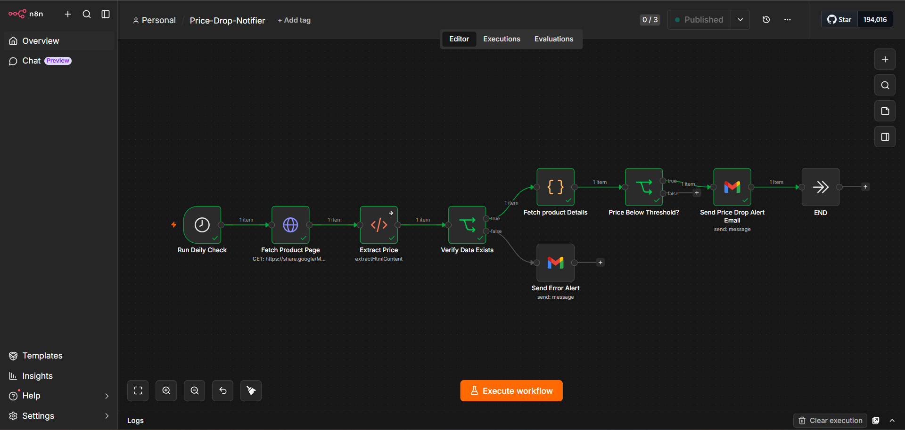
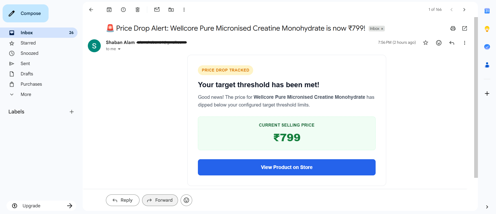

# 🔔 Price Drop Notifier


An n8n automation that checks an e-commerce product page on a schedule, scrapes the live price and product name from the page HTML, validates the extracted data, and sends a branded HTML email when the price is under a configured threshold. Errors in data extraction are routed to a separate diagnostic email instead of failing silently.

---

## Problem

Most people track product prices by opening the same page over and over, hoping the number has changed. Flash discounts and short-lived sales often come and go in hours, and manually checking a tab isn't a reliable way to catch them. The time cost isn't missing a single deal — it's the repeated, low-value effort of checking a price that hasn't moved.

---

## Solution

This workflow automates the check. On a timed interval, it fetches the target product page, extracts the price and product name from the raw HTML using CSS selectors, confirms both values were actually found, and compares the parsed price against a fixed threshold configured in the workflow. If the price is below that threshold, it sends a formatted email alert with the product name, current price, and a link back to the product page. If the extraction step comes back empty — for example because the page layout changed — it sends a separate diagnostic email instead of proceeding with bad data.

---

## Architecture

The workflow runs as a linear pipeline with two branching decision points: one that validates the scraped data, and one that checks the price against the threshold.

**Run Daily Check** is a Schedule Trigger. In the current export its interval is configured on the `hours` field rather than a `days` field, and no explicit numeric interval is set in the JSON itself — the exact run frequency is whatever is configured in the trigger's UI settings, and is not determinable from the export alone. The node's display name suggests a daily cadence, but that is a naming choice rather than a technical guarantee; treat the two as independent until the interval is explicitly set.

**Fetch Product Page** is an HTTP Request node that issues a GET request against the configured product URL and returns the page's raw HTML. The URL currently saved in the workflow (`https://share.google/MyProductPage`) is a placeholder and needs to be replaced with a real product page before this workflow would do anything useful.

**Extract Price** is an HTML Extraction node that pulls two fields from the returned HTML using CSS selectors: `Product_Price` from `.mQzvxd b`, and `Product_Name` from `div[data-attrid="product_title"]`. The node is configured with `onError: continueRegularOutput`, so if the extraction itself throws (for example, because the selector no longer matches anything on the page), execution continues rather than halting — the resulting empty values are what the next node checks for.

**Verify Data Exists** is an IF node that confirms both `Product_Price` and `Product_Name` are non-empty strings. If either is empty, the false branch fires. If both are present, the true branch continues.

- **False** → `Send Error Alert`: a Gmail node sends a static diagnostic email explaining that the page structure may have changed or the selectors need review. Nothing is connected downstream of this node — the run ends here.
- **True** → continues to `Fetch product Details`.

**Fetch product Details** is not an HTTP or scraping node despite its name — it's a JavaScript Code node. It parses the first numeric run out of the raw `Product_Price` string with a regular expression, strips comma separators, and converts the result to a number as `currentPrice`. It also reads the workflow's static data store via `$getWorkflowStaticData('global')`, pulling out a previously saved price into a local `oldPrice` variable, and then immediately overwrites that stored value with the current run's price. `oldPrice` is read and reassigned but not referenced anywhere else in the code or passed downstream — as written, it currently has no effect on the workflow's behavior. The node outputs `productUrl` (read from the static URL parameter configured on the `Fetch Product Page` node, not the page's actual response URL), `productName`, and `currentPrice`.

**Price Below Threshold?** is an IF node that compares `currentPrice` against a hardcoded numeric literal, `850`, using a less-than operator. This is a fixed threshold check against a single configured number — it is not a comparison against the previously saved price, even though a previous price is being stored in static data (see above).

- **True** (`currentPrice < 850`) → `Send Price Drop Alert Email`.
- **False** → nothing is connected; the run ends here with no output.

**Send Price Drop Alert Email** is a Gmail node that renders a branded HTML email containing the product name, current price, a "PRICE DROP TRACKED" badge, a "Your target threshold has been met!" heading, the price displayed in a styled card, and a "View Product on Store" button linking to `productUrl`. The recipient address and Gmail credential in the export are both placeholder values.

**END** is a No-Op node used purely as a visual terminator for the alert branch. The error branch and the below-threshold-not-met branch both end without reaching it.

---

## 📊 Workflow Diagram


```mermaid
flowchart LR
    A[Run Daily Check] --> B[Fetch Product Page]
    B --> C[Extract Price]
    C --> D{Verify Data Exists}

    D -- False --> E[Send Error Alert]
    D -- True --> F[Fetch product Details]

    F --> G{Price Below Threshold?}
    G -- True: less than 850 --> H[Send Price Drop Alert Email]
    H --> I[END]
    G -- False --> J[No connection — run ends]
```

---

## Tech Stack

| Technology | Role |
|---|---|
| **n8n** | Workflow orchestration engine — hosts, schedules, and executes the pipeline |
| **Schedule Trigger** | Interval-based trigger, currently configured on an `hours` field |
| **HTTP Request** | Fetches the raw HTML of the target product page via GET |
| **HTML Extraction** | Parses the page HTML and pulls price and name via CSS selectors |
| **IF Node (×2)** | Branching logic — data validation gate, then threshold gate |
| **Code Node (JavaScript)** | Parses the price string to a number, reads/writes workflow static data, shapes the output object |
| **Gmail (×2)** | Sends the price-drop alert email and the error diagnostic email |
| **No-Op** | Terminator node for the alert branch |

---

## Features

| Feature | Description |
|---|---|
| Interval-based execution | Runs on a schedule without a manual trigger, per the Schedule Trigger's configured interval |
| Live HTML scraping | Fetches and parses the current page HTML on every run |
| Data validation gate | Checks that both extracted fields are non-empty before continuing |
| Threshold-based alerting | Sends an email only when the parsed price is below a configured numeric threshold |
| Separate error path | Routes missing/empty extraction results to a distinct diagnostic email rather than proceeding silently |
| Branded HTML email | Formatted alert with a price card and a direct call-to-action button |
| Workflow-scoped price memory | Stores the last seen price in workflow static data (not currently used in the alert decision) |
| Modular nodes | Each step is a separate, independently configurable node |

---

## Screenshots

### Workflow



The 9-node pipeline as it appears in the n8n editor: trigger, fetch, extract, validate, the JavaScript price-parsing node, the threshold check, and the two Gmail branches.

### Email Notification



The price-drop alert as delivered to Gmail, showing the "PRICE DROP TRACKED" badge, the product name, the current price (₹799 in this captured example), and the "View Product on Store" button.

---

## How It Works

1. **The Schedule Trigger fires** on its configured interval (currently set on the `hours` field; the specific numeric interval isn't present in the exported JSON).
2. **The product page is fetched** with an HTTP GET request to the configured URL.
3. **The price and name are extracted** from the returned HTML using the two CSS selectors. If extraction errors out, the node continues with empty output rather than halting.
4. **Data validation runs.** If `Product_Price` or `Product_Name` came back empty, execution routes to the error path.
5. **On invalid data**, `Send Error Alert` sends a diagnostic email and the run ends.
6. **On valid data**, the Code node parses the price string into a number, reads and overwrites the stored previous price in workflow static data, and outputs `productUrl`, `productName`, and `currentPrice`.
7. **The price is compared to the threshold.** If `currentPrice` is less than 850, execution continues to the alert email; otherwise the run ends with no output.
8. **The alert email is sent**, rendering the branded HTML template with the current price and a link to the product page.
9. **Execution ends** at the No-Op node on the alert path, or ends without a terminator node on the other two paths.

---

## Sample Configuration

```yaml
Product URL:       https://share.google/MnHzzv8cCfWiE7VmR  
Price Selector:     .mQzvxd b
Name Selector:       div[data-attrid="product_title"]
Configured Threshold: 850                                # currentPrice < 850 triggers the alert
Trigger Interval:    hours field (exact count set in n8n UI, not present in this export)
Alert Channel:       Gmail (recipient in export: youremail@gmail.com — placeholder)
```

---

## Sample Output

The captured example below reflects an actual run where the parsed price came in under the configured ₹850 threshold. The ₹799 figure is the example current price, not the threshold — the threshold itself is a separate, fixed value of ₹850 set in the `Price Below Threshold?` node.

```
Subject: 🚨 Price Drop Alert: Wellcore Pure Micronised Creatine Monohydrate is now ₹799!

┌──────────────────────────────────────────────────┐
│  PRICE DROP TRACKED                               │
│                                                    │
│  Your target threshold has been met!              │
│                                                    │
│  Good news! The price for Wellcore Pure           │
│  Micronised Creatine Monohydrate has dipped        │
│  below your configured target threshold limits.    │
│                                                    │
│  ┌──────────────────────────────────────────────┐ │
│  │        CURRENT SELLING PRICE                 │ │
│  │                  ₹799                        │ │
│  └──────────────────────────────────────────────┘ │
│                                                    │
│  [ View Product on Store → ]                       │
└──────────────────────────────────────────────────┘

Configured Threshold:  ₹850
Current Price:         ₹799
```

---

## Known Behavior & Current Limitations

- **Trigger cadence isn't fully specified.** The Schedule Trigger's interval field is set to `hours`, but no numeric interval value is present in the exported JSON, so the effective run frequency depends entirely on the live n8n instance's trigger configuration.
- **Placeholder values throughout.** The product URL, the alert/error email recipient, and the Gmail credential ID are all placeholders in this export and need to be set before the workflow is usable.
- **Threshold is a single hardcoded number.** `850` is written directly into the IF node's condition rather than exposed as a workflow variable or parameter.
- **Stored price isn't used yet.** The Code node saves the current price to workflow static data (`savedPrice`) and reads the previous value into `oldPrice` on each run, but `oldPrice` is never referenced again — the alert logic is a static threshold check, not a drop-versus-last-run comparison, even though the underlying state needed for that comparison is already being captured.
- **Error handling scope.** The error branch only covers the case where the extracted price or name comes back empty. Broader HTTP-level failures (timeouts, non-200 responses) aren't separately branched on elsewhere in this JSON.
- **Exported as inactive.** The workflow JSON has `"active": false`.

---

## Future Improvements

- **Use the stored previous price** already captured in static data to detect an actual price *drop*, rather than a fixed absolute threshold
- **Multi-product tracking** — parameterize the workflow to monitor more than one product per run
- **Google Sheets price history** — log each check for trend analysis
- **Additional notification channels** — Telegram, Slack, or WhatsApp alongside email
- **Price history charts** — visualize trends over time
- **Percentage-based alerts** — trigger on a relative drop rather than an absolute number
- **Playwright-based scraping** — handle JavaScript-rendered product pages
- **Database storage** — persist price history in PostgreSQL or Airtable
- **Explicit numeric interval** — set and document a concrete schedule instead of relying on UI-only configuration
- **Broader HTTP error handling** — branch on request failures, not just empty extraction results

---

## Repository Structure

```
price-drop-notifier/
├── price-drop-notifier.json    # Exported n8n workflow (importable directly)
├── README.md
└── images/
    ├── workflow.png            # n8n editor screenshot
    └── email-alert.png         # Gmail notification screenshot
```

To use this workflow: import the workflow JSON into your n8n instance, connect Gmail credentials, replace the placeholder product URL and recipient address, review the CSS selectors against your target site, and set the threshold and trigger interval before activating.

---

## Author

**Shaban Alam**
Python Automation Developer · n8n Workflow Specialist · AI Integration Engineer

Building automation systems for businesses that want to eliminate repetitive manual work.

- **GitHub:** [github.com/Shaban27-dev](https://github.com/Shaban27-dev)
- **Email:** shabandev27@gmail.com
- **Available for:** freelance automation projects, workflow consulting, API integrations

> Open to projects involving n8n, Python automation, web scraping pipelines, notification systems, AI workflow integration, and process automation.

---

## Summary

Price Drop Notifier is a compact n8n pipeline covering scheduled execution, live HTTP scraping, HTML parsing, data validation, JavaScript-based price parsing with workflow-scoped state, multi-branch conditional logic, and email delivery through two Gmail nodes. It's structured as a reference build: the logic is complete and internally consistent, but several values — the product URL, recipient address, credential ID, and trigger interval — are placeholders that need to be filled in before deployment, and one piece of captured state (the previous price) isn't yet wired into the alert decision.

This project is part of an active automation portfolio. Additional workflows covering lead enrichment, invoice processing, and related pipelines are available in the linked GitHub profile.
